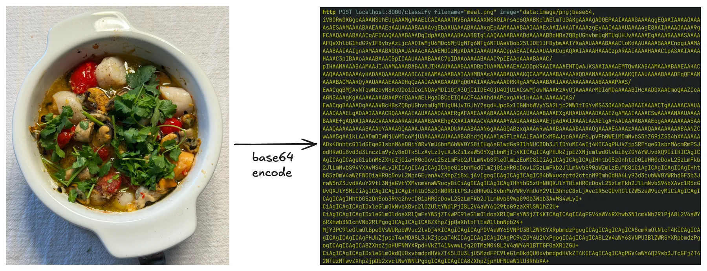

+++
title = "Implementing AI-enabled API Servers"
date = 2026-04-25
description = ""
weight = 14

[extra]
chapter = "Module A.4"
+++

In [Module A.3](@/ai-system/api-server/index.md) we built a small API server with FastAPI.
We can take requests, validate their bodies, and stream responses.
The catch is that the server does not actually compute anything yet.
Every endpoint we wrote returns a hardcoded reply, which is fine for learning the framework but not very interesting otherwise.

In this module, we fill in the missing piece.
We will plug an actual AI model into the endpoints, so that requests trigger real inference and responses contain real predictions.
Along the way we will pick up a few patterns that production AI APIs rely on but we have so far ignored: loading the model only once when the server starts, using `async` so the server can handle multiple users at the same time, protecting endpoints with API keys, tracking usage in a database, and limiting how often each user can call us.

By the end of this module, the server we built in the previous module turns into something that genuinely deserves to be called an AI API server, and the client we built in [Module A.2](@/ai-system/interact-api-python/index.md) can talk to it just like it talks to OpenAI or any other AI provider.

{{ toc() }}


## Plugging AI Models into Endpoints

To keep the example concrete, we will build a small image classification API.
The server takes an image in the request body, runs it through a vision model, and returns the top predicted labels.
The same pattern works for any other AI model.
What changes is the data type of the inputs and outputs and the model itself.

### Loading a Pre-trained PyTorch Model

The most common source of pre-trained vision models in the PyTorch ecosystem is [`torchvision`](https://docs.pytorch.org/vision/stable/index.html), which ships with a long list of standard architectures along with weights trained on ImageNet.
A lightweight one that runs comfortably on a laptop is [ResNet-18](https://docs.pytorch.org/vision/stable/models/generated/torchvision.models.resnet18.html).

Install the dependencies:
```bash
pip install torch torchvision pillow
```

Then load the model along with its preprocessing transforms:
```python
import torch
from torchvision.models import resnet18, ResNet18_Weights

weights = ResNet18_Weights.DEFAULT
model = resnet18(weights=weights)
model.eval()  # switch to inference mode

preprocess = weights.transforms()  # the same transforms used during training
categories = weights.meta["categories"]  # list of 1000 ImageNet class names
```
`weights=ResNet18_Weights.DEFAULT` tells `torchvision` to download the pre-trained weights from the internet the first time we run this, then cache them locally for future runs.
`model.eval()` puts the model in inference mode, which disables dropout and batch normalization updates.
The `weights` object also conveniently bundles the preprocessing transform and the class labels, so we do not have to recreate them by hand.

Running inference on a single image then becomes a few short lines:
```python
from PIL import Image

image = Image.open("cat.jpg").convert("RGB")
batch = preprocess(image).unsqueeze(0)  # add batch dimension

with torch.no_grad():
    logits = model(batch)
    probs = logits.softmax(dim=1)[0]  # convert to probabilities

top5 = probs.topk(5)
predictions = [
    {"label": categories[idx], "confidence": round(score.item(), 4)}
    for score, idx in zip(top5.values, top5.indices)
]
```
`torch.no_grad()` skips gradient tracking, since we are not training.
`topk(5)` picks the five highest probabilities.
The result is a list of pairs, each with a label and a confidence score, ready to be returned as JSON.

If you have a model that you trained yourself in another course, for example, the Deep Learning course, you can load it the same way.
Instead of asking `torchvision` for pre-trained weights, you point PyTorch at the saved weights file:
```python
import torch
from your_module import YourModel  # the model class you defined during training

model = YourModel()
model.load_state_dict(torch.load("your_model_weights.pt", map_location="cpu"))
model.eval()
```
The rest of the inference code stays the same, except you may need to write your own preprocessing and label list to match how the model was trained.

### Off-the-Shelf Models from Hugging Face

`torchvision` is great for classic vision models, but most state-of-the-art models live on the [Hugging Face Hub](https://huggingface.co/models) instead.
The Hub hosts millions of models contributed by the community, including image classifiers, language models, speech models, and more.
The [`transformers`](https://huggingface.co/docs/transformers/) library provides a uniform interface to download and run any of them with very little code.

Install:
```bash
pip install transformers
```

The simplest way to use a model from the Hub is the [`pipeline`](https://huggingface.co/docs/transformers/main_classes/pipelines) helper, which wraps download, preprocessing, inference, and postprocessing into a single callable:
```python
from transformers import pipeline

classifier = pipeline("image-classification", model="google/vit-base-patch16-224")

image = Image.open("cat.jpg").convert("RGB")
predictions = classifier(image, top_k=5)
# [{"label": "tabby cat", "score": 0.78}, ...]
```
The `pipeline` decides how to preprocess based on the model card on the Hub, runs the model, and returns the top-k labels with their confidence scores.
Switching to a different model is just a matter of changing the string in `model=...`, as long as it is also an image classification model.
`pipeline` supports many other tasks too, like `"text-generation"`, `"automatic-speech-recognition"`, and `"object-detection"`.

For the rest of the module we will go with `torchvision`'s ResNet-18, since it is small enough to run on any laptop without a GPU, but the patterns translate to any other model with minimal changes.

> Below are some additional resources to help you get more comfortable with the Hugging Face ecosystem.
> - [Getting started with Hugging Face in 15 minutes (video)](https://www.youtube.com/watch?v=QEaBAZQCtwE), a short tour of transformers, pipelines, tokenizers, and models
> - [Hugging Face Learn (courses)](https://huggingface.co/learn), the central hub of free Hugging Face courses, including dedicated tracks on LLMs, computer vision, and audio
> - [The `transformers` quickstart (docs)](https://huggingface.co/docs/transformers/quicktour), the official walkthrough of loading and running models from the Hub

### Wrapping the Model in an Endpoint

We can now drop the model into the `/inspect` endpoint we wrote in the previous module and turn it into a real classifier.
The request still carries a Base64-encoded image like before, only this time we run the image through the model instead of just returning its dimensions:
```python
# main.py
import base64
from io import BytesIO

import torch
from PIL import Image
from fastapi import FastAPI, HTTPException
from pydantic import BaseModel
from torchvision.models import resnet18, ResNet18_Weights

weights = ResNet18_Weights.DEFAULT
model = resnet18(weights=weights)
model.eval()
preprocess = weights.transforms()
categories = weights.meta["categories"]

app = FastAPI(title="My AI API Server", version="1.0.0")

class ImageRequest(BaseModel):
    image: str  # Base64-encoded image bytes

@app.post("/v1/classify")
def classify(req: ImageRequest):
    try:
        encoded = req.image.split(",", 1)[1] if req.image.startswith("data:") else req.image
        image = Image.open(BytesIO(base64.b64decode(encoded))).convert("RGB")
    except Exception as e:
        raise HTTPException(status_code=400, detail=f"Invalid image: {e}")

    batch = preprocess(image).unsqueeze(0)
    with torch.no_grad():
        probs = model(batch).softmax(dim=1)[0]
    top5 = probs.topk(5)

    return {
        "model": "resnet18",
        "predictions": [
            {"label": categories[idx], "confidence": round(score.item(), 4)}
            for score, idx in zip(top5.values, top5.indices)
        ],
    }
```
We can send a real image to this endpoint from our [Module A.2](@/ai-system/interact-api-python/index.md) program, and watch real predictions come back.
For example, here is a Spanish-style seafood casserole I cooked the other day, and it was delicious:



After Base64-encoding the image and sending it to `/v1/classify`, the server returns the following JSON response:
```json
{
    "model": "resnet18",
    "predictions": [
        {"label": "soup bowl", "confidence": 0.5749},
        {"label": "consomme", "confidence": 0.2213},
        {"label": "hot pot", "confidence": 0.1637},
        {"label": "mortar", "confidence": 0.0107},
        {"label": "potpie", "confidence": 0.0097}
    ]
}
```
ResNet-18 was only trained on the 1000 ImageNet classes, none of which is "seafood casserole", so the closest matches are dishes that vaguely resemble soup.
But the result still tells us that the whole pipeline is working end to end.


## Going Async

The server above works, but it has two awkward properties.
First, the model is loaded at the top of the file, which means every Uvicorn auto-reload during development triggers a fresh download check and a few hundred megabytes of disk reads.
Second, every request to `/v1/classify` runs in a regular synchronous function, which means while one request is being processed, other requests waiting in line cannot make progress.

FastAPI gives us two tools to fix this: the [`lifespan`](https://fastapi.tiangolo.com/advanced/events/) context manager for code that should run once at startup, and `async def` endpoints for code that should not block other requests.

### Loading the Model Once at Startup

`lifespan` is an async context manager attached to the FastAPI app.
The code before `yield` runs once when the server starts, and the code after `yield` runs once when it shuts down.
That makes it a good place to load and release the model:
```python
from contextlib import asynccontextmanager
from fastapi import FastAPI
from torchvision.models import resnet18, ResNet18_Weights

ml = {}  # holds the model and its peripherals

@asynccontextmanager
async def lifespan(app: FastAPI):
    weights = ResNet18_Weights.DEFAULT
    model = resnet18(weights=weights)
    model.eval()
    ml["model"] = model
    ml["preprocess"] = weights.transforms()
    ml["categories"] = weights.meta["categories"]
    yield
    ml.clear()  # release on shutdown

app = FastAPI(title="My AI API Server", version="1.0.0", lifespan=lifespan)
```
The model now loads exactly once, before the server accepts any traffic, and stays in memory for the lifetime of the process.
Reloading `main.py` no longer reloads the weights repeatedly.

### Async Endpoints

A useful way to think about `async def` is to imagine our server as a single waiter at a busy restaurant.
Without `async`, the waiter takes one order, walks to the kitchen, stands there until the food is ready, then walks it back to the table before taking the next order.
Most of the waiter's time is spent just standing around.
Marking an endpoint as `async def` is like teaching the waiter a new habit.
After handing the order to the kitchen, the waiter immediately moves on to take other tables' orders, and only comes back to deliver the food once the kitchen says it is ready.
The keyword `await` is the moment the waiter steps aside and is free to serve other tables.
A single waiter can serve many tables in parallel this way, as long as the slow part is something happening outside the waiter, like the kitchen cooking, a network request, or a database query.

For our classification endpoint, the slow part is the model inference itself, which the function actually has to compute.
There is no kitchen to wait on, so marking the endpoint `async def` alone does not help.
The waiter is now busy cooking, and cannot take other orders while doing it.
The fix is to hire a separate cook.
We hand the inference call to another thread using `asyncio.to_thread`, so the waiter can go back to taking orders while the cook prepares the food:
```python
import asyncio

@app.post("/v1/classify")
async def classify(req: ImageRequest):
    try:
        encoded = req.image.split(",", 1)[1] if req.image.startswith("data:") else req.image
        image = Image.open(BytesIO(base64.b64decode(encoded))).convert("RGB")
    except Exception as e:
        raise HTTPException(status_code=400, detail=f"Invalid image: {e}")

    predictions = await asyncio.to_thread(run_inference, image)
    return {"model": "resnet18", "predictions": predictions}

def run_inference(image: Image.Image):
    batch = ml["preprocess"](image).unsqueeze(0)
    with torch.no_grad():
        probs = ml["model"](batch).softmax(dim=1)[0]
    top5 = probs.topk(5)
    return [
        {"label": ml["categories"][idx], "confidence": round(score.item(), 4)}
        for score, idx in zip(top5.values, top5.indices)
    ]
```
The endpoint itself is now `async def`, but the heavy work runs in a separate thread via `asyncio.to_thread`.
While that thread runs the inference, the server is still free to accept other requests and start processing the next image.

The benefit becomes more obvious if we imagine the endpoint also calling another remote AI API, for example, to forward the image to a larger model in the cloud.
Each call to that remote API takes several seconds, almost all of which is spent waiting on the network.
With `async def` and `await`, a single server process can have hundreds of these waits going on at the same time without hiring hundreds of waiters.

> The [official FastAPI docs on concurrency](https://fastapi.tiangolo.com/async/) have a much longer explanation of when `async def` helps and when it does not.
> In short, use `async def` for endpoints that mostly wait on something outside the function, like a network reply, a database response, or another API, and use `asyncio.to_thread` to push heavy computation inside the process onto a separate thread so the server stays responsive.
> If we just use plain synchronous `def` for an endpoint, FastAPI will run it in its own pool of threads, which is usually fine for low traffic but does not scale to many parallel requests as gracefully as a properly async endpoint does.


## Protecting and Tracking the Endpoints

So far our server happily serves anyone who knows its address.
That is fine for local development, but the moment we put it on the internet, anyone can poke at it.
For an AI server, that is more than a small problem.
AI inference is expensive, and an unprotected endpoint can be used to overload our hardware or run up our cloud or electricity bill within minutes.

This section adds the three protections most real AI APIs have: API key authentication, usage tracking for each user, and rate limiting.
We will start with a hardcoded key, then move the keys into a small database so we can support multiple users, and finally use that same database to enforce rate limits.

### Header Auth with API Keys

In [Module A.1](@/ai-system/api-fundamentals/index.md#http-request) we saw that AI providers identify their users by an API key sent in the `Authorization` header, formatted as `Bearer <key>`.
We can replicate that on our server using FastAPI's [`HTTPBearer`](https://fastapi.tiangolo.com/reference/security/) helper from the `fastapi.security` module:
```python
from fastapi import Depends, HTTPException, status
from fastapi.security import HTTPBearer, HTTPAuthorizationCredentials

bearer_scheme = HTTPBearer()
VALID_API_KEYS = {"sk-mysecretkey-001", "sk-mysecretkey-002"}

def verify_api_key(creds: HTTPAuthorizationCredentials = Depends(bearer_scheme)) -> str:
    if creds.credentials not in VALID_API_KEYS:
        raise HTTPException(
            status_code=status.HTTP_401_UNAUTHORIZED,
            detail="Invalid API key",
        )
    return creds.credentials
```
`HTTPBearer` reads the `Authorization` header, splits off the `Bearer ` prefix, and gives us the rest as `creds.credentials`.
`verify_api_key` is a regular function we will use through FastAPI's [dependency injection](https://fastapi.tiangolo.com/tutorial/dependencies/) system. Any endpoint that depends on it will only run if the key is valid, and will return `401 Unauthorized` otherwise.

To protect the classification endpoint, we add `verify_api_key` as a dependency:
```python
@app.post("/v1/classify")
async def classify(req: ImageRequest, api_key: str = Depends(verify_api_key)):
    # the rest of the endpoint stays the same
    ...
```
A request without a valid `Authorization: Bearer <key>` header now bounces with `401`, before the model is even touched.

### Dynamic API Keys with a Database

Hardcoding keys works for one or two users, but quickly falls apart in practice.
We cannot add or revoke keys without redeploying the server, and we have no idea which user is responsible for which request.
Both problems go away once we move the keys into a database.

For a small server, [SQLite](https://www.sqlite.org/) is more than enough.
SQLite stores the entire database in a single file and needs no separate database server, which makes it perfect for getting started.
We will talk to it through [SQLAlchemy](https://www.sqlalchemy.org/), the standard Python library for working with relational databases.
SQLAlchemy lets us describe tables as Python classes and run queries through Python expressions, which means we do not have to write raw SQL by hand and we get type checking for free.
This is very similar to how [Pydantic](@/ai-system/api-server/index.md#validating-the-body-with-pydantic) lets us describe request bodies as Python classes and validate incoming data automatically, except SQLAlchemy classes are mapped to database tables instead of JSON payloads.

Install:
```bash
pip install sqlalchemy
```

Define two tables: one for users, each with a unique API key, and one for the requests they make:
```python
# db.py
from datetime import datetime
from sqlalchemy import ForeignKey, create_engine
from sqlalchemy.orm import DeclarativeBase, Mapped, Session, mapped_column, relationship

class Base(DeclarativeBase):
    pass

class User(Base):
    __tablename__ = "users"

    id: Mapped[int] = mapped_column(primary_key=True)
    api_key: Mapped[str] = mapped_column(unique=True)
    email: Mapped[str | None]
    created_at: Mapped[datetime] = mapped_column(default=datetime.utcnow)

    requests: Mapped[list["APIRequest"]] = relationship(back_populates="user")

class APIRequest(Base):
    __tablename__ = "api_requests"

    id: Mapped[int] = mapped_column(primary_key=True)
    user_id: Mapped[int] = mapped_column(ForeignKey("users.id"))
    endpoint: Mapped[str]
    timestamp: Mapped[datetime] = mapped_column(default=datetime.utcnow)
    response_time_ms: Mapped[float]
    status_code: Mapped[int]

    user: Mapped[User] = relationship(back_populates="requests")

engine = create_engine("sqlite:///ai_api.db")
Base.metadata.create_all(engine)

def get_session():
    with Session(engine) as session:
        yield session
```
This follows the modern SQLAlchemy 2.0 declarative style, where each table column is a `Mapped[...]` annotation and `mapped_column` describes the column itself.
Calling `Base.metadata.create_all(engine)` creates the tables on the first run if they do not exist yet, so we do not need a separate setup step.

Each `User` row holds an API key plus some metadata.
Each `APIRequest` row records one call to our server, linked back to the user who made it.
The `relationship` calls let us navigate from a user to their requests via `user.requests`, or from a request to its user via `request.user`, as Python attributes, without writing a `JOIN`.

Now we change `verify_api_key` to look the key up in the database instead of in a hardcoded set:
```python
from fastapi import Depends, HTTPException, status
from fastapi.security import HTTPBearer, HTTPAuthorizationCredentials
from sqlalchemy import select
from sqlalchemy.orm import Session

from db import User, get_session

bearer_scheme = HTTPBearer()

def get_current_user(
    creds: HTTPAuthorizationCredentials = Depends(bearer_scheme),
    db: Session = Depends(get_session),
) -> User:
    user = db.scalar(select(User).where(User.api_key == creds.credentials))
    if user is None:
        raise HTTPException(
            status_code=status.HTTP_401_UNAUTHORIZED,
            detail="Invalid API key",
        )
    return user
```
`db.scalar(select(...))` is the SQLAlchemy 2.0 way of running a query that returns a single object, or `None` if there is no match.
The endpoint now receives a real `User` object whenever the key is valid, which we will use in a moment to record usage:
```python
@app.post("/v1/classify")
async def classify(
    req: ImageRequest,
    user: User = Depends(get_current_user),
    db: Session = Depends(get_session),
):
    ...
```
Adding or revoking a key now means inserting or deleting a row in the database, no code changes needed.

> Below are some additional resources for learning SQLAlchemy more systematically.
> - [Real Python's tutorial on SQLite and SQLAlchemy (blog post)](https://realpython.com/python-sqlite-sqlalchemy/), a long, hands-on walkthrough of moving from raw files to a SQLAlchemy-backed app
> - [SQLAlchemy: the best SQL database library in Python (video)](https://www.youtube.com/watch?v=aAy-B6KPld8) by ArjanCodes, covering the same modern declarative style we used here
> - [The official SQLAlchemy tutorial (docs)](https://docs.sqlalchemy.org/en/20/tutorial/), the canonical reference once you need anything beyond the basics

> SQLite is convenient for development and small deployments, but it does not handle many concurrent writers well, and it lives on a single machine.
> Production AI APIs typically use a more capable database.
> Two common choices are [PostgreSQL](https://www.postgresql.org/), a powerful general-purpose relational database, and [Redis](https://redis.io/), an in-memory key-value store often used for caching and rate limiting.
> Thanks to SQLAlchemy, switching from SQLite to PostgreSQL is usually a one-line change to the connection URL, and most of the code we wrote stays the same.
> - [SQLite vs MySQL vs PostgreSQL (blog post)](https://www.digitalocean.com/community/conceptual-articles/sqlite-vs-mysql-vs-postgresql-a-comparison-of-relational-database-management-systems), a side-by-side look at three popular relational databases
> - [Introduction to Redis (docs)](https://redis.io/about/), the official summary of what Redis is and what it is good for

### Logging Each Request

With users in the database, recording usage is just a matter of inserting an `APIRequest` row whenever a request finishes.
We measure how long the inference took and what status code we are returning, both of which are useful for billing, monitoring, and debugging:
```python
import time
from db import APIRequest

@app.post("/v1/classify")
async def classify(
    req: ImageRequest,
    user: User = Depends(get_current_user),
    db: Session = Depends(get_session),
):
    start = time.perf_counter()
    status_code = 200
    try:
        encoded = req.image.split(",", 1)[1] if req.image.startswith("data:") else req.image
        image = Image.open(BytesIO(base64.b64decode(encoded))).convert("RGB")
        predictions = await asyncio.to_thread(run_inference, image)
        return {"model": "resnet18", "predictions": predictions}
    except HTTPException as e:
        status_code = e.status_code
        raise
    except Exception as e:
        status_code = 500
        raise HTTPException(status_code=500, detail=str(e))
    finally:
        db.add(APIRequest(
            user_id=user.id,
            endpoint="/v1/classify",
            response_time_ms=(time.perf_counter() - start) * 1000,
            status_code=status_code,
        ))
        db.commit()
```
The `finally` block runs whether the endpoint returned successfully or raised an error, so failed requests get logged too.
This is exactly what we want when we are trying to debug bad behavior later.

A separate endpoint can let users check their own usage:
```python
from sqlalchemy import func

@app.get("/v1/usage")
def usage(user: User = Depends(get_current_user), db: Session = Depends(get_session)):
    total = db.scalar(
        select(func.count()).select_from(APIRequest).where(APIRequest.user_id == user.id)
    )
    return {"user_id": user.id, "total_requests": total}
```

### Rate Limiting

The last thing we need to add is rate limiting.
Even with API keys in place, a misbehaving or malicious client can send thousands of requests per minute and overload our server.
A rate limit caps the number of requests each user can make in a given time window.

There are two algorithms commonly used for rate limiting.

The **fixed window** approach divides time into fixed intervals, say, every minute on the minute.
Each interval has a counter that resets to zero at the boundary.
This is simple to implement, but it lets a client send a burst of `2 * limit` requests around the boundary by squeezing in `limit` requests just before the window flips and another `limit` immediately after.

The **sliding window** approach instead looks at the last `N` seconds from the current moment.
At every request we count how many requests the user has made in the past `N` seconds, and reject if that count exceeds the limit.
This is smoother and avoids the burst at the boundary, at the cost of having to look up recent requests at each call.

Since we already log every request to the database, the sliding window is almost free for us to implement:
```python
from datetime import datetime, timedelta, timezone

RATE_LIMIT = 5
WINDOW_SECONDS = 60

def check_rate_limit(user: User, db: Session):
    cutoff = datetime.now(timezone.utc) - timedelta(seconds=WINDOW_SECONDS)
    recent = db.scalar(
        select(func.count()).select_from(APIRequest)
        .where(APIRequest.user_id == user.id, APIRequest.timestamp >= cutoff)
    )
    if recent >= RATE_LIMIT:
        raise HTTPException(
            status_code=429,
            detail=f"Rate limit exceeded: {RATE_LIMIT} requests per {WINDOW_SECONDS} seconds",
        )
```
Adding one line at the start of `classify` enforces the limit:
```python
async def classify(req: ImageRequest, user: User = Depends(get_current_user), db: Session = Depends(get_session)):
    check_rate_limit(user, db)
    # ...rest of the endpoint
```
Once a user crosses the threshold, every additional request within the next minute returns `429 Too Many Requests` until enough time has passed.
The status code `429` is the standard one for rate limiting, and well-behaved clients, including ours from Module A.2, can pick it up and back off accordingly.

In a real deployment we would also want to store the rate limit on the `User` row itself, so different users can have different limits, and probably move the counter into a faster store like Redis to avoid hitting the database on every request.
But the principle stays the same.

> Fixed and sliding windows are only two of several rate limiting algorithms.
> Other common ones are the token bucket and the leaky bucket, each with its own trade-offs around burstiness, smoothness, and implementation cost.
> Below are some additional resources to learn about these algorithms more systematically.
> - [What is rate limiting? (blog post)](https://www.imperva.com/learn/application-security/rate-limiting/), a written overview of fixed-window, sliding-window, and leaky-bucket algorithms
> - [Rate limiting system design (video)](https://www.youtube.com/watch?v=mhUQe4BKZXs), covering token bucket, leaky bucket, and sliding logs side by side
> - [System design interview - rate limiting (video)](https://www.youtube.com/watch?v=FU4WlwfS3G0), discussing both single-machine and distributed rate limiting


## Exercise: Bring Your AI API Server to Life

Take the API server you built in [Module A.3](@/ai-system/api-server/index.md#exercise-your-first-api-server) and make it actually compute something with an AI model.
Then point your [Module A.2 program](@/ai-system/interact-api-python/index.md#exercise-a-command-line-chatbot) at it again, and confirm that real predictions come back.

A reasonable starting point:

1. Pick an AI model that runs comfortably on your hardware.
   Image classification with `torchvision`'s ResNet-18 is the easiest path if you have only a CPU.
   If you have a GPU and want to play with something larger, an off-the-shelf Hugging Face model is fine too.
2. Load the model once at startup using a `lifespan` context manager.
   Verify in the server logs that the model is loaded only once, even when you edit and save `main.py` repeatedly.
3. Replace the hardcoded response in your `/v1/classify` or equivalent endpoint with a real inference call.
   Run the model in a separate thread via `asyncio.to_thread` so the server can keep accepting other requests while one is being processed.
4. Send a real image from your Module A.2 program and confirm that the server returns sensible predictions.

Once that works, try the following extensions:

1. Add API key authentication backed by a SQLite database.
   Create a couple of users by hand, log every request to the `api_requests` table, and add a `/v1/usage` endpoint that lets each user query their own request count.
   Then send a request without a key, with a wrong key, and with a valid key, and confirm each gets the response you expect.
2. Add a sliding-window rate limit on top of the database-backed auth.
   Set the limit low, for example, 5 requests per minute, so it is easy to trigger.
   Send a flurry of requests from your Module A.2 program and watch the server start returning `429`.
3. If you have access to a real LLM, running locally or via an API you trust, build a `/v1/chat/stream` endpoint that calls the LLM and forwards the stream as SSE events.
   This is where `async def` really helps, since the endpoint spends almost all of its time waiting on the upstream model.
   Update your Module A.2 streaming client to consume your endpoint and verify it feels just like talking to OpenAI or another provider.

