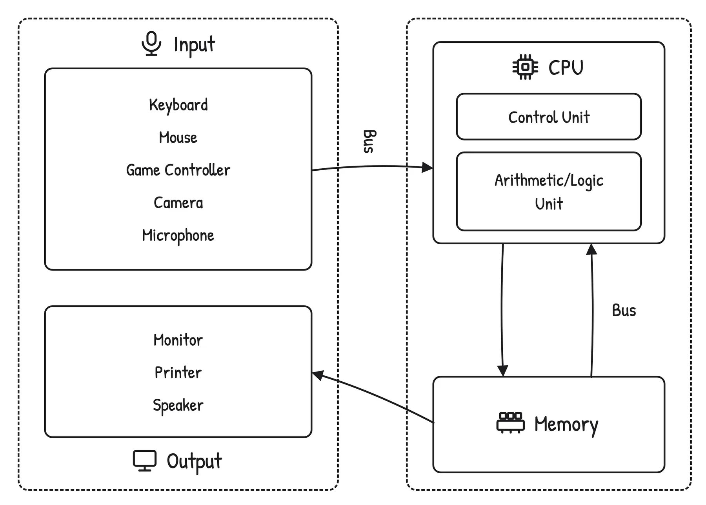
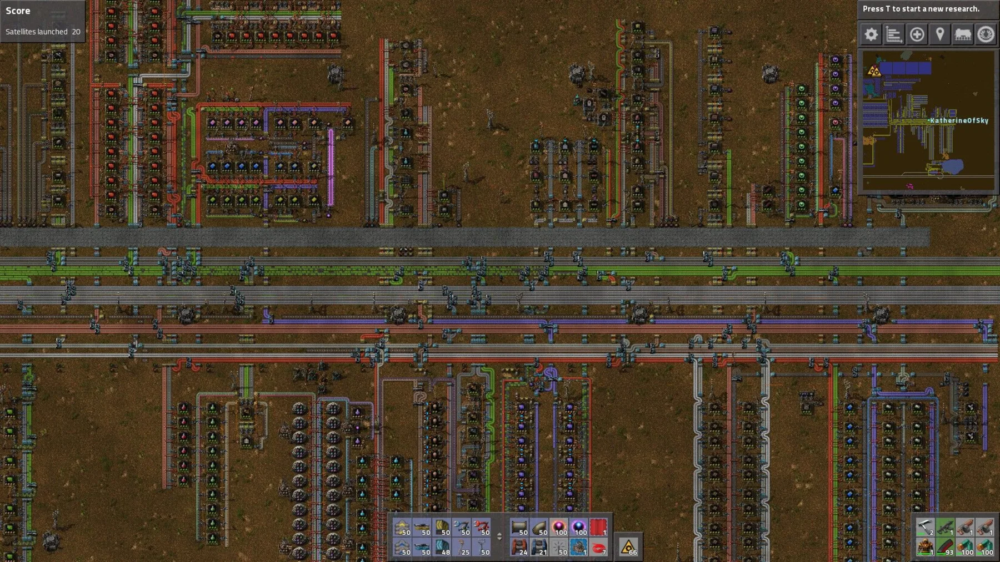
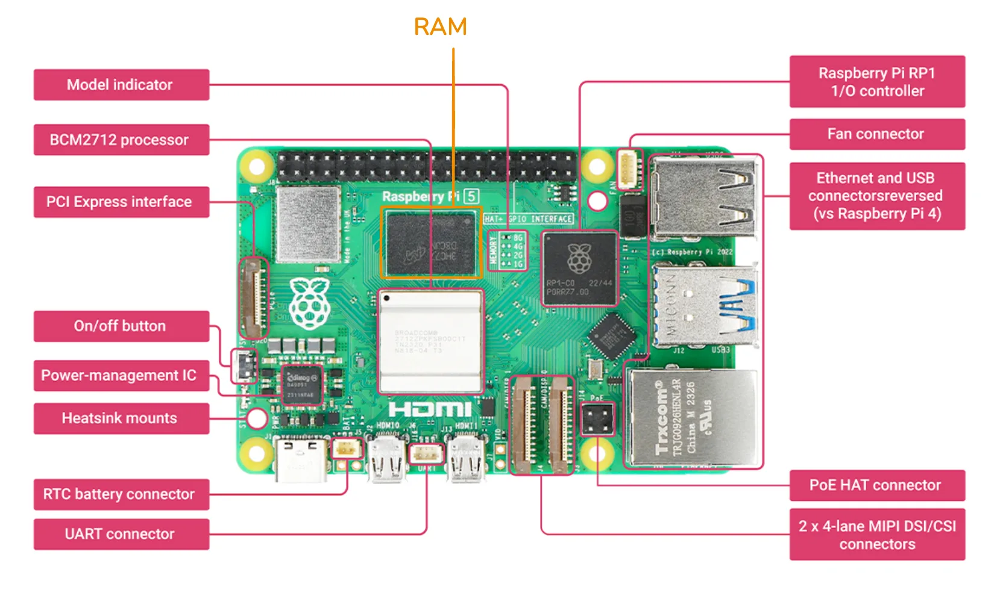

+++
title = "AI Hardware Infrastructure"
date = 2026-04-30
description = ""
weight = 21
aliases = [ "/ai-system/ai-compute-hardware/" ]

[extra]
chapter = "Module B.1"
+++

In the [introduction to Part B](@/ai-system/infra-deploy-ai/index.md), we noticed that our small AI API server gets noticeably slow once we plug in heavier models, and we wondered how companies like OpenAI and Google can serve much larger models to millions of users at once.
Both observations come back to hardware.
To understand why a laptop struggles where a data center does not, we first need to look at how a computer is actually put together, and then at how that design has been adapted for AI workloads.

In the meantime, vendors love to slap "AI" onto every new device.
Marketing pages keep talking about "AI computers" and "AI-ready" laptops as if a new kind of machine has been invented just for the hype.
The reality is much less dramatic.
In 1945, the Hungarian-American mathematician [John von Neumann](https://en.wikipedia.org/wiki/John_von_Neumann) sketched a design that would become the basis for almost every general-purpose computer built since.
Eighty years later, our smartphones, gaming PCs, the laptop you are reading this on, and even those new "AI computers" all still follow the same design.
The hardware has gotten dramatically faster, smaller, and cheaper, but the basic recipe has not changed.

In this module we walk through that classic design, called the Von Neumann architecture, using a restaurant kitchen as a running analogy.
Then we look at where it falls short for AI workloads, and what kinds of specialized chips have been added to fill those gaps.

{{ toc() }}


## Von Neumann Architecture

The [**Von Neumann architecture**](https://www.geeksforgeeks.org/computer-organization-architecture/computer-organization-von-neumann-architecture/) describes a computer as a small set of components working together: a processor that does the actual computing, a memory that stores both data and instructions, an input/output system that talks to the outside world, and a bus that connects everything.

To make these components feel less abstract, we will lean on a restaurant kitchen analogy throughout this section.
Imagine a busy kitchen with orders and recipes coming in, ingredients ready to be cooked, chefs preparing dishes, a pantry that stores both ingredients and recipe books, waiters carrying orders in and food out, and corridors connecting every part of the kitchen.
Each role in the kitchen maps to a component in the architecture, as we will see below.



The components of the Von Neumann architecture and how they relate to each other.


### Instructions and Data

Before looking at any of the components, it helps to be clear on the two kinds of information that flow through them.

[**Instructions**](https://www.geeksforgeeks.org/computer-organization-architecture/computer-organization-basic-computer-instructions/) tell the computer what to do, like a recipe in the kitchen.
A recipe is a step-by-step description of how to handle ingredients and tools:
```
1. Cut the onion into pieces.
2. Heat the pan to medium heat.
3. Add 2 tablespoons of oil.
4. Sauté the onions until golden.
```
A computer program is the same idea, only the steps operate on data instead of food:
```
1. LOAD dkk_price
2. MULTIPLY dkk_price by conversion_factor
3. STORE the result in usd_price
4. DISPLAY usd_price
```

**Data** is the information the instructions operate on, like the ingredients in the kitchen.
For the recipe above we need a few ingredients:
```
- 2 large onions
- Olive oil
```
For the program above we need a few values:
```
- dkk_price: 599
- conversion_factor: 0.1570
- usd_price: to be calculated
```
A key idea in the Von Neumann design is that instructions and data live in the same memory and look the same to the computer at the lowest level.
Both are just sequences of bits.
What makes one a program and the other a value is how the processor uses them.


### Architecture Components

#### Central Processing Unit (CPU)

The [**Central Processing Unit (CPU)**](https://www.geeksforgeeks.org/computer-science-fundamentals/central-processing-unit-cpu/) is the part that actually executes instructions on data, like the chefs in the kitchen who follow recipes to turn ingredients into dishes.
Modern CPUs are built from many sub-components, but for this course we will focus on the two essential ones: the control unit and the arithmetic logic unit.

The [**control unit (CU)**](https://www.geeksforgeeks.org/computer-organization-architecture/introduction-of-control-unit-and-its-design/) is like the executive chef who reads the orders and recipes, figures out what needs to happen next, and tells everyone else what to do.
In CPU terms it fetches the next instruction from memory, decodes it into an [operation code](https://en.wikipedia.org/wiki/Opcode) that says what to do and [operands](https://en.wikipedia.org/wiki/Operand#Computer_science) that say what to do it on, and signals the rest of the CPU to actually carry it out.

The [**arithmetic logic unit (ALU)**](https://www.learncomputerscienceonline.com/arithmetic-logic-unit/) is like the cooks who do the actual cooking, working off whatever the executive chef tells them.
It performs the elementary operations that make up every program: arithmetic (addition, subtraction, multiplication, division), logical operations (AND, OR, NOT, XOR), comparisons (equal, greater than, less than), and bit manipulation (shifts, rotations, and so on).
A modern CPU usually contains more than one ALU, so the same core can run several of these operations at once.

#### Memory

The [**memory**](https://www.geeksforgeeks.org/computer-science-fundamentals/computer-memory/) holds both instructions and data, like a pantry that stores both recipe books and ingredients on the same shelves.
Every cell in memory has a numerical address, similar to having labeled slots in the pantry, so the CPU can ask for any specific instruction or value directly without rummaging through the rest.

Two characteristics of memory matter for the rest of the discussion.
First, memory is *random-access*, meaning any address can be reached in roughly the same time, so the CPU does not pay extra to jump around.
Second, the memory we are talking about here is *volatile*, meaning turning the power off wipes the contents.
That is why your unsaved work disappears when the computer crashes.


#### Input/Output

The [**input/output (I/O) system**](https://www.geeksforgeeks.org/operating-systems/i-o-hardware-in-operating-system/) is how data and programs come into the computer from the outside world, and how results go back out, like the waiters who carry orders into the kitchen and dishes out to the customers.
On the input side we have devices like keyboards, mice, microphones, and cameras.
On the output side we have monitors, speakers, and printers.
Some devices, such as network cards and storage drives, do both.

Each I/O device is connected through a small piece of hardware called an *I/O controller* that takes care of the device-specific details, so the rest of the computer can treat all of them in a relatively uniform way.


#### Bus

The [**bus**](https://www.geeksforgeeks.org/computer-organization-architecture/what-is-a-computer-bus/) is the set of wires that move instructions and data between every other component, like the corridors and counters that let staff and trolleys carry orders, ingredients, and dishes around the kitchen.
A typical bus is split into three logical parts: an *address bus* that says which memory location or device to talk to, a *data bus* that carries the actual contents being moved, and a *control bus* that carries timing and coordination signals.

If you have ever played [Factorio](https://www.factorio.com/), the factory automation game, you have already seen the same idea.
Production lines feed into a main bus of conveyor belts, and any new machine you build can tap into that bus instead of being wired up individually.
The bus turns adding new components into a near-trivial change, which is exactly what makes computer architectures scalable.



A main bus in Factorio: production lines plug into it, much like CPU and memory plug into a computer's bus.


### How It All Fits Together

Now that we have all the pieces, it is worth tracing through how they actually work together.
We will use the small DKK-to-USD program from earlier as a running example.

Before anything else, the program (the instructions) and the input value `dkk_price = 599` have to be in memory.
A CPU cannot work directly with information sitting on a disk or arriving from a keyboard.
It can only operate on what is already in memory and reachable through the bus.
Getting things into memory is the I/O system's job. The program is loaded from storage when we launch it, and the input value comes in from a keyboard, a file, or a network request, all of which travel through I/O.

Once both are in memory, the CPU starts the actual work.
The control unit fetches the first instruction (`LOAD dkk_price`) from memory over the bus, decodes what it is asking for, and tells the CPU to load the value 599 from memory into itself.
The next instruction (`MULTIPLY dkk_price by conversion_factor`) follows the same fetch-decode-execute loop. The ALU takes 599 and 0.1570 and produces 94.04.
The remaining two instructions store that result back into memory and hand it off to the I/O system, which displays the number on the monitor.

Every step goes through the same machinery in some combination. The control unit decides what to do next, the ALU does the arithmetic, memory holds instructions and intermediate values, the I/O system shuttles things across the computer's boundary, and the bus carries everything between them.
The Von Neumann architecture is essentially this loop, repeated billions of times per second.

As a small but complete example, here is a [Raspberry Pi 5](https://www.raspberrypi.com/products/raspberry-pi-5/), a credit-card-sized computer often used for hobby projects and prototypes.



The components of the Von Neumann architecture, as they appear on a Raspberry Pi 5 board.

The CPU sits in the middle-left, labeled `BCM2712 processor`.
Like most modern CPUs, it has multiple cores, equivalent to having several chefs cooking in parallel in one kitchen.
The memory chip is right next to it, labeled `RAM`.
Memory is placed close to the CPU to keep the wires short, since longer wires mean longer access times, just like keeping prep counters close to the chefs makes their work faster.
Around the edges of the board are the I/O interfaces: a `PCI Express` slot for high-speed peripherals like SSDs, `Ethernet` and `USB` connectors, and `MIPI DSI/CSI` connectors for displays and cameras.
The `RP1 I/O controller` chip handles the bookkeeping for several of those interfaces.
Finally, if you look closely you can see thin copper traces running between all of these components.
Those traces are the bus, in physical form.

> Below are some additional resources for getting more comfortable with the Von Neumann architecture.
> - [A (very) brief history of John von Neumann (video)](https://www.youtube.com/watch?v=QhBvuW-kCbM), a short tour through Von Neumann's life and work
> - [Computer architecture explained (video playlist)](https://www.youtube.com/playlist?list=PL9vTTBa7QaQOoMfpP3ztvgyQkPWDPfJez), a more systematic walkthrough of the same concepts
> - [Computer architecture explained with Minecraft (video)](https://www.youtube.com/watch?v=dV_lf1kyV9M), if you would rather see the architecture built out of redstone


## Where Generic Hardware Falls Short

The architecture above describes a *general-purpose* machine.
It can run web browsers, video games, spreadsheets, compilers, and AI models, all on the same hardware.
That generality is the reason CPUs are so dominant. One design covers nearly every workload we throw at it.
Generality has a price, though, and AI workloads are where the price is most visible.
Two limitations of CPUs show up clearly the moment we try to use them for serious AI work.


### Sequential Speed vs Parallel Demand

CPUs are tuned for [sequential execution](https://www.starburst.io/blog/parallel-vs-sequential-processing/).
Given any one instruction, a CPU core wants to finish it as quickly as possible before moving on to the next one.
This is the right trade-off for tasks where each step depends on the previous one, like parsing a file or following the logic of a complex program.
Modern CPUs do have multiple cores so they can run several such sequences in parallel, but the count is small, usually around 8 cores in a consumer laptop and up to a [few dozen](https://www.amd.com/en/products/processors/desktops/ryzen/9000-series/amd-ryzen-9-9950x3d.html) in a high-end desktop CPU.

AI models, especially neural networks, are a very different shape of work.
Most of the math inside a transformer or convolutional network is matrix multiplication, where each output element is the result of an independent weighted sum.
For a single matrix multiplication there can be hundreds of thousands of these tiny calculations, and none of them depend on each other.
A CPU faced with this kind of work is a bit like a university professor faced with a giant stack of basic arithmetic worksheets.
Each problem is well below the professor's pay grade, but solving them one by one still takes forever.
A whole class of primary school students, each only able to do basic arithmetic, can power through the same stack much faster.


### Memory Bandwidth Bottleneck

Speed is not the only issue.
Even when the CPU is fast enough to compute, it often spends most of its time waiting for data to arrive from memory.
This is what people often call the [**memory wall**](https://medium.com/riselab/ai-and-memory-wall-2cb4265cb0b8). Processor speed has improved much faster than memory speed over the last few decades, and the gap keeps growing.

There are two related but different things to track here.
*Latency* is how long a single piece of data takes to arrive once requested.
*Bandwidth* is how much data can be moved per second.
A CPU's memory is built around low latency, since programs typically jump around memory reading small values, and any wait directly slows down the next instruction.
AI workloads are the opposite.
The matrices used in a neural network are large and stored in contiguous blocks, and the CPU often wants to bring in millions of values one after another.
What matters here is bandwidth, and CPU memory hits a ceiling pretty quickly. Typical [DDR5](https://en.wikipedia.org/wiki/DDR5_SDRAM) memory peaks at around 50 to 100 GB/s.
For modern AI models, that ceiling becomes the bottleneck long before the CPU itself runs out of compute.


## Specialized Hardware for AI

The two limitations above point to the same conclusion. AI workloads need hardware that does many simple operations in parallel and feeds them with high-bandwidth memory.
Several families of chips have been built around this idea, each at a different sweet spot of generality and efficiency.


### Graphics Processing Unit (GPU)

The first and most important is the [**Graphics Processing Unit (GPU)**](https://www.nvidia.com/en-us/geforce/graphics-cards/50-series/rtx-5090/).
As the name suggests, GPUs were originally designed for computer graphics, not AI.
Rendering a 3D scene means computing the color of millions of pixels every frame, where each pixel can be processed independently from the rest.
To do that quickly, GPUs were built around two ideas: lots of small cores running in parallel, and memory designed for moving large chunks of data fast.

While a modern CPU has on the order of 10 to 100 cores, a modern GPU contains thousands of much smaller cores, each capable of only simple instructions.
Combined, they can power through highly parallel workloads far faster than any CPU.

GPU memory is also built differently from CPU memory.
Instead of [DDR5](https://en.wikipedia.org/wiki/DDR5_SDRAM), high-end gaming GPUs use [GDDR7](https://en.wikipedia.org/wiki/GDDR7_SDRAM) memory, which is built for bandwidth and can deliver around 1.8 TB/s.
Data center GPUs go further with [High Bandwidth Memory (HBM)](https://en.wikipedia.org/wiki/High_Bandwidth_Memory), reaching above 2 TB/s in current generations.

What turned GPUs into the default hardware for AI is that the operations behind 3D graphics and the operations behind neural networks are essentially the same kind of math. Both come down to lots of independent matrix and vector arithmetic on large blocks of data.
Game developers spent decades pushing GPU vendors to make these operations faster, and AI researchers eventually realized they could ride on top of all that work.
The unfortunate side effect is that today, GPU vendors care much more about AI customers than gamers, reflected in the price tags of modern GPUs.


### Tensor Processing Unit (TPU)

GPUs are still general-purpose enough to handle graphics, scientific simulation, video encoding, and a long list of other tasks.
That generality limits how efficient GPUs can be on AI workloads specifically.
So as the AI industry grew, hardware vendors started designing chips that target only AI workloads.

[**Tensor Processing Units (TPUs)**](https://cloud.google.com/tpu) are Google's family of such chips.
The core idea is to lay out a grid of very simple processors, called a *systolic array*, where each processor receives data from its neighbor, multiplies and adds it, and passes the result on.
Data flows through the grid like a wave, and the whole array completes a matrix multiplication in one coordinated pass.

Because the design only needs to support a small set of operations, a TPU can squeeze out more performance per watt and per dollar than a GPU on the same workload.
The trade-off is that it is useless for anything else.
You cannot play a video game on a TPU, run a database, or render a movie.
TPUs therefore live almost exclusively in data centers, mostly Google's own.


### Neural Processing Unit (NPU)

GPUs and TPUs target the high end of the spectrum, where power and cooling are not the main concern.
The other end of the spectrum is consumer devices, like phones, tablets, and laptops, where battery life matters more than raw throughput.
The chip family targeting that end is the [**Neural Processing Unit (NPU)**](https://en.wikipedia.org/wiki/Neural_Engine).

NPUs are built for *inference*, meaning running a pre-trained model rather than training a new one.
Inference uses far less compute than training and tolerates lower numerical precision, so NPUs typically use lower-precision arithmetic such as 8-bit or even 4-bit numbers instead of the 16- or 32-bit precision used during training.
Lower precision means smaller circuits, less data to move, and lower power, all of which fit a phone or laptop.

Different vendors brand their NPUs differently.
Apple calls theirs the [Neural Engine](https://en.wikipedia.org/wiki/Neural_Engine), integrated into iPhones since the A11 chip and into Macs starting with the [M-series chips](https://en.wikipedia.org/wiki/Apple_M4#NPU).
Qualcomm calls theirs the [AI Engine](https://www.qualcomm.com/products/technology/processors/ai-engine), shipped in their mobile and laptop chips like the [Snapdragon X Elite](https://www.qualcomm.com/products/mobile/snapdragon/laptops-and-tablets/snapdragon-x-elite).
AMD ships [Ryzen AI](https://www.amd.com/en/partner/articles/ryzen-ai-300-series-processors.html) NPUs in their newer laptop processors.
The implementation details vary, but the goal is the same. All of them aim to provide enough on-device AI to run features like dictation, image enhancement, and small language models without offloading to a cloud.


### Coming Back to Von Neumann

Specialized hardware is what makes most modern AI systems practical, but it has not replaced the Von Neumann architecture.
Look at any modern computer, even a "real" AI computer in a data center, and you will find the same picture.
A CPU sits at the center, with GPUs, TPUs, or NPUs attached as accelerators through the bus, and all of them share access to memory and are coordinated by the operating system running on the CPU.
The CPU is still the executive chef.
The accelerators are highly skilled sous chefs hired for one specialty.

For a recent illustration, look at what is happening to RAM and storage prices as of writing.
Even with all the specialized acceleration involved, the hyperscalers building modern AI data centers still need enormous amounts of regular RAM and storage, the same Von Neumann components our laptops use, and they are buying up most of what gets made.
[Consumer DRAM and SSD prices](https://spectrum.ieee.org/dram-shortage) have roughly doubled over the past year, and [data centers are projected to consume around 70% of all DRAM produced in 2026](https://www.tomshardware.com/pc-components/ram/data-centers-will-consume-70-percent-of-memory-chips-made-in-2026-supply-shortfall-will-cause-the-chip-shortage-to-spread-to-other-segments).
The accelerators may handle the actual AI math, but a Von Neumann computer is still what hosts them.

The genius of the Von Neumann design is not in any single component but in this modular shape.
Each new generation of hardware can plug in as just another component on the bus, and software running on the CPU still coordinates everything.
Going back to the Factorio analogy, even when an update adds new types of machines, you still feed them off the same main bus you already had.
The factory grows, but the recipe for building factories does not change.

> Below are some additional resources for comparing the chip families covered above.
> - [CPU vs GPU vs TPU vs DPU vs QPU (video)](https://www.youtube.com/watch?v=r5NQecwZs1A), a short side-by-side comparison of common chip families
> - [The "AI and memory wall" article (blog post)](https://medium.com/riselab/ai-and-memory-wall-2cb4265cb0b8), if you want to dig into the data behind the bandwidth argument
> - [GPU Gems 3 (book)](https://developer.nvidia.com/gpugems/gpugems3/part-ii-light-and-shadows/chapter-10-parallel-split-shadow-maps-programmable-gpus), a free NVIDIA book whose chapters are good entry points into how GPUs are used for graphics


## Exercise: Run a Model on Different Hardware

The point of this exercise is to feel the difference between CPU and GPU on the same model.
We will use [**Google Colab**](https://colab.research.google.com/), a hosted Jupyter notebook service that gives anyone with a Google account a few free hours of CPU, GPU, and sometimes TPU runtime per day.
No local setup is needed.

You can also run this exercise on a computing platform provided by the university, such as [**AI-LAB**](https://hpc.aau.dk/ai-lab/), the university's GPU cluster for student projects.
It uses a Slurm job scheduler instead of an interactive notebook, but the underlying code is the same, and you get access to dedicated GPUs without the time limits of Colab's free tier.

Open a new Colab notebook or an AI-LAB session and try the following:

1. Reuse the image classification setup from [Module A.4](@/ai-system/ai-api-server/index.md#plugging-ai-models-into-endpoints), which is a `torchvision` ResNet-18 with its preprocessing transforms and ImageNet labels.
   Move the model and the input batch onto whichever device the runtime exposes using `.to(device)`, where `device` is `"cuda"` for GPU and `"cpu"` otherwise.
2. From the Colab `Runtime` menu, switch the runtime hardware between `CPU` and `GPU`.
   After each switch, restart the runtime and rerun the notebook so the model is reloaded onto the new device.
3. Time how long the model takes to classify one image on each device.
   Run it a few times and take the average, since the first run also includes some warm-up overhead.

A few extensions to deepen the experience:

1. Print the number of parameters in the model with `sum(p.numel() for p in model.parameters())`.
   Multiply that by the size of one parameter, which is 4 bytes for 32-bit floats, to estimate how much memory the model occupies.
2. Switch to a heavier model, such as ResNet-152 or a small Hugging Face vision transformer, and repeat the timing comparison.
   The gap between CPU and GPU should grow noticeably as the model gets larger.
3. Try classifying a small batch of images at once instead of one at a time.
   GPU performance usually scales much better with batch size than CPU performance does, since the GPU can keep more of its cores busy.

By the end you should have a hands-on feel for why specialized hardware matters for AI, and a number you can point to the next time someone tries to sell you an "AI computer".
