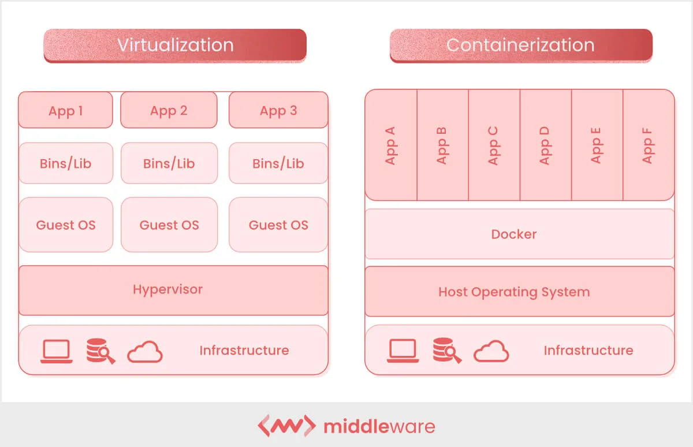
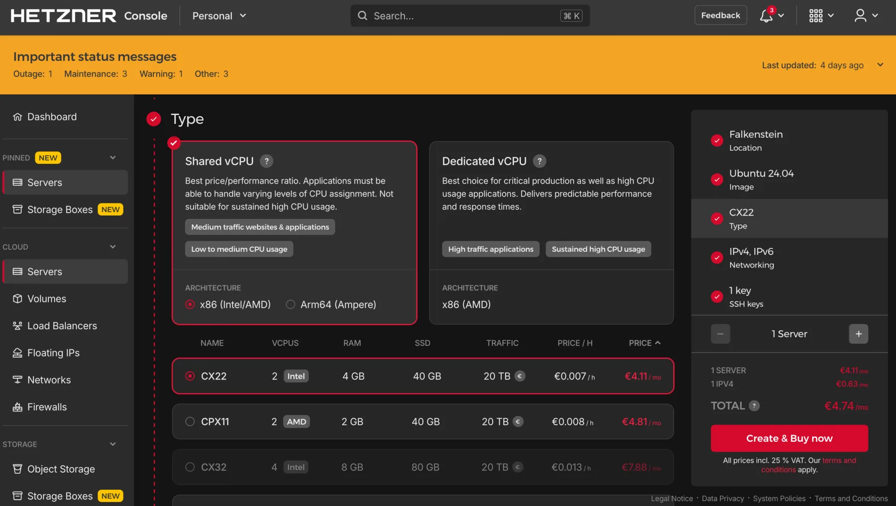
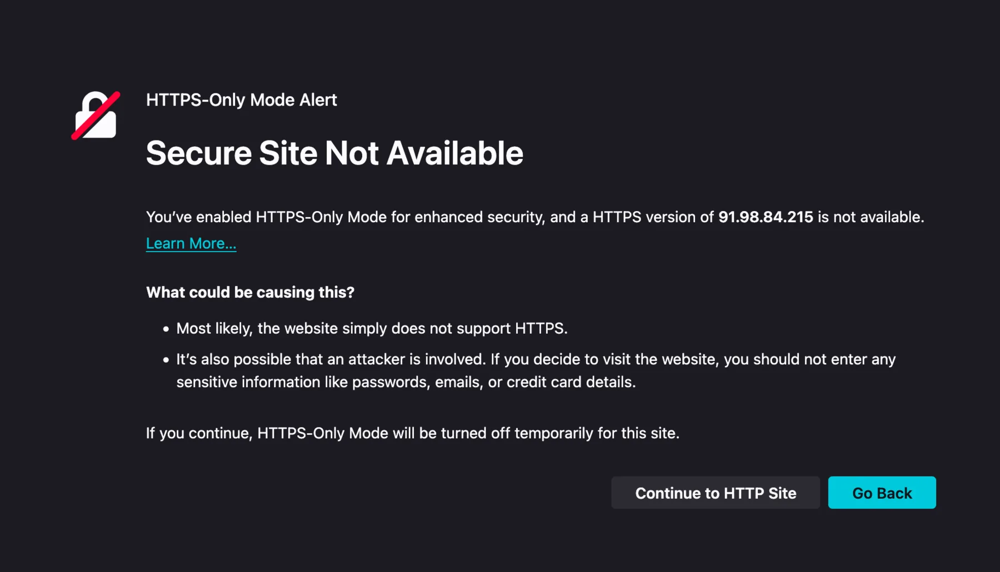

+++
title = "Cloud Deployment"
date = 2026-05-07
description = ""
weight = 24

[extra]
chapter = "Module B.4"
+++

In [Module B.3](@/ai-system/ai-container/index.md) we packaged our AI API server into a container image that anyone with Docker can pull and run.
That solves the *how do we ship the software* problem, but it leaves the *whose machine does it run on* problem wide open.

Running the container on our laptop is fine for development, but as soon as we want anyone else to use the API, our laptop becomes a bad host.
We probably do not want to leave it powered on 24/7, our home internet connection might not be reliable, and the moment the laptop goes to sleep the API stops responding.

The standard answer to this is to rent a computer somewhere else and run our container there.
That somewhere else is what people call ["the cloud"](https://en.wikipedia.org/wiki/Cloud_computing): a fleet of computers sitting in [data centers](https://en.wikipedia.org/wiki/Data_center) operated by companies that specialize in keeping them powered, cooled, and connected to the internet.
We rent some slice of that capacity by the hour or the month, log into it remotely, and run whatever we want.

In this module we walk through what the cloud actually is under the hype, look at the main types of services cloud providers sell, and then deploy our containerized AI server to a small rented machine.
Once the server is running publicly, we will also cover what it takes to make it look professional: a domain name, an HTTPS certificate, and a reverse proxy in front.

{{ toc() }}


## What Is "the Cloud"?

"The cloud" is not a new kind of computing or a special technology.
It is just other people's computers that you can rent over the internet.
The name comes from old network diagrams, where engineers would draw a fluffy cloud whenever they wanted to convey "and somewhere out there is the network, but the details do not matter for this picture".
Over time the symbol got attached to the computing resources sitting on the other side of that cloud, and the name stuck.

The reason cloud computing exists at the scale it does today is fundamentally an economic argument.
Big internet companies like Amazon and Google have to size their infrastructure for peak load, holiday shopping spikes, viral search traffic, and the like, which means most of their hardware sits idle most of the time.
Around 2006, Amazon noticed that this idle capacity could be rented to other people who would otherwise have to buy their own servers, and the modern cloud industry was born from that observation.
What started as monetizing leftover capacity has since grown into a major business, with hyperscalers building data centers specifically to rent out.

For us as customers, the upside is straightforward: we get a computer in minutes instead of weeks, we pay for what we use rather than buying hardware up front, and someone else worries about hardware failures, electricity, and network connectivity.
The downside is that we are now dependent on the provider's pricing, availability, and policies, which can become a real concern as we will see later in the module.


### Virtualization

The technical trick that makes the cloud practical is [**virtualization**](https://en.wikipedia.org/wiki/Virtualization).
A single physical server in a data center is a powerful machine, often with dozens of cores and hundreds of gigabytes of RAM, far more than any small customer needs.
Virtualization lets the provider slice that physical machine into many smaller [**virtual machines (VMs)**](https://en.wikipedia.org/wiki/Virtual_machine), each behaving like a complete computer with its own CPU, memory, disk, and operating system, all running independently and unaware of each other.
A small piece of software called a [**hypervisor**](https://en.wikipedia.org/wiki/Hypervisor) sits between the VMs and the physical hardware, dividing the real resources and making sure no VM can interfere with another.

This may sound familiar from [Module B.2](@/ai-system/container-fundamentals/index.md#what-is-a-container), where we contrasted containers with VMs.
Both provide isolation, but at different levels.
A VM virtualizes the entire hardware and runs its own kernel, so it can run a completely different operating system from the host (a Linux VM on a Windows host, for example).
A container shares the host's kernel and only ships userspace files, which makes it lighter but means the host kernel ultimately decides what is allowed.
In practice, cloud providers rely on both: the hypervisor splits each physical server into VMs that are sold to different customers, and inside each VM the customer typically runs containers to package and deploy their applications.

When we rent a "VM" or an "instance" from a cloud provider, what we are getting is exactly this: a slice of a real machine, running its own operating system, accessible to us alone over the network.
From inside the VM it looks no different from a small dedicated server.



Virtualization and containerization side by side: each VM carries its own guest OS on top of the hypervisor, while containers share the host kernel through Docker.

> Below are some additional resources for getting more comfortable with cloud and virtualization concepts.
> - [Cloud computing in 6 minutes (video)](https://www.youtube.com/watch?v=M988_fsOSWo) by Simplilearn, a short overview at a slower pace
> - [Containers vs VMs: what's the difference? (video)](https://www.youtube.com/watch?v=cjXI-yxqGTI) by IBM Technology, a side-by-side comparison
> - [What is a hypervisor? (article)](https://www.redhat.com/en/topics/virtualization/what-is-a-hypervisor) by Red Hat, a written walkthrough of the technology behind virtualization


> The cloud market is dominated by three **hyperscalers**: [Amazon Web Services (AWS)](https://aws.amazon.com/), the original from the spare-capacity story above and still the largest by catalog and revenue; [Google Cloud Platform (GCP)](https://cloud.google.com/), known for data and ML services and competitive GPU pricing; and [Microsoft Azure](https://azure.microsoft.com/), the natural choice for organizations already in the Microsoft ecosystem. They offer roughly the same vast catalog of services across regions all over the world.
>
> Beyond the big three, plenty of smaller providers exist for specific needs.
> [DigitalOcean](https://www.digitalocean.com/), [Linode](https://www.linode.com/), and [Vultr](https://www.vultr.com/) offer clean interfaces and predictable pricing, often a better fit for individual developers and small projects.
> [Lambda](https://lambdalabs.com/), [CoreWeave](https://www.coreweave.com/), and [RunPod](https://www.runpod.io/) specialize in renting GPU servers for training and inference, usually at lower prices than the equivalent hyperscaler instances.
> European providers like [Hetzner](https://www.hetzner.com/) (Germany), [OVHcloud](https://www.ovhcloud.com/) (France), and [Scaleway](https://www.scaleway.com/) (France) keep data within EU jurisdiction and frequently undercut the hyperscalers on price for basic VMs.
>
> For most of this course it does not matter which one we pick, since the basic ideas (rent a VM, install Docker, run your container) translate across all of them.


## Common Cloud Services

Inside any major provider's catalog, the same handful of service categories show up under different names.
Knowing what each category does helps us pick the right one for our AI server, instead of getting lost in branded acronyms.

**Virtual machines** are the foundational service: a rented VM you can SSH into and treat as your own server.
You install whatever you want, run whatever you want, and get charged per hour the VM is running, regardless of how busy it is.
This is the closest thing to a traditional server in the catalog, and it gives the most direct control.
Examples are [EC2](https://aws.amazon.com/ec2/) on AWS, [Compute Engine](https://cloud.google.com/products/compute) on GCP, and [Virtual Machines](https://azure.microsoft.com/en-us/products/virtual-machines) on Azure.

**Container services** run our Docker containers without us managing the underlying VM at all.
The provider takes care of the operating system and runtime, and we hand them an image to run, often with the option of automatically scaling the number of containers up and down with traffic.
Examples are [ECS](https://aws.amazon.com/ecs/) and [EKS](https://aws.amazon.com/eks/) on AWS, [Cloud Run](https://cloud.google.com/run) on GCP, and [Container Apps](https://azure.microsoft.com/en-us/products/container-apps) on Azure.

**GPU instances** are virtual machines with one or more GPUs attached, used for training models or running inference on heavier ones.
They are powerful but also among the most expensive line items in the catalog: a top-end NVIDIA H100 instance can run several dollars per hour, and during industry-wide demand spikes they can be hard to find at all.
Examples are AWS [P-series and G-series](https://aws.amazon.com/ec2/instance-types/), GCP [A-series and G-series](https://cloud.google.com/compute/docs/gpus), and Azure [NC and ND-series](https://azure.microsoft.com/en-us/pricing/details/virtual-machines/series/).

> A few more service categories are worth knowing about, even though we will not use them directly in this course:
>
> [**Managed AI platforms**](https://aws.amazon.com/sagemaker/) (like SageMaker on AWS, [Vertex AI](https://cloud.google.com/vertex-ai) on GCP, or [Azure Machine Learning](https://azure.microsoft.com/en-us/products/machine-learning) on Azure) sit one more layer of abstraction above container services and are tailored for ML workflows: training jobs, model registries, A/B testing different model versions, and one-click deployment. They are the easiest path from "I have a model" to "I have an HTTPS endpoint serving it", at the cost of writing code against the provider's APIs.
>
> [**Object storage**](https://aws.amazon.com/s3/) (like S3 on AWS, [Cloud Storage](https://cloud.google.com/storage) on GCP, or [Blob Storage](https://azure.microsoft.com/en-us/products/storage/blobs) on Azure) is a separate category for storing large blobs of data: training datasets, model checkpoints, user uploads. It is not designed for low-latency access, so we do not serve API requests directly from it, but it is extremely cheap and durable, with files automatically replicated across data centers.
>
> [**Serverless functions**](https://aws.amazon.com/serverless/) (like AWS Lambda or Google Cloud Functions) run a piece of code in response to an event, with no long-running server to manage, billed per millisecond of execution. Useful for short tasks but a poor fit for AI servers that need to keep large models loaded in memory.
>
> [**Managed databases**](https://aws.amazon.com/products/databases/) (like RDS, Cloud SQL, or Cosmos DB) replace running your own SQL or NoSQL database on a VM with a database the provider operates and backs up for you. A natural upgrade from the SQLite database in our [Module A.4](@/ai-system/ai-api-server/index.md) server once we outgrow it.


### Choosing a Service for Our AI Server

A reasonable first instinct when browsing a cloud catalog is to reach for the most automated option: a managed container service or a managed AI platform that promises "just give us your image, we handle the rest".
For learning purposes, and for small AI services in general, we will argue the opposite is usually wiser: start with a plain VM and run our container on it ourselves.

The first reason is predictable cost.
A small VM rents at a fixed hourly or monthly rate, regardless of traffic, so the bill at the end of the month is exactly what we expect.
Usage-based services, on the other hand, charge per request, per second of compute, per gigabyte of bandwidth, and so on, which sounds appealing but can produce unpleasant surprises.
Stories of accidental cloud bills are easy to find: a static documentation site that suddenly cost six figures on Netlify, four-figure S3 charges overnight from public buckets being scraped, GPU instances left running through the weekend.
The [Serverless Horrors](https://serverlesshorrors.com/) site collects them.
None of this happens with a fixed-price VM.

The second reason is transparency.
On a VM we install Docker ourselves, we run our container with `docker run`, and when something breaks we can SSH in, check `docker logs`, and inspect the system the same way we would on our laptop.
Managed services tend to wrap our application in their own scheduling, networking, and logging layers, which is a great convenience when everything works and a frustrating black box when it does not.

The third reason is portability and avoiding lock-in.
A container running on a VM can be moved to any other VM at any other provider, since all we are using is the standard Docker runtime.
A function written against AWS Lambda's APIs or a model deployed through SageMaker is much harder to extract: the code has to be rewritten, the data formats may be incompatible, and the IAM configuration and operational habits all have to be redone.
Surveys regularly find [vendor lock-in](https://journalofcloudcomputing.springeropen.com/articles/10.1186/s13677-016-0054-z) ranks among the top concerns enterprises have about cloud adoption, and individual developers feel it just as much when prices change or a service is discontinued.

For our containerized image classification API server, a small VM at any provider is more than enough.
Something with 2 vCPUs and 4 GB of RAM rents for somewhere in the 5 to 20 USD per month range and is a comfortable fit for the workload.
We can always grow into a bigger VM, or migrate to a managed service later, once we know what we actually need.

> Below are some additional resources on the trade-offs of cloud services.
> - [Why we're leaving the cloud (blog post)](https://world.hey.com/dhh/why-we-are-leaving-the-cloud-654b47e0) by 37signals, a well-known case study of a company that moved off the hyperscalers back onto owned hardware
> - [The cost of vendor lock-in (article)](https://journalofcloudcomputing.springeropen.com/articles/10.1186/s13677-016-0054-z), an academic look at why cloud migrations are so painful


## Deploying to a Cloud VM

Every provider has a slightly different web console, but the deployment flow is always the same: create a VM, SSH into it, install Docker, run the container.
The mechanics of SSH, `apt`, and `docker run` are the same as on any other Linux box (such as the AAU servers you may have used in earlier courses), so we will only highlight the cloud-specific bits here.

When creating the VM, [Ubuntu LTS](https://ubuntu.com/about/release-cycle) (`24.04` at the time of writing) is the safe default operating system, and 2 vCPUs with 4 GB of RAM and 20 to 30 GB of disk is enough for our CPU-only classifier.
Two settings deserve attention because they are the most common cause of "I deployed it but it does not respond": make sure the VM is assigned a public IP address, and open ports 22 (SSH), 8000 (our API), and the default HTTP and HTTPS ports 80 and 443 in the cloud firewall (called *security groups* on AWS, *firewall rules* on GCP, *network security groups* on Azure). We will come back to why ports 80 and 443 matter in the [next section](#going-public-domains-and-https).
Cloud firewalls deny everything by default, so anything we do not explicitly allow will be unreachable from outside, regardless of what the VM itself is doing.
Finally, paste in an SSH public key so we can log in without a password; if you do not have one yet, [DigitalOcean's tutorial](https://www.digitalocean.com/community/tutorials/how-to-configure-ssh-key-based-authentication-on-a-linux-server) walks through generating and installing one.



Creating a VM in the Hetzner Cloud console: pick a server type (here a shared-vCPU `CX22` with 2 vCPUs and 4 GB of RAM), an OS image (Ubuntu 24.04), and an SSH key, then press "Create & Buy now". Other providers' consoles look different but ask for the same handful of choices.

Once the VM boots, SSH in, update the system (`sudo apt update && sudo apt upgrade -y`), and install Docker following the [official Docker install guide for Ubuntu](https://docs.docker.com/engine/install/ubuntu/).
With Docker in place, the container side is identical to what we already did in [Module B.2](@/ai-system/container-fundamentals/index.md#using-off-the-shelf-containers) and [Module B.3](@/ai-system/ai-container/index.md): pull the image we pushed in B.3 (or transfer the project with [`scp`](https://www.man7.org/linux/man-pages/man1/scp.1.html) and build it on the VM), then run it with the same `docker run -d -p 8000:8000` we used locally.
One flag worth adding on a server we want to keep running 24/7 is `--restart unless-stopped`, which tells the Docker daemon to bring the container back up if it crashes or if the VM reboots:
```bash
docker run -d --name ai-server -p 8000:8000 --restart unless-stopped \
    yourusername/my-ai-server:1.0
```
To verify the container is reachable from the public internet, send a request to it from your laptop:
```bash
curl http://<vm-ip>:8000
```
If the request hangs, the culprit is almost always a closed port: either the cloud-level firewall above, or a host-level firewall like [UFW](https://help.ubuntu.com/community/UFW) if you enabled one on the VM.

> Once we move beyond a single VM and a single container, manually running `apt install` and `docker run` over SSH stops scaling.
> The next layer of tooling automates the whole VM setup as code:
> - [**Ansible**](https://www.ansible.com/) lets us describe a sequence of steps (install Docker, copy these files, start this container) in YAML, and run that script against any number of remote machines over SSH.
> - [**Terraform**](https://www.terraform.io/) and its open-source fork [**OpenTofu**](https://opentofu.org/) describe the cloud resources themselves (VMs, networks, firewall rules) as code, and apply those descriptions through provider APIs.
> - [**NixOS**](https://nixos.org/) goes further and describes the entire operating system declaratively, so reproducing a server is just rebuilding from the same configuration file.
>
> All of these matter once the number of servers grows past what we can keep track of by hand. For one or two VMs, plain SSH is fine.


## Going Public: Domains and HTTPS

The container is now reachable at `http://<vm-ip>:8000`, which is technically a working public AI service but not one most people would actually use.
Two things are missing.

First, as we discussed in [Module A.1](@/ai-system/api-fundamentals/index.md#network-fundamentals), an IP address is not how most people find things on the internet: it is hard to remember, carries no meaning, and is also fragile.
The moment we move to a different VM (or a different cloud provider), every client that hardcoded the IP breaks.
Second, the connection is over plain HTTP, which means any network in between (the public Wi-Fi a user is on, their ISP, anyone running middleboxes along the way) can read and modify the traffic.
Modern browsers know this and increasingly refuse to even talk to non-HTTPS endpoints from HTTPS pages, a policy called [mixed content blocking](https://developer.mozilla.org/en-US/docs/Web/Security/Mixed_content).

The fix on both fronts is standard infrastructure: a domain name and an HTTPS certificate.


### Domains and DNS

We saw in [Module A.1](@/ai-system/api-fundamentals/index.md#network-fundamentals) that an IP address is the actual location of a server on the network, and that a domain name is the human-friendly handle pointing to that location.
The system that translates domain names into IP addresses is called the [**Domain Name System (DNS)**](https://www.cloudflare.com/learning/dns/what-is-dns/), and it is one of the oldest pieces of internet infrastructure still in active use.

DNS works as a globally distributed lookup service.
When a browser visits `api.example.com`, it asks a DNS resolver "what IP is this?", the resolver works through a chain of DNS servers (root servers, top-level domain servers for `.com`, then the authoritative servers for `example.com`), and eventually returns an IP address.

Out of the whole chain, the only part a domain owner controls is what their own authoritative servers respond with, and we configure that through the [**DNS records**](https://www.cloudflare.com/learning/dns/dns-records/) we publish for the domain.
Each record is a small piece of data that maps a name to an address or other resource.
The most important one for us is the **A record**, which maps a name to an IPv4 address.
For our server, we want a record like:
```
api.example.com.   A   <vm-ip>
```
With this in place, anyone resolving `api.example.com` gets back our VM's IP, and the server they reach is the one we just deployed.

To get a domain, we have two paths.
The free option is a service like [**DuckDNS**](https://www.duckdns.org/), which gives anyone a free subdomain like `myaiapi.duckdns.org` that they can point at any IP.
This is perfect for a learning exercise.
The paid option is buying our own domain from a registrar like [Cloudflare Registrar](https://www.cloudflare.com/products/registrar/), [Porkbun](https://porkbun.com/), or [Namecheap](https://www.namecheap.com/).
A long, ordinary `.com` is in the 10 to 15 USD per year range, but the price has effectively no upper limit: short and common names are sold as "premium" domains and can cost hundreds, thousands, or even millions of USD.
With our own domain we can choose any name we like (and can afford), and control the DNS through the registrar's dashboard.

Once the A record is created and given a few minutes to propagate, we can verify it from our laptop:
```bash
dig +short api.example.com
```

> Below are some additional resources for getting comfortable with how DNS works.
> - [Everything you need to know about DNS (video)](https://www.youtube.com/watch?v=27r4Bzuj5NQ) by ByteByteGo, part of the Crash Course System Design series, a short walkthrough of the lookup chain
> - [How a DNS server works (video)](https://www.youtube.com/watch?v=mpQZVYPuDGU) by PowerCert Animated Videos, an animated tour of the same chain at a slower pace
> - [What is DNS? Introduction to DNS (article)](https://aws.amazon.com/route53/what-is-dns/) by AWS, a written explanation that doubles as the intro to AWS's own DNS service
> - [How does DNS work? (drawing)](https://drawings.jvns.ca/dns/) by Julia Evans, a one-page hand-drawn comic if a single picture is more your style


### Why HTTPS

With a domain pointing at our server, the next problem is the protocol.
HTTP traffic is unencrypted, which has a few concrete consequences.
Anyone on the network path can read the request bodies and responses, including any user data or API keys flowing through, and they can also modify the traffic by injecting their own content or stripping ours, which is how some ISPs have inserted ads into web pages in the past.
On top of that, modern browsers warn or outright block users from interacting with HTTP endpoints, especially when the request originates from an HTTPS page.



Firefox's HTTPS-Only Mode blocks plain-HTTP visits to a server reached by IP address. Most modern browsers ship with similar protections enabled by default, which is one reason a public AI service really needs HTTPS.

[**HTTPS**](https://en.wikipedia.org/wiki/HTTPS) (HTTP over [TLS](https://en.wikipedia.org/wiki/Transport_Layer_Security)) wraps the HTTP traffic in an encrypted, authenticated tunnel.
It does two things at once: it encrypts the traffic so anyone watching the network sees only scrambled data instead of the real request and response, and it lets the client verify that it is actually talking to the real `api.example.com` (not an impostor) using a [**certificate**](https://en.wikipedia.org/wiki/Public_key_certificate) issued by a trusted [**certificate authority (CA)**](https://en.wikipedia.org/wiki/Certificate_authority).

For a long time, certificates from trusted CAs cost real money, which kept HTTPS out of small projects.
That changed in 2015 when the nonprofit [**Let's Encrypt**](https://letsencrypt.org/) started issuing free, automated certificates, valid for 90 days and renewable indefinitely.
Today Let's Encrypt has issued certificates for hundreds of millions of sites, and there is no good reason for any new public service to launch without HTTPS.

> Below are some additional resources for getting comfortable with HTTPS, TLS, and Let's Encrypt.
> - [SSL, TLS, HTTPS explained (video)](https://www.youtube.com/watch?v=j9QmMEWmcfo) by ByteByteGo, a short overview of how the three terms relate and what each one actually does
> - [TLS handshake explained (video)](https://www.youtube.com/watch?v=86cQJ0MMses) by Computerphile, a deeper walkthrough of the messages exchanged when a browser opens an HTTPS connection
> - [How HTTPS works (comic)](https://howhttps.works/) by DNSimple, an illustrated walkthrough of the TLS handshake and certificates
> - [Let's Encrypt: how it works (article)](https://letsencrypt.org/how-it-works/), the canonical explanation of the protocol Certbot uses


### Reverse Proxy with Nginx

Our containerized server speaks plain HTTP on port 8000 and we are not going to teach it HTTPS directly.
Instead, the standard pattern is to put a [**reverse proxy**](https://en.wikipedia.org/wiki/Reverse_proxy) in front: a separate program that listens on the public ports 80 and 443, terminates the HTTPS connection, and forwards the decrypted request to our container on port 8000.
The container does not know HTTPS exists, which keeps the image identical between local development and production deployment.

The word "reverse" distinguishes this kind of proxy from a [**forward proxy**](https://en.wikipedia.org/wiki/Proxy_server), which a client's outgoing traffic passes through on its way to the internet (like a school or workplace filter that blocks certain websites).
A reverse proxy works the other way around: it stands in front of a server and incoming requests from the internet pass through it on their way to that server, so from the client's perspective the reverse proxy is the server.
That indirection is useful for many things beyond HTTPS termination, including writing access logs, limiting how many requests per second a client may send, caching responses so repeated requests do not hit the application, compressing what is sent back to the browser, splitting incoming traffic across several copies of the same application running on different machines, and serving fixed files like images and HTML directly so the application is not bothered with them.

The most common reverse proxy is [**Nginx**](https://nginx.org/), a small and fast web server that has been around since 2004 and powers a large fraction of the internet.
It became popular because a single Nginx instance can handle tens of thousands of simultaneous connections on modest hardware, which is far more than what earlier web servers like [Apache HTTP Server](https://httpd.apache.org/) could manage at the time, and that made Nginx a default choice for high-traffic sites.

On Ubuntu or other Debian-based Linux systems, install Nginx with apt:
```bash
sudo apt install -y nginx
```
Nginx starts automatically and serves a default welcome page on port 80.
We replace that with a configuration that proxies our domain to the container.

On Ubuntu, Nginx loads its main configuration from `/etc/nginx/nginx.conf`, which in turn pulls in every file under `/etc/nginx/conf.d/` and every [symbolic link](https://en.wikipedia.org/wiki/Symbolic_link) (a small file that just points to another file) under `/etc/nginx/sites-enabled/`.
The convention is to write each site as a separate file under `/etc/nginx/sites-available/` and create a link to it in `sites-enabled/` to activate it, which makes it easy to turn individual sites on and off without deleting the config file itself.

Create a file at `/etc/nginx/sites-available/api.example.com` with:
```nginx
server {
    listen 80;
    server_name api.example.com;

    location / {
        proxy_pass http://127.0.0.1:8000;
        proxy_set_header Host $host;
        proxy_set_header X-Real-IP $remote_addr;
        proxy_set_header X-Forwarded-For $proxy_add_x_forwarded_for;
        proxy_set_header X-Forwarded-Proto $scheme;
    }
}
```

Nginx configuration is built out of nested **blocks** (the parts wrapped in curly braces) and **directives** (the `name value;` lines).
A `server` block describes the rules for one site (called a *virtual host* in web server jargon), and a `location` block inside it describes what to do for a particular set of URL paths.
Here we declare one site listening on port 80 for the hostname `api.example.com`, with a single `location /` that matches every path and forwards it to our container at `127.0.0.1:8000`.

The four `proxy_set_header` lines are the small piece of glue that lets the application behind a reverse proxy still see who its real users are.
The first, `Host $host`, forwards the original `Host` header (the domain name the client typed into the URL bar) to the application, instead of letting Nginx replace it with the application's local address `127.0.0.1:8000`.
This matters whenever the application generates URLs or behaves differently per hostname.

The other three put back details about the client that would otherwise be lost when Nginx forwards the request to the application locally.
`X-Real-IP $remote_addr` tells the application the client's real IP address, since Nginx and the application are on the same machine and the application would otherwise only see Nginx's address `127.0.0.1`.
`X-Forwarded-For $proxy_add_x_forwarded_for` does the same thing using a more widely recognized [standard header](https://developer.mozilla.org/en-US/docs/Web/HTTP/Reference/Headers/X-Forwarded-For).
If the request had already passed through other proxies before reaching Nginx, each one would have added its IP to a list in this header, and Nginx appends its own at the end of that list.
Finally, `X-Forwarded-Proto $scheme` tells the application whether the original request came in over HTTP or HTTPS, since the application could not otherwise tell because Nginx forwards everything to it over plain HTTP regardless of what the client used.

Enable the site, test the configuration, and reload Nginx:
```bash
sudo ln -s /etc/nginx/sites-available/api.example.com /etc/nginx/sites-enabled/
sudo nginx -t
sudo systemctl reload nginx
```
`nginx -t` reads every config file and reports any typo or unknown directive without applying any changes.
Always run it before reloading, since a mistake that brings Nginx down in production is much more painful than one caught a step earlier.
`systemctl reload nginx` then applies the new config without interrupting any active connections: it starts a fresh set of Nginx worker processes using the new config, and lets the old ones finish whatever requests they were already serving before they exit.
This is different from `systemctl restart nginx`, which fully stops and restarts Nginx and briefly drops every connection in the middle, so for ordinary config changes `reload` is almost always what we want.

Now `http://api.example.com` reaches our container through Nginx, and we can drop port 8000 from the public firewall (and from UFW), since traffic comes in on port 80 instead.

> Below are some additional resources for learning Nginx more comprehensively.
> - [How to set up an NGINX reverse proxy (video)](https://www.youtube.com/watch?v=B62QSbPhh1s) by Akamai Developer, a hands-on walkthrough of the same setup we just did
> - [Nginx beginner's guide (official docs)](https://nginx.org/en/docs/beginners_guide.html), the canonical introduction by the project itself, covering directives, blocks, and a minimal proxy setup
> - [DigitalOcean's Nginx tutorials (collection)](https://www.digitalocean.com/community/tags/nginx), a large set of practical walkthroughs for common Nginx setups beyond the basic reverse proxy
> - [`nginxconfig.io` (interactive tool)](https://www.digitalocean.com/community/tools/nginx), a config generator that produces production-grade Nginx setups from a guided form, useful for seeing what a fuller real-world config looks like


### HTTPS Certificates with Certbot

The official tool for getting Let's Encrypt certificates is [**Certbot**](https://certbot.eff.org/), maintained by the [Electronic Frontier Foundation](https://www.eff.org/).
It can request a certificate, install it into Nginx's config, and set up automatic renewal in one command.

Install Certbot and its Nginx plugin:
```bash
sudo apt install -y certbot python3-certbot-nginx
```
Before requesting a certificate, make sure ports 80 and 443 are open in both the cloud provider's firewall and UFW:
```bash
sudo ufw allow 80/tcp
sudo ufw allow 443/tcp
```
Then run Certbot:
```bash
sudo certbot --nginx -d api.example.com
```
Certbot will ask for an email address (used for renewal warnings), ask us to accept the Let's Encrypt terms, and then complete a domain validation challenge: it places a small file under `/.well-known/acme-challenge/` on the server, asks Let's Encrypt to fetch it over HTTP, and proves we control the domain because we are the ones serving it.
Once validated, Certbot installs the issued certificate, edits the Nginx config to add a `listen 443 ssl;` block with the right paths, and (optionally but recommended) sets up an HTTP-to-HTTPS redirect.

Visit `https://api.example.com` in a browser and the padlock icon should appear, with the certificate details showing it was issued by Let's Encrypt.
HTTP requests to the same hostname should automatically redirect to HTTPS.

Let's Encrypt certificates are valid for 90 days, but Certbot installs a systemd timer that renews them well before expiry.
We can dry-run the renewal to make sure it works:
```bash
sudo certbot renew --dry-run
```
Once that succeeds, certificate management takes care of itself.

> An alternative worth knowing about is [**Traefik**](https://traefik.io/), a reverse proxy designed for container environments.
> Traefik watches Docker for new containers, reads routing rules from container labels, and can request and renew Let's Encrypt certificates automatically with no separate Certbot step.
> The trade-off is that the configuration is spread across container labels rather than in a single Nginx file, which is harder to read for a small one-container deployment but very convenient once you are running ten or twenty services on the same VM.
> The [Traefik getting-started guide for Docker](https://doc.traefik.io/traefik/getting-started/docker/) is a good starting point if you want to try this approach.


> Once HTTPS is in place we have a solid production deployment, but it is still one VM with one container. A single VM with HTTPS is a perfectly fine setup for our small AI service, but real production systems usually layer a few high-availability practices on top. None of this is necessary for the course, but the names are worth knowing, so that when you encounter them later you already see how they fit on top of what we just built.
>
> A [**load balancer**](https://en.wikipedia.org/wiki/Load_balancing_(computing)) sits in front of multiple identical VMs, splitting incoming traffic among them. Cloud providers offer managed load balancers as a service ([AWS ELB](https://aws.amazon.com/elasticloadbalancing/), [GCP Cloud Load Balancing](https://cloud.google.com/load-balancing), [Azure Load Balancer](https://azure.microsoft.com/en-us/products/load-balancer)), or we can run our own with Nginx or [HAProxy](https://www.haproxy.org/).
>
> A [**content delivery network (CDN)**](https://en.wikipedia.org/wiki/Content_delivery_network) like [Cloudflare](https://www.cloudflare.com/) or [Fastly](https://www.fastly.com/) caches responses close to users, both speeding things up and shielding the origin server from a chunk of traffic.
>
> For real fault tolerance we would run replicas across multiple [**availability zones**](https://en.wikipedia.org/wiki/Availability_zone), each a separate physical data center within a cloud region, so a single facility going down does not take the whole service offline.
>
> Container orchestration platforms automate placing many containers across many machines, restarting failures, rolling updates, and scaling with load. We mentioned [Kubernetes](https://kubernetes.io/) at the end of [Module B.3](@/ai-system/ai-container/index.md#distributing-images) as the most widely deployed of these.


## Exercise: Deploy Your AI API Server to the Cloud

Take the AI API server image you built and pushed in the [Module B.3 exercise](@/ai-system/ai-container/index.md#exercise-containerize-your-ai-api-server) and bring it up on a cloud VM.
Then point your [Module A.2](@/ai-system/interact-api-python/index.md) client at the cloud-hosted server and confirm it still works.

A reasonable starting point:

1. Pick a provider with a free tier or a cheap small VM. AWS, GCP, and Azure all offer trial credits; Hetzner, DigitalOcean, and Vultr have small VMs around 5 USD per month with straightforward signup. Create a Linux VM (Ubuntu LTS), allow SSH (port 22) and your API port (8000) in the cloud firewall, and add your SSH public key.
2. SSH into the VM, run the system update, install Docker following [the official Ubuntu guide](https://docs.docker.com/engine/install/ubuntu/), and add your user to the `docker` group.
3. Pull your image from the registry (or transfer the project with `scp` and build it on the VM), run it with `docker run -d --restart unless-stopped -p 8000:8000`, and verify with `docker ps` and `docker logs` that it is up.
4. From your laptop, change the API base URL in your Module A.2 client to `http://<VM_IP>:8000` and run a few requests. They should look exactly like they did against your local server in Module A.4.

Once that works, try the following extensions:

1. Get a free domain on [DuckDNS](https://www.duckdns.org/) (or buy a real one), point an A record at your VM's public IP, and verify with `dig +short` that the name resolves correctly.
2. Install Nginx, configure it as a reverse proxy in front of your container on port 80, and confirm the API still works through `http://<your-domain>`.
3. Install Certbot and run `sudo certbot --nginx -d <your-domain>` to obtain and install a Let's Encrypt certificate. Verify in a browser that `https://<your-domain>` shows a padlock and serves your API.
4. Update the Module A.2 client to use the HTTPS URL, and confirm the requests still go through. You now have a real publicly accessible AI service, with a domain and a valid certificate, running entirely on infrastructure you set up yourself.

If you finish all the extensions, you have walked through the same end-to-end deployment that backs most production web services: container, cloud VM, reverse proxy, HTTPS, custom domain.
At larger scale the hardware and tooling get more complex, but the basic structure stays the same.
