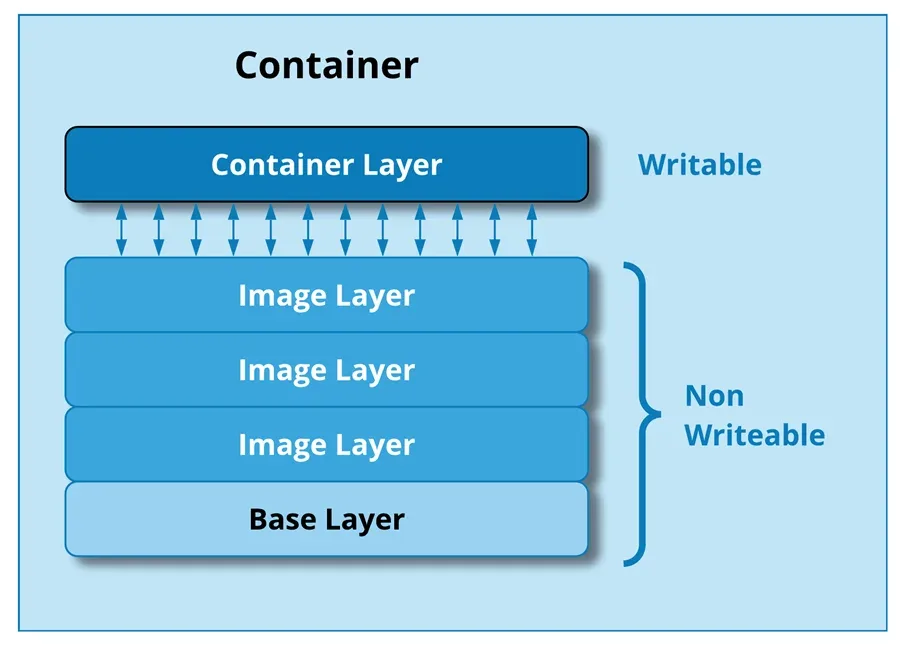

+++
title = "Container Fundamentals"
date = 2026-05-12
description = ""
weight = 22
aliases = [ "/ai-system/packaging-containerization/" ]

[extra]
chapter = "Module B.2"
+++

In [Module B.1](@/ai-system/ai-hardware/index.md) we looked at the hardware side of running AI: how a generic computer is put together, why that design struggles with AI workloads, and what kinds of accelerators have been built to bridge the gap.
The next question is how we actually get our software running on all that hardware.

Recall the AI API server we built in [Module A.4](@/ai-system/ai-api-server/index.md).
It runs on your machine because you spent a few hours setting up a Python environment, installing FastAPI, PyTorch, torchvision, and possibly the right drivers if you have a GPU.
If you want a teammate to run the same server, they would have to repeat the entire setup, and the chance of someone hitting a version conflict or a missing system library is uncomfortably high.
Now imagine running the same server on a hundred machines in a data center, each with a slightly different operating system or hardware setup.
Saying _it works on my machine_ is not going to be very helpful.

This is where containers come in.
A **container** is a self-contained package of a program plus everything the program needs to run, so that the same package can run on any machine that supports containers.
Once our AI server is in a container, deploying it to another machine becomes one or two commands.
Containers are arguably the most important reason cloud-scale AI deployment is even practical today, and they are the focus of the rest of Part B.

In this module we will look at what containers are, how they work, and how to use existing container images to run software on our own machine.
In [Module B.3](@/ai-system/ai-container/index.md) we will go a step further and package our own AI API server as a container.

{{ toc() }}


## What is a Container?

Before there were software containers, there were [shipping containers](https://en.wikipedia.org/wiki/Containerization), the steel boxes you have seen on cargo ships, freight trains, and trucks.
The story of those is worth a quick detour, since software containers borrow both their idea and their name.

Before shipping containers were standardized in the 1960s, freight was loaded onto ships piece by piece.
Each shipment had its own size, shape, and packing, and dock workers had to figure out where everything went by hand.
Loading a single ship could take days, and goods often got damaged, lost, or stolen along the way.
The fix was embarrassingly simple: agree on a standard box that any ship, train, or truck can carry, and pack everything into those boxes once at the source.
Cranes can move them mechanically, the inside of the box does not matter to the ship, and the same box can be transferred between modes of transport without ever being opened.

Software containers solve a very similar problem.
A container packages a program together with its code, libraries, configuration, and the rest of the filesystem layout it expects to see.
Once a program is packaged this way, any machine with a container runtime can run it without us having to set anything up on that machine first.
The container is the standardized box, and the runtime is the crane and the ship.

The benefit becomes obvious as soon as we step outside our own laptop.
A program that runs in a container on a developer's MacBook also runs on a Linux server in a data center, on a Raspberry Pi, or on any of the cloud machines we will see in [Module B.4](@/ai-system/cloud-deployment/index.md), without redoing any of the setup work.
Containers have become so standard that the majority of software deployed in the cloud today runs inside one.


### Images and Containers

Two terms in the container world get used interchangeably in everyday speech but actually mean different things, and it is worth getting them straight from the start.

A [**container image**](https://docs.docker.com/get-started/docker-concepts/the-basics/what-is-an-image/) is the package itself: a static, read-only blueprint of everything needed to run a program.
It sits on disk and does nothing on its own, much like a recipe written on paper.

A [**container**](https://docs.docker.com/get-started/docker-concepts/the-basics/what-is-a-container/) (sometimes called a container instance) is a running program created from an image.
When the runtime starts a container from an image, it allocates CPU and memory, sets up an isolated environment, and runs the program inside it.
The container is the dish you cooked from the recipe.
You can cook the same recipe many times, and each cooked dish lives its own life.

The same image can be used to start many containers, all of which begin in the same state but evolve independently as they run.
Stopping or removing a container does not destroy the image it was started from, so we can spin up more containers from the same image later.


> A natural question at this point is: how is a container different from a [virtual machine (VM)](https://en.wikipedia.org/wiki/Virtual_machine)?
> VMs are the older approach to the same problem, simulating an entire computer in software (including its operating system) and running programs inside that simulated computer.
> The key difference is what gets shared with the host: a VM brings its own kernel and core utilities on top of a hypervisor, while a container shares the host's kernel and only ships the application and its userspace files.
> That makes containers light enough to start in seconds, at the cost of weaker isolation than a VM.
> VMs remain preferred when strong isolation is the priority (for example running untrusted code from many customers on the same hardware), but containers hit the sweet spot for most application deployment, including AI.
> We will come back to VMs and the technology behind them in [Module B.4](@/ai-system/cloud-deployment/index.md#virtualization), since they are also what cloud providers rent out as the building block of cloud infrastructure.


### Layered Filesystems

The "everything the program needs" inside an image is essentially a complete filesystem snapshot: a Linux directory tree with the binaries, libraries, and config files the program expects.
Storing each image as one giant blob would be wasteful, since most images share a lot of common ground.
For example, an image for a Python program and an image for a Java program might both start from the same base Debian Linux. There is no reason to keep two copies of `/usr/bin/ls`.

What containers actually use is a [**layered filesystem**](https://docs.docker.com/get-started/docker-concepts/building-images/understanding-image-layers/).
Think of building burgers in a fast-food restaurant.
The bottom bun and the beef patty are the same across most of the menu; a cheeseburger only adds a slice of cheese, and a deluxe burger adds lettuce, tomato, and sauce.
The kitchen does not assemble each burger from scratch, but stacks the variable parts on top of a shared base.
A container image is built the same way, as a stack of read-only layers, each describing a small set of changes from the layer below it.
A typical image for a Python application might look like this:
```
4. Application code      <- /app/main.py copied in
3. Python packages       <- pip install ...
2. Python runtime        <- apt install python3
1. Debian base           <- /, /bin, /lib, etc.
```
Each layer is a self-contained, content-addressed chunk on disk.
Two images that share the same base Debian layer (which most of them do) only store that layer once on disk, even though their upper layers may be completely different.
When we download a new image, the runtime only has to fetch the layers we do not already have, which is why pulling the second image from the same base feels much faster than the first.

When a container starts from an image, the runtime adds one extra writable layer on top of the read-only stack.
Anything the running program writes (temporary files, log lines, cached data) ends up in that layer, leaving the image untouched.
When the container is removed, the writable layer is discarded, so the next container started from the same image gets a clean slate.



A running container sits on top of the read-only image layers, with one writable layer of its own that holds any changes made while the container is running.

> When a running program tries to modify a file that lives in one of the read-only image layers, the runtime quietly copies the file up to the writable layer first and modifies the copy, a technique called **copy-on-write**.
> The original layer stays untouched, which is what makes layer sharing safe across many running containers.
> Under the hood, this is implemented through a [**union filesystem**](https://en.wikipedia.org/wiki/UnionFS) like [OverlayFS](https://en.wikipedia.org/wiki/OverlayFS), which merges multiple directories into a single view.
>
> Two other Linux features, [**namespaces**](https://en.wikipedia.org/wiki/Linux_namespaces) and [**cgroups**](https://en.wikipedia.org/wiki/Cgroups), provide the rest of a container's isolation.
> Namespaces give each container its own view of process IDs, network interfaces, and filesystem mounts, so processes in different containers cannot see each other.
> Cgroups limit how much CPU, memory, and other resources a container is allowed to use, so a runaway container cannot drag down the rest of the machine.


### The OCI Standard

You may have noticed that we keep saying "containers" and "container runtimes" as if they were generic things, even though Docker is the name everyone associates with them.
The reason is that the format and behavior of containers are governed by an open standard, not by any single vendor.

The [**Open Container Initiative (OCI)**](https://opencontainers.org/) is an industry body that maintains the specifications for what a container image looks like and how a runtime should run it.
As long as a tool follows the OCI specs, the images and containers it produces are interoperable with everyone else's tools.
We can build an image with one tool, push it to a registry hosted by another, and run it on a third without any conversion step in between.

This is exactly what made shipping containers explode in the real world: not the steel boxes alone, but the agreement that all steel boxes have the same dimensions and the same locking corners.
Software containers had a few competing formats early on, but the industry has since converged on OCI, and most modern container tools are OCI-compliant.
Docker is the most well-known of those tools and the one we will use in this course, but the concepts and most of the commands transfer almost unchanged to the alternatives.


## The Docker Ecosystem

[**Docker**](https://www.docker.com/) is the toolset that made containers mainstream, and it is still the most popular way to work with containers today.
The name "Docker" is often used as a stand-in for "containers" in conversations, the same way "Google it" tends to mean searching the web in general.
In reality, Docker is a collection of tools that work together.
Below are the four pieces we will actually use in this course.


### Docker Engine

[**Docker Engine**](https://docs.docker.com/engine/) is the core runtime responsible for actually running containers on a machine.
It does the heavy lifting: pulling images from registries, unpacking them into the layered filesystem, setting up namespaces and cgroups, starting and stopping container processes, and tracking everything along the way.

Docker Engine is built around a client-server design.
The server side, called the **Docker daemon** (`dockerd`), is a long-running background process that listens for instructions and carries them out.
We rarely talk to the daemon directly. Instead, we use a client tool that sends our instructions to the daemon over a local socket or a network connection.
This split is the same client-server pattern we used in [Part A](@/ai-system/interact-ais/index.md): the daemon is essentially an API server for managing containers, and we are its client.

A handy consequence is that the client and the daemon do not have to live on the same machine.
We can have a client on our laptop talk to a daemon running on a remote server and manage containers there as if they were local.
We will not exploit this much in the course, but it is one of the reasons Docker fits so well into cloud workflows.


### Docker CLI and Docker Desktop

The two clients we will use to talk to the Docker daemon are the Docker CLI and Docker Desktop.

The [**Docker CLI**](https://docs.docker.com/reference/cli/docker/) is the command-line client, a program called `docker` that ships with Docker Engine.
Almost everything we will do in this course goes through `docker`-prefixed commands like `docker pull`, `docker run`, and `docker build`.
Each command turns into a request to the daemon, which does the actual work and reports back.

[**Docker Desktop**](https://www.docker.com/products/docker-desktop/) bundles the daemon, the CLI, and a graphical user interface into a single installer for macOS, Windows, and Linux.
The GUI is mainly for browsing images, inspecting running containers, and tweaking settings.
On Windows and macOS, Docker Desktop also takes care of running the Linux kernel that the daemon needs (since the daemon really wants Linux), behind the scenes through a small virtual machine.
On Linux, Docker Engine can be installed directly without Desktop, since the host kernel can be used as-is.

For most of this course, we only need the CLI.
The GUI is helpful when first getting set up, but everything that matters is one `docker` command away.


### Dockerfile

A [**Dockerfile**](https://docs.docker.com/reference/dockerfile/) is a plain-text file that describes how to build a container image.
Each line is one instruction (e.g., "start from this base image", "install these packages", "copy these files in"), and each instruction roughly corresponds to one layer of the resulting image.

We will spend much more time on Dockerfiles in [Module B.3](@/ai-system/ai-container/index.md), since that is where we package our own AI server.
For this module we focus on using existing images, so most of the time someone else has already written the Dockerfile for us.


### Docker Hub

[**Docker Hub**](https://hub.docker.com/) is a public registry where developers can publish and download container images.
It is the GitHub of container images: the place we go to fetch existing images, and the place we push our own when we want to share them.

The Hub hosts both **official images** (curated by Docker, often by the project maintainers themselves) for popular software like [Python](https://hub.docker.com/_/python), [PostgreSQL](https://hub.docker.com/_/postgres), and [Nginx](https://hub.docker.com/_/nginx), and a much larger collection of community images for everything else.
For most of the off-the-shelf software we want to run, there is already a ready-to-go image on the Hub, often maintained by the same team that develops the software.

> A couple of videos that go over the same Docker basics in a different style:
> - [Containerization Explained (video)](https://www.youtube.com/watch?v=0qotVMX-J5s) by IBM, a visual walkthrough at a slower pace
> - [Docker in 100 Seconds (video)](https://www.youtube.com/watch?v=Gjnup-PuquQ) by Fireship, a fast-paced overview
>
> Docker Hub is not the only registry.
> Other widely used ones include the [GitHub Container Registry](https://docs.github.com/en/packages/working-with-a-github-packages-registry/working-with-the-container-registry) (`ghcr.io`), [Google Artifact Registry](https://cloud.google.com/artifact-registry/docs), and [AWS Elastic Container Registry](https://docs.aws.amazon.com/ecr/) on Amazon's cloud.
> They all speak the same OCI protocol, so the only thing that changes between registries is the URL prefix in the image name.
>
> Docker is also not the only OCI-compliant container ecosystem. Below are a few alternatives you might run into.
> - [**Podman**](https://podman.io/) is a daemonless drop-in replacement for Docker, with a CLI that mirrors Docker's almost command for command. Without a long-running daemon, Podman containers run as ordinary user processes, which can be a security advantage in shared environments.
> - [**containerd**](https://containerd.io/) is a minimal container runtime that focuses purely on running containers. It is what Docker Engine uses internally for the actual container execution, and it is also the default runtime in [Kubernetes](https://kubernetes.io/), the most popular system for orchestrating large numbers of containers.
> - [**Apptainer**](https://apptainer.org/) (formerly Singularity) is popular in scientific computing and HPC environments, where rootless execution and easy GPU access matter more than the developer ergonomics Docker is built around.


## Using Off-the-Shelf Containers

With the concepts in place, we can put them to work.
The first step is to [install Docker](https://docs.docker.com/get-started/get-docker/) (Docker Desktop on Mac and Windows, Docker Engine or Docker Desktop on Linux), and then walk through the most common commands for using existing images.
The examples below all use the official Python image as a stand-in, but the same commands work for any other image.


### Pulling Images

To get a container image onto our machine, we use `docker pull`:
```bash
docker pull python:3.13
```
The argument is in the form `<repository>:<tag>`.
The repository name (`python`) tells the daemon which image to fetch, and the tag (`3.13`) picks a specific version.
If we omit the tag, Docker defaults to `latest`, which is whatever the publisher most recently labeled as such.

For larger projects we usually want to pin a specific tag rather than `latest`, since `latest` moves under our feet as the publisher pushes new versions.
Many official images also publish smaller variants, like `python:3.13-slim` (a stripped-down Debian base) or `python:3.13-alpine` (built on the much smaller Alpine Linux base), which can save hundreds of megabytes per image:
```bash
docker pull python:3.13-slim
docker pull python:3.13-alpine
```

For images hosted on a registry other than Docker Hub, the registry URL goes in front of the repository name:
```bash
docker pull ghcr.io/some-user/some-image:v1
```

We can also list the images currently on our machine, inspect details about a specific one, or remove ones we no longer need:
```bash
docker images               # list all local images
docker inspect python:3.13  # detailed metadata about one image
docker rmi python:3.13      # remove an image (when no container is using it)
docker image prune          # remove unused images to free up disk space
```


### Running Containers

To turn an image into a running container, we use `docker run`:
```bash
docker run python:3.13
```
This starts a container from the `python:3.13` image and runs the image's default command.
For the official Python image that command is just `python3`, which starts an interactive Python interpreter.
Since we are not connected to its input, the container starts and immediately exits.
We can pass our own command instead:
```bash
docker run python:3.13 python -c "print('Hello from a container!')"
```
Everything after the image name is interpreted as the command to run inside the container.
The line above starts a container, runs `python -c "..."`, prints the message, and exits as soon as the command finishes.

If we want an interactive session, we add `-it`, which stands for **i**nteractive **t**erminal:
```bash
docker run -it python:3.13           # interactive Python REPL
docker run -it python:3.13 bash      # a bash shell to poke around inside the container
```
Inside the container we can install packages, run scripts, or just look at the filesystem, and everything we do stays inside the container.

For long-running services like an API server, we usually do not want the container to take over our terminal.
The `-d` flag (for **d**etached) starts the container in the background:
```bash
docker run -d python:3.13 python -c "import time; time.sleep(3600)"
```
This returns immediately with the container's ID while the container itself keeps running for an hour in the background.


### Naming, Listing, and Stopping Containers

Each container has both an autogenerated ID (a long hex string) and an autogenerated name (a slightly silly two-word combination like `eager_tesla`).
For long-running containers it is much easier to give them a name we choose, with the `--name` flag:
```bash
docker run --name my-app -d python:3.13 python -c "import time; time.sleep(3600)"
```

We can list, stop, restart, and inspect containers by their name (or by the first few characters of their ID, which is enough as long as it is unique):
```bash
docker ps                # running containers
docker ps -a             # all containers, including stopped ones
docker stop my-app       # stop a running container
docker start my-app      # start a stopped container again
docker restart my-app    # stop and immediately start
docker logs my-app       # print everything the container has written to stdout/stderr
docker logs -f my-app    # follow logs as they are written, like `tail -f`
```

To run an extra command inside a container that is already running, `docker exec` lets us step inside and tell it to do something:
```bash
docker exec my-app python -c "print('hello from inside')"
docker exec -it my-app bash    # an interactive shell in the running container
```

When we are done with a container, we can remove it with `docker rm`.
Removing only deletes the container instance, not the image:
```bash
docker rm my-app           # remove a stopped container
docker container prune     # remove all stopped containers in one go
```


### Talking to the Outside

A container is isolated from our machine by default.
Files written inside it stay inside it, ports it listens on are not reachable from outside, and it does not see any of the environment variables we set on our host.
That isolation is the whole point, but it also means we need explicit ways to poke holes when we actually want a container to interact with the outside world.
The three most common holes we open are ports, files, and environment variables.


#### Port Mapping

If a containerized program listens on a network port, like our API server in [Module A.4](@/ai-system/ai-api-server/index.md), we need to [**publish**](https://docs.docker.com/get-started/docker-concepts/running-containers/publishing-ports/) that port to the host so we can reach the program from a browser or our Module A.2 client.

The `-p` flag does this:
```bash
docker run -p 8000:8000 python:3.13 python -m http.server 8000
```
The format is `-p <host_port>:<container_port>`.
Here the container is running Python's built-in HTTP server on port 8000 inside the container, and we expose that as port 8000 on the host.
We can now visit `http://127.0.0.1:8000` from our browser and reach the server inside the container.

The two ports do not have to be the same:
```bash
docker run -p 3000:8000 python:3.13 python -m http.server 8000
```
Here the server still listens on 8000 inside the container, but it shows up as port 3000 on the host.
This is useful when we have several containers that all want the same internal port; we can map each one to a different host port.


#### Volume Mapping

Containers also start with their own isolated filesystem.
Anything we write inside the container's filesystem disappears when the container is removed, and the container cannot see our host's files unless we explicitly grant access.

The `-v` flag mounts a host directory or file into the container:
```bash
docker run -v $(pwd):/app python:3.13 ls /app
```
The format is `-v <host_path>:<container_path>`.
After this command, the current directory on our host appears as `/app` inside the container, and any change either side makes is visible to the other.

Mounting host paths into containers is how we feed in code or configuration without baking it into an image, and how we let containers persist files (like a database) past their lifetime.
We will see both patterns in action shortly.

> Mounting a host directory like this is technically a [**bind mount**](https://docs.docker.com/engine/storage/bind-mounts/).
> Docker also supports [**named volumes**](https://docs.docker.com/engine/storage/volumes/), which are pieces of storage that the daemon keeps in its own area on disk and gives a name.
> Named volumes are usually preferred for production data because the daemon manages them out of our way.
> Bind mounts are great for development since they make our working directory visible inside the container immediately.


#### Environment Variables

Recall from [Module A.2](@/ai-system/interact-api-python/index.md#storing-secrets-in-environment-variables) that we use environment variables to keep secrets like API keys out of our source code.
A container does not see the environment variables on our host by default, so we have to pass them in explicitly with `-e`:
```bash
docker run -e OPENAI_API_KEY=sk-abc... python:3.13 \
    python -c "import os; print(os.getenv('OPENAI_API_KEY'))"
```

When there are several variables, it is more convenient to keep them in a file and use `--env-file`:
```bash
docker run --env-file .env python:3.13 python -c "import os; print(dict(os.environ))"
```
The `.env` file uses the same format we used in [Module A.2](@/ai-system/interact-api-python/index.md#storing-secrets-in-environment-variables): one `KEY=value` pair per line.

> Below are some additional resources for getting more comfortable with Docker.
> - [Docker Crash Course for Absolute Beginners (video)](https://www.youtube.com/watch?v=pg19Z8LL06w) by TechWorld with Nana, a longer hands-on tutorial covering the same commands at a slower pace
> - [The Only Docker Tutorial You Need To Get Started (video)](https://www.youtube.com/watch?v=DQdB7wFEygo) by The Coding Sloth, an entertaining short tour
> - [The official Docker get-started guide (docs)](https://docs.docker.com/get-started/), the canonical reference if you want to dig further
>
> When we have several containers that need to work together, like a web app, a database, and a cache, managing them with individual `docker run` commands gets tedious quickly.
> [**Docker Compose**](https://docs.docker.com/compose/) lets us describe a multi-container setup in a single YAML file and bring it all up with one command:
> ```yaml
> services:
>   web:
>     image: my-web-app
>     ports:
>       - "8080:80"
>   db:
>     image: postgres
>     environment:
>       POSTGRES_PASSWORD: secret
> ```
> A single `docker compose up` then starts both containers and wires them onto a shared network.
> We will not need Compose for the rest of this course, but it is a natural next step after `docker run`.


## Exercise: Run the Client in a Container

Recall the command-line chatbot from the [Module A.2 exercise](@/ai-system/interact-api-python/index.md#exercise-a-command-line-chatbot).
On our own machine we ran it directly with the system Python after installing the `requests` package.
In this exercise we will run the same script inside a container based on an off-the-shelf Python image, without ever installing Python or `requests` on the host.

A reasonable starting point:

1. Open a terminal in the directory containing your Module A.2 program (let us call the file `chatbot.py`).
2. Pull the official Python image with `docker pull python:3.13-slim`. Confirm with `docker images` that it now appears on your machine.
3. Run a container with three flags: `-it` so we can interact with it, `-v` to mount the current directory at, say, `/app` inside the container, and `-e` to pass your AI provider's API key in.
4. Inside the running container, install `requests` (`pip install requests`) and then run your script (`python /app/chatbot.py`). Verify that the chatbot replies as before.

Once that works, try the following extensions:

1. Replace the interactive `pip install` step with a one-shot `docker run` command that installs the dependency and runs your script in a single line. Look up the `--rm` flag and use it so containers do not pile up after each run.
2. Run the same script through a different image, for example `python:3.13-alpine`, and notice that everything still works while the image is much smaller. This is the portability promise from the start of the module: the same container-based command runs on any compatible image.
3. Try `docker stats` while a container is running to watch its CPU and memory usage in real time, and `docker inspect <container>` to see the full configuration that Docker applied to it. Both commands give you a feel for what the daemon is actually managing on your behalf.

If you finish all the extensions, you should have a feel for how containers run programs without any per-machine setup, and a working command you can reuse on any other machine that has Docker installed.
In the next module we drop the "install `requests` at the start of every run" step by building our own image instead of relying on someone else's.
