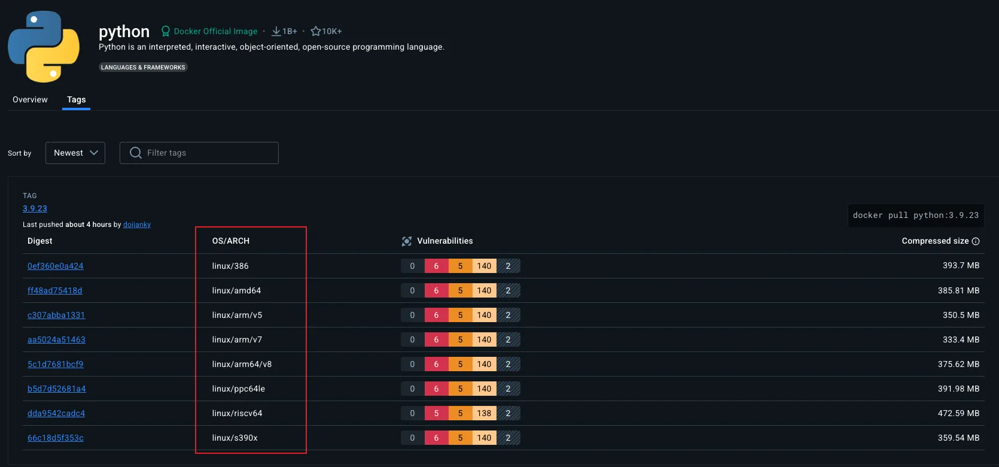

+++
title = "Edge Deployment"
date = 2026-05-13
description = ""
weight = 25
aliases = [ "/ai-system/edge-self-hosted-deployment/" ]

[extra]
chapter = "Module B.5"
+++

In [Module B.4](@/ai-system/cloud-deployment/index.md) we deployed our AI server on a small cloud VM, gave it a domain name and an HTTPS certificate, and ended up with a real public AI service backed by infrastructure we did not have to own.

However, there are scenarios where running our system on a computer we have physical access to fits better than renting cloud capacity.
For example, a smart camera that has to react to people walking past it before they have walked past, where a cloud round trip is too slow.
Or an app processing medical scans we are not allowed to send to a third party.
Maybe a long-running service we have run for years where the cumulative cloud bill has crossed the price of just buying a small server.

These cases fall under two related ideas.
**Edge computing** runs computation near where data is created or where users interact with the system, instead of in a faraway data center.
**Self-hosting** runs services on hardware we own and control, instead of renting capacity from a cloud provider.

In this module we cover both, because despite the different motivations they share most of the practical concerns.
The hardware and operating system are now ours to manage, the network sits behind a home or office router rather than in a data center, and we are the only ones responsible for keeping the data alive.
Once we have those covered, the actual deploying-a-container part is identical to what we already did in [Module B.4](@/ai-system/cloud-deployment/index.md).

{{ toc() }}


## Edge and Self-Hosting

To start, we will discuss what each term actually means.


### What Is Edge Computing?

[**Edge computing**](https://en.wikipedia.org/wiki/Edge_computing) is the idea of running computation near the place where data is generated or where users interact with the system, instead of in a centralized data center hundreds or thousands of kilometers away.

The "edge" simply refers to devices at the boundary of a network, where data first appears or where a person hits a button.
A surveillance camera detecting someone at the door, a sensor on an assembly line counting defects, a self-driving car deciding whether to brake, a smartphone running on-device speech recognition: all of those are edge computing.

For AI workloads in particular, a few properties make the edge attractive.
Latency drops because the round trip to a data center disappears, so an on-device model can respond in milliseconds, fast enough for real-time control loops.
Bandwidth use drops because not much data needs to travel back to the cloud, which matters when uplinks are slow, expensive, or both.
Privacy improves because sensitive data never has to leave the device.
And the system keeps working when the internet goes down.

And there is a variety of edge hardware that can be found in the wild.
The [Raspberry Pi 5](https://www.raspberrypi.com/products/raspberry-pi-5/) we already met in [Module B.1](@/ai-system/ai-hardware/index.md#a-real-board-raspberry-pi-5) is a perfectly capable edge device for hobby and small commercial projects.
NVIDIA's [Jetson family](https://www.nvidia.com/en-us/autonomous-machines/embedded-systems/) offers boards with on-board GPUs for harder AI workloads.
Industrial PCs designed to sit in factories and survive vibration, dust, and temperature swings handle the higher end.
And the smartphone in our pocket is an edge device too, with one of the [NPUs](@/ai-system/ai-hardware/index.md#neural-processing-unit-npu) we discussed in [Module B.1](@/ai-system/ai-hardware/index.md) doing the AI work.


### What Is Self-Hosting?

[**Self-hosting**](https://en.wikipedia.org/wiki/Self-hosting_(web_services)) is the practice of running services on hardware we own and control, rather than paying a cloud provider to do it for us.

By definition, we have actually been self-hosting throughout this course.
Every time we ran our AI server on our laptop in [Part A](@/ai-system/interact-ais/index.md), that was a self-hosted service.
The only difference between that and a "real" self-hosted setup is that we did not put the laptop on a shelf and leave it running 24/7.

The motivation for self-hosting is mostly the inverse of the cloud's selling points.
We have control over our data, since it sits on hardware we have physical access to, and no provider can suddenly change pricing or suspend our account.
Cost is predictable, since hardware is a one-time purchase and electricity is the only ongoing item. For services we plan to run for years, the cumulative cloud bill often exceeds the price of buying the hardware outright.
There is no vendor lock-in either, since our setup is built on standard tools and can move between machines and providers without rewriting.

The hardware choice for self-hosting is open-ended.
At the smallest end, we repurpose hardware we already own: an old laptop in a drawer, a desktop tower from before the last upgrade.
In the middle we have purpose-built [home server](https://en.wikipedia.org/wiki/Home_server) builds and [network attached storage (NAS)](https://en.wikipedia.org/wiki/Network-attached_storage) appliances, for example from [Synology](https://www.synology.com/) or [QNAP](https://www.qnap.com/).
At the larger end, people put together small racks with proper server hardware and run dozens of services off the same setup.

> The catalog of things people self-host is huge, and exploring it on the side is one of the more enjoyable rabbit holes in computing once we have the basic Docker + Linux setup down.
> A handful of categories to give a sense of scale:
> - **Media servers** like [Jellyfin](https://jellyfin.org/) (open-source) or [Plex](https://www.plex.tv/) replace streaming subscriptions with our own libraries on our own disks.
> - **Photo management** like [Immich](https://immich.app/) or [PhotoPrism](https://www.photoprism.app/) replaces Google Photos with a self-hosted gallery, often with on-device AI for face and object search.
> - **File sync and collaboration** with [Nextcloud](https://nextcloud.com/) replaces Google Drive or Dropbox.
> - **Smart home automation** through [Home Assistant](https://www.home-assistant.io/) provides a single dashboard for sensors and devices that would otherwise each need their own vendor app.
> - **Password managers** like [Vaultwarden](https://github.com/dani-garcia/vaultwarden) (a Bitwarden-compatible server) keep credentials on our own machine instead of a provider that might leak them someday.
> - **Network-wide ad and tracker blocking** with [Pi-hole](https://pi-hole.net/), often the first project people run on a Raspberry Pi.
> - **Git hosting** with [Gitea](https://about.gitea.com/) or its community fork [Forgejo](https://forgejo.org/) for a private GitHub on our own hardware.
> - **Local large language models** through tools like [Ollama](https://ollama.com/) or [llama.cpp](https://github.com/ggml-org/llama.cpp).
>
> A few good places to discover more:
> - [awesome-selfhosted](https://github.com/awesome-selfhosted/awesome-selfhosted), the canonical curated list of free and open-source self-hostable software.
> - [r/selfhosted](https://www.reddit.com/r/selfhosted/), the largest community for setup advice, project showcases, and troubleshooting.
> - [selfh.st](https://selfh.st/), a weekly newsletter and aggregator that tracks new and updated self-hosted projects.


It should be noted that edge computing and self-hosting are different terminologies, and come from different motivations.
Edge is motivated by *where* data and users are: we put the computer near them.
Self-hosting is motivated by *who* owns the hardware: we own it.
At the same time, they often overlap. Most edge devices are self-hosted since we own the devices, and most self-hosting is using edge devices since the devices sit on the edge of the network.
For example, a Raspberry Pi running on the corner of our desk is both.


## Edge and Self-Hosted Deployment in Practice

For actually deploying our containers on edge and self-hosted devices, we can reuse most of the process from [Module B.4](@/ai-system/cloud-deployment/index.md).
What changes is everything that happens before installing Docker: picking the hardware, getting a working operating system on it, and dealing with the slightly different CPU than the cloud VM had.


### Picking Hardware

The right choice depends on what we are running and what we already have around.

For learning, light AI workloads, and most hobby projects, a [**Raspberry Pi 5**](https://www.raspberrypi.com/products/raspberry-pi-5/) is a great choice.
It is small, sips power (around 3 to 5 W idle, 10 to 15 W under full load), and runs a full Linux distribution. Also, Raspberry Pi might be the most popular family of edge devices in the world. That means it is usually easier to solve a problem we run into when tinkering with them, since there is a very high chance that someone on the internet has run into the same problem, and we can just copy the solution.
For heavier on-device AI, NVIDIA's [**Jetson Orin Nano Super Developer Kit**](https://www.nvidia.com/en-us/autonomous-machines/embedded-systems/jetson-orin/nano-super-developer-kit/) packs a small GPU into a board not much bigger than a Raspberry Pi.
The Jetson family scales up to much more powerful boards intended for robotics and autonomous vehicles, at correspondingly higher prices.
We can also save money and reduce e-waste by using an old laptop or desktop computer sitting unused in a closet.
It typically has more RAM and storage than any single-board computer, costs nothing, and (if it is a laptop) comes with a built-in battery that doubles as an [uninterruptible power supply](https://en.wikipedia.org/wiki/Uninterruptible_power_supply) when the power flickers.
For more ambitious setups, purpose-built home servers assembled from PC parts give us flexibility on CPU, RAM, storage, and GPU at any budget level we choose.

Unlike a cloud VM, our device usually does not arrive with a fresh OS already booted, but each common platform has an official guide that walks through the installation process: the [Raspberry Pi Imager](https://www.raspberrypi.com/software/) writes a preconfigured SD card for the Pi, NVIDIA's [JetPack SDK](https://developer.nvidia.com/embedded/jetpack) ships a Jetson image with the GPU drivers preinstalled, and an x86 laptop or desktop takes [Ubuntu Server](https://ubuntu.com/download/server) on a USB stick made with [balenaEtcher](https://etcher.balena.io/).
Once the operating system is up, our device is at the same starting line as the VM in [Module B.4](@/ai-system/cloud-deployment/index.md), and the rest of the workflow is identical.


### CPU Architecture

In [Module B.2](@/ai-system/container-fundamentals/index.md) we said that a container image runs anywhere a container runtime is installed.
We glossed over a small caveat that becomes important the moment we move outside cloud x86 servers: a container image is built for a specific CPU architecture, and only runs on a CPU that speaks that architecture's machine code.
A Docker image built for x86-64 will not run on a Raspberry Pi with an ARM64 CPU.

The following three CPU architectures should cover almost everything we will run into.
[**x86-64**](https://en.wikipedia.org/wiki/X86-64) (also called *amd64*) is the architecture inside almost every desktop, laptop, and cloud server you have used.
Designed by Intel and AMD, it has been the dominant general-purpose architecture since the 1990s, and almost any image we find on Docker Hub will have an x86-64 build.
[**ARM64**](https://en.wikipedia.org/wiki/AArch64) (also called *aarch64*) is the architecture inside almost every smartphone, the Raspberry Pi, NVIDIA Jetson, [Apple silicon](https://en.wikipedia.org/wiki/Apple_silicon) Macs, and an increasing share of cloud servers like AWS [Graviton](https://aws.amazon.com/ec2/graviton/).
It is more power-efficient than x86 at comparable performance, which is why it dominates devices that care about battery, and why edge devices are mostly ARM today.
[**RISC-V**](https://en.wikipedia.org/wiki/RISC-V) is a newer, open-source architecture not controlled by any single company.
Most current RISC-V hardware is microcontrollers and embedded boards (the StarFive VisionFive and Milk-V Mars lines, for example), but the ecosystem is growing fast and could become a third mainstream option for edge hardware over time.

For images we pull from a registry, look for a [**multi-architecture image**](https://docs.docker.com/build/building/multi-platform/).
Most popular images on Docker Hub publish builds for both `linux/amd64` and `linux/arm64`, sometimes also `linux/arm/v7` for older 32-bit ARM hardware.
When we run `docker pull python:3.13`, the daemon checks the architecture of the local machine and pulls the matching variant automatically, no extra flags needed.
The Docker Hub page of an image lists the platforms it supports.



The platform list on the official `python` image page on Docker Hub. Each line is a separate build of the same image for a different OS plus CPU architecture combination.

For our own images, we have two options.
The simple one is to build the container image on the target hardware: SSH into the Pi, copy the project over, and run `docker build` there.
The image that comes out is naturally ARM64.
The more sophisticated option is [**Buildx**](https://docs.docker.com/reference/cli/docker/buildx/), Docker's modern builder, which can produce a multi-architecture image from a single build:
```bash
docker buildx build --platform linux/amd64,linux/arm64 \
    -t yourusername/my-ai-server:1.0 --push .
```
This builds the same Dockerfile for both architectures (using emulation for whichever architecture is not the host's) and pushes both variants to a registry under the same tag.
Anyone pulling the image gets the variant matching their hardware.

> Below are some additional resources for getting more comfortable with CPU architectures and multi-platform container images.
> - [ARM vs x86 - key differences explained (video)](https://www.youtube.com/watch?v=AADZo73yrq4) by Gary Explains, a clear walkthrough of where the two architectures diverge in design and where they end up
> - [Explaining RISC-V: an x86 & ARM alternative (video)](https://www.youtube.com/watch?v=Ps0JFsyX2fU) by ExplainingComputers, a friendly tour of why RISC-V exists and where it might fit
> - [ARM vs x86: what's the difference? (article)](https://www.redhat.com/en/topics/linux/ARM-vs-x86) by Red Hat, a short written comparison of the two dominant general-purpose architectures
> - [Multi-platform builds (official docs)](https://docs.docker.com/build/building/multi-platform/), Docker's full documentation on building images that target several CPU architectures from one machine


## Network: Getting Past NAT

The cloud VM in [Module B.4](@/ai-system/cloud-deployment/index.md) came with a public IP address.
Anyone on the internet could type that IP into their browser and reach our server (subject to the cloud firewall we configured).
Our edge or self-hosted device sits on a home or office network, and that picture changes completely.


### How NAT Hides Us

[**Network Address Translation (NAT)**](https://en.wikipedia.org/wiki/Network_address_translation) is the trick that lets every device on a home network share a single public IP address.

When we connect a laptop to home WiFi, the router gives it a *private* IP like `192.168.1.42`.
That address only has meaning inside our home network; it is one of a few ranges reserved by [RFC 1918](https://datatracker.ietf.org/doc/html/rfc1918) for private use, and routers on the wider internet refuse to forward packets to or from it.
The router itself has a *public* IP given to it by the ISP, and that one address is shared by every device on the home network.

When the laptop makes an outgoing request, say to `example.com`, the router rewrites the packet so it looks like it came from the router's public IP, and remembers in a table that this connection belongs to the laptop.
When the reply comes back to the public IP, the router uses the table to forward it to the laptop.

Outgoing connections work fine, but incoming connections do not.
If someone on the public internet sends a packet to our public IP on port 8000, the router has no idea which device behind it (if any) should receive that packet, so by default it drops the packet.
From the outside, the router looks like a closed door, and our edge device looks like it does not exist on the public internet at all.

For most home uses (browsing, streaming, email) this is not a problem; everything we initiate from inside works.
But the moment we want our edge device to *accept* incoming connections from anywhere on the internet, which is exactly what an AI API server has to do, NAT is in our way.

[**Carrier-grade NAT (CGNAT)**](https://en.wikipedia.org/wiki/Carrier-grade_NAT) makes this worse.
With CGNAT, the ISP itself does another layer of NAT in front of many customers, so even the "public" IP our router thinks it has is shared with strangers.
Mobile networks almost always use CGNAT, and an increasing number of fixed broadband ISPs do too as IPv4 addresses run out.
Behind CGNAT, no amount of router configuration on our side will help, because the bottleneck sits at the ISP.

> Below are some additional resources for understanding NAT and the IPv4 address shortage.
> - [NAT explained (video)](https://www.youtube.com/watch?v=FTUV0t6JaDA) by PowerCert Animated Videos, a short animation walking through what the router actually does to outgoing and incoming packets
> - [What is CGNAT? (article)](https://www.a10networks.com/glossary/what-is-carrier-grade-nat-cgn-cgnat/) by A10 Networks, an overview of why ISPs added a second layer of NAT and what that breaks for end users
> - [How NAT traversal works (article)](https://tailscale.com/blog/how-nat-traversal-works) by Tailscale, a careful look at how a service can still reach a device behind NAT, useful background for the tunnel section below


### Public IP and Port Forwarding

If our ISP gives us a real public IP (no CGNAT), the most direct solution is [**port forwarding**](https://en.wikipedia.org/wiki/Port_forwarding) on our router.
A port forwarding rule tells the router that incoming traffic on a given port (say, 80 and 443) should be sent to a specific device on the local network (say, `192.168.1.42`).
This is essentially the inverse of the NAT bookkeeping we just described, and most routers have a settings page for it.

The remaining problem is that home public IPs are usually *dynamic*: they change every few weeks or whenever the router reconnects.
We cannot put a changing IP into DNS by hand.
The fix is [**dynamic DNS (DDNS)**](https://en.wikipedia.org/wiki/Dynamic_DNS), where a small daemon on our device periodically tells a DDNS provider what our current public IP is, and the provider updates the DNS record.

Some ISPs also offer a static public IP as a paid add-on, which removes the need for DDNS. Whether this is available, and at what price, varies by country and provider.

> Below are some additional resources for setting up port forwarding and dynamic DNS.
> - [Beginners guide to port forwarding (video)](https://www.youtube.com/watch?v=jfSLxs40sIw) by Tinkernut, a hands-on walkthrough of port forwarding on a typical home router
> - [DDNS - Dynamic DNS explained (video)](https://www.youtube.com/watch?v=rOLGvZagdC0) by PowerCert Animated Videos, a short animation showing how DDNS keeps a name pointed at a changing IP
> - [How to port forward on your router (article)](https://www.howtogeek.com/66214/how-to-forward-ports-on-your-router/) by How-To Geek, a friendly written walkthrough of the typical router admin page
> - [What is dynamic DNS? (article)](https://www.cloudflare.com/learning/dns/glossary/dynamic-dns/) by Cloudflare, a short written explanation of the same idea


### Hybrid: A Cloud VM as Reverse Proxy

If we cannot get a public IP because of CGNAT, or simply do not want to expose our home network at all, we can borrow a public IP by renting a small cloud VM.
The reverse proxy we built in [Module B.4](@/ai-system/cloud-deployment/index.md#reverse-proxy-with-nginx) is exactly the right shape for this.
Instead of forwarding requests to a container running on the same VM, we point it through a private tunnel to the container running on our edge device.

The setup chains three pieces together.
Our edge device opens an outgoing connection to the cloud VM through a [VPN tunnel](https://en.wikipedia.org/wiki/Virtual_private_network), most commonly [**WireGuard**](https://www.wireguard.com/), and since this connection originates from inside the home network, it works fine through NAT.
The cloud VM's public IP and domain face the internet, and the Nginx we set up in [Module B.4](@/ai-system/cloud-deployment/index.md#reverse-proxy-with-nginx) listens on 80 and 443 and forwards each request through the tunnel to the edge device instead of to a local container.
The edge device itself runs our containerized AI server exactly as in [Module B.3](@/ai-system/ai-container/index.md), listening only on its tunnel-side interface.

With WireGuard installed (referring to the official [WireGuard install guide](https://www.wireguard.com/install/)) and configured (referring to the [quick start](https://www.wireguard.com/quickstart/)) on both sides, the cloud VM and the edge device end up on a small private network of their own, each reachable by an IP we pick during the setup.
For the rest of this section we will assume the cloud VM has the tunnel address `10.0.0.1` and the edge device has `10.0.0.2`.
From Nginx's perspective on the cloud VM, the edge device is then just another machine on the network at `10.0.0.2`, no different from the local container at `127.0.0.1` we forwarded to in [Module B.4](@/ai-system/cloud-deployment/index.md#reverse-proxy-with-nginx).

The only change to the Nginx config from [Module B.4](@/ai-system/cloud-deployment/index.md#reverse-proxy-with-nginx) is the address it forwards to.
Edit `/etc/nginx/sites-available/api.example.com` on the cloud VM and point `proxy_pass` at the edge device's tunnel address instead of `127.0.0.1`:
```nginx
location / {
    proxy_pass http://10.0.0.2:8000;
    proxy_set_header Host $host;
    proxy_set_header X-Real-IP $remote_addr;
    proxy_set_header X-Forwarded-For $proxy_add_x_forwarded_for;
    proxy_set_header X-Forwarded-Proto $scheme;
}
```
The four `proxy_set_header` lines stay as they were, since they only describe what Nginx forwards to the upstream, not where the upstream lives.
Reload with `sudo nginx -t && sudo systemctl reload nginx`, and visiting `https://api.example.com` now reaches the AI server on our edge device through the tunnel, with the same Let's Encrypt certificate from [Module B.4](@/ai-system/cloud-deployment/index.md#https-certificates-with-certbot) still terminating HTTPS at the cloud VM.

On the edge device, run the container as before but bind its port to the tunnel address only:
```bash
docker run -d --name ai-server --restart unless-stopped \
    -p 10.0.0.2:8000:8000 \
    yourusername/my-ai-server:1.0
```
The leading `10.0.0.2:` in the port mapping tells Docker to publish the port on the WireGuard interface alone, so even if the edge device is later attached to a less trusted network, the AI server stays reachable only from inside the tunnel.


> Below are some additional resources for getting comfortable with WireGuard and the surrounding VPN landscape.
> - [Build your OWN WireGuard VPN! (video)](https://www.youtube.com/watch?v=5NJ6V8i1Xd8) by Jeff Geerling, a short hands-on tutorial spinning up a WireGuard server on a small VM
> - [How to easily configure WireGuard (article)](https://www.stavros.io/posts/how-to-configure-wireguard/) by Stavros Korokithakis, a popular hands-on walkthrough with the minimum config files for both ends
> - [WireGuard whitepaper (paper)](https://www.wireguard.com/papers/wireguard.pdf) by Jason Donenfeld, the original technical paper for the protocol if you want the cryptography behind the `wg0.conf`
> - [How Tailscale works (article)](https://tailscale.com/blog/how-tailscale-works), an explanation of the mesh model that builds on top of WireGuard, useful for understanding what Tailscale is doing under the hood

> A few managed services sidestep most of the work above by handling the tunnel for us.
>
> [**Tailscale**](https://tailscale.com/) is a popular layer on top of WireGuard that handles key exchange, NAT traversal, and routing automatically, so setting up the tunnel becomes "install Tailscale on both the VM and the edge device, sign in with the same account, done", with no keys or `wg0.conf` to manage by hand.
> For setups where every client we want to reach the service has Tailscale installed (a personal device fleet, for example), Tailscale alone can replace the cloud VM entirely, since the clients reach the edge device directly through the Tailscale mesh.
> The [Tailscale quickstart](https://tailscale.com/kb/1017/install) walks through the install on both ends.
>
> [**Cloudflare Tunnel**](https://developers.cloudflare.com/cloudflare-one/connections/connect-networks/) goes further and collapses the whole arrangement into a single small daemon.
> We install `cloudflared` on the edge device, it opens an outgoing connection to Cloudflare, and Cloudflare routes traffic from our domain to our device through that connection, with no cloud VM, no router configuration, and no separate certificate workflow since Cloudflare provides HTTPS at the edge of their network.
> The trade-off is that our service now depends on Cloudflare being available and willing to host it, and all traffic flows through their network, which is often fine for a personal project but worth thinking twice about for anything where the dependency or data flow matters.
> The [Cloudflare Tunnel getting-started guide](https://developers.cloudflare.com/cloudflare-one/connections/connect-networks/get-started/) is the official walkthrough.
>
> Many ISPs now also provide [**IPv6**](https://en.wikipedia.org/wiki/IPv6) connectivity alongside IPv4.
> IPv6 has a large enough address space that every device can have its own globally routable address, so no NAT is needed.
> If both our device and our visitors have IPv6, we can publish an `AAAA` DNS record pointing to the device's IPv6 address and connections work without any tunneling.
> The catch is that not all internet users have IPv6 yet, so we usually still need an IPv4 path through one of the options above.


## Backups Are Now Our Job

On a cloud VM we usually get a baseline of reliability for free.
Most providers replicate the underlying disks, swap failed hardware, and let us snapshot the entire VM with a click of a button.
None of that is true on our own hardware.
SD cards commonly used on edge devices have a high failure rate after a few years of heavy writes, hard drives will die eventually, laptops get spilled on often, and the only person responsible for any of it is us.
If we are going to put real data on a self-hosted system (user accounts, request logs, training data, anything we cannot regenerate), backups are part of our job.

The most quoted rule of thumb is the [**3-2-1 rule**](https://www.backblaze.com/blog/the-3-2-1-backup-strategy/): keep at least 3 copies of important data, on 2 different storage media, with 1 copy stored offsite.
The point is to protect against different failures simultaneously.
If a single disk dies and takes one copy, the other two survive.
If a fire or theft takes everything in the building, the offsite copy survives.
With this rule properly applied, we can lower the probability of completely losing our data to a very small number, close to mathematically impossible.

> Below are some additional resources for backup strategy and tooling.
> - [The 3-2-1 backup rule explained (video)](https://www.youtube.com/watch?v=62oi_G8exC8) by LabCyber, a short video on why the rule is shaped the way it is
> - [Backups done right! A beginner's guide to Restic (video)](https://www.youtube.com/watch?v=Br-h-fjwzYM) by DeAndre Wilson, a hands-on tour of one of the two backup tools we mentioned
> - [Borg vs Restic (article)](https://dataswamp.org/~solene/2021-05-21-borg-vs-restic.html) by Solène Rapenne, a careful side-by-side comparison of the two open-source backup tools we mentioned
> - [`restic/others` (list)](https://github.com/restic/others), an exhaustive list of self-hostable backup tools maintained by the Restic project, useful if neither Borg nor Restic fits

> A few practical pieces sit on top of that rule.
> The whole thing should be automated rather than something we rely on remembering, whether through a daily `cron` job, a [systemd timer](https://www.freedesktop.org/software/systemd/man/systemd.timer.html), or a scheduler built into the backup tool itself, since a backup we have to run manually will be a backup we will not run.
> The tool itself should do incremental, deduplicated backups instead of copying everything every time, so each backup (except for the first one) is relatively fast. [Borg](https://www.borgbackup.org/) and [Restic](https://restic.net/) are the two most popular open-source choices for that.
> Databases need database-aware tools rather than a plain file copy out from under a running database to avoid backing up a non-functional state of the database. For SQLite the [`sqlite3 .backup`](https://www.sqlite.org/cli.html) command takes a consistent snapshot even while writes are in progress, with PostgreSQL, MySQL, and the rest all shipping similar tools.
> The offsite copy can be cheap object storage like [Backblaze B2](https://www.backblaze.com/cloud-storage) or AWS S3 [Glacier](https://aws.amazon.com/s3/storage-classes/glacier/), which holds a terabyte of backup data for a few EUR per month.


## Exercise: Self-Host Your AI API Server

Take the AI API server you containerized in [Module B.3](@/ai-system/ai-container/index.md#exercise-containerize-your-ai-api-server) and host it on hardware you own, then make it publicly accessible.
The cloud VM you set up in [Module B.4](@/ai-system/cloud-deployment/index.md#exercise-deploy-your-ai-api-server-to-the-cloud) can be repurposed as the reverse proxy, so nothing from earlier modules has to be thrown away.

1. Use your daily computer as the natural starting point. If your device is ARM and the image you built in [Module B.3](@/ai-system/ai-container/index.md#exercise-containerize-your-ai-api-server) was x86-only, either rebuild it on the device or use Buildx as we covered above.
2. Get the device online, install Docker, and run the container. Verify from another machine on your local network that `http://<device-local-ip>:8000` responds.
3. Bring the AI server to the public internet through the cloud VM from your [Module B.4](@/ai-system/cloud-deployment/index.md#exercise-deploy-your-ai-api-server-to-the-cloud). Set up a WireGuard tunnel between the VM and your device so the VM can reach the device on its tunnel address, then edit the Nginx config on the VM and point `proxy_pass` at that tunnel address instead of `127.0.0.1:8000`.
4. From a network outside your home (e.g., mobile data), point your [Module A.2](@/ai-system/interact-api-python/index.md) client at the public URL and confirm that classification requests still go through.

Once that works, try the following extensions:

1. Set up a periodic backup of the SQLite database file using one of the tools we covered above. For bonus points, simulate a file loss event and test restoring the backup.
2. Compare the response time of your self-hosted server to the cloud-VM version from [Module B.4](@/ai-system/cloud-deployment/index.md). Depending on your hardware and home network, the self-hosted version may well be faster, despite the cloud VM having "professional" infrastructure behind it.

If you finish all the extensions, you have built a real publicly accessible AI service running on your own hardware, with backups in place and an understanding of why each piece is there.
