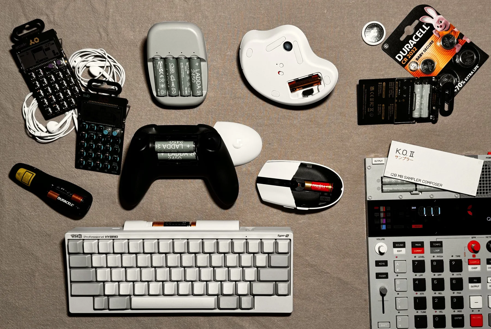

+++
title = "Long Live AA Batteries"
date = 2026-03-14
description = ""
+++

I have been actively moving away from electronic products with built-in lithium batteries, unless I have no practical alternatives.
That means depending on what I need, smartphones and laptops could be the only two electronic devices that I can bear with having built-in lithium batteries.

For all the other devices that need to be portable, I am trying my best to stick to devices with easily replaceable batteries, preferably AA or AAA batteries for bigger devices and CR batteries for smaller devices.
Or for devices that don't necessarily need to have batteries in them, I just stick to wired devices.

My devices that use AA/AAA/CR batteries or are simply battery-free.

In my opinion, AA/AAA/CR batteries are the real "user-replaceable battery" design that I am pursuing.
In recent years, in response to the right-to-repair demand, many companies have started to design the built-in lithium batteries in their products as easier to reach with simple tools and available in their storefronts.
However, as of right now, you probably still need quite a lot of effort getting into the battery compartment of these devices, and you might only be able to purchase the specific model of battery from the specific vendor, with no guarantee that you can always do so.

AA/AAA/CR batteries, on the other hand, are so common that they are essentially an open standard, not locked down to any specific vendor, and always available everywhere.
Replacing batteries on devices that use them usually takes only a few seconds, versus needing to find a charger and a cable and wait for a few hours for the device to charge.
Most importantly, I can confidently pull out one of the devices from my drawer 10 or 20 years later, pop in a new pair of batteries, and it would serve me as well as today. I cannot make the same claim for devices with built-in lithium batteries, and sometimes people forget that lithium batteries will degrade whether you use them or not.
In fact, many of the devices I showed in the picture above are already more than 10 years old, and still hold up as a valid purchase today.

From my experience, devices that use AA/AAA/CR batteries usually have a quite long battery life to begin with, so you don't need to constantly replace the batteries (_long live AA batteries, literally_).
And even if you really like the idea of rechargeable batteries, just buy a set of rechargeable AA/AAA batteries from IKEA or Amazon or elsewhere, and it is super easy to always have a few batteries that are fully charged and ready to use.
