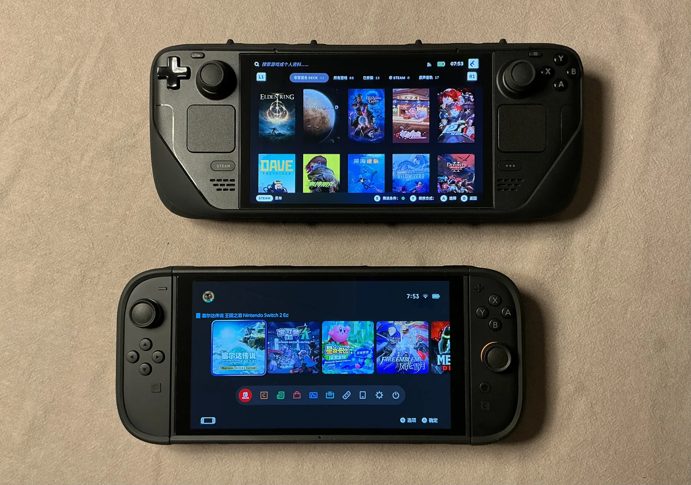
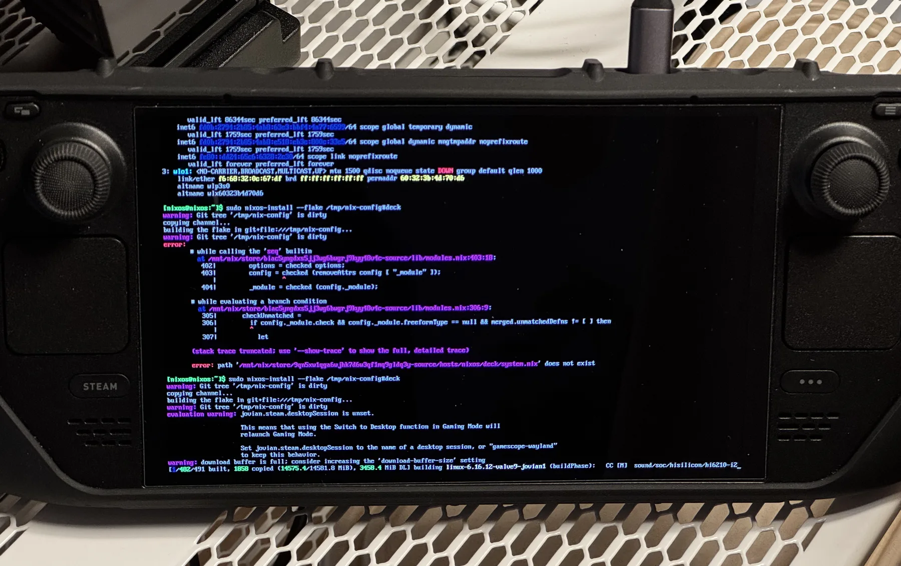
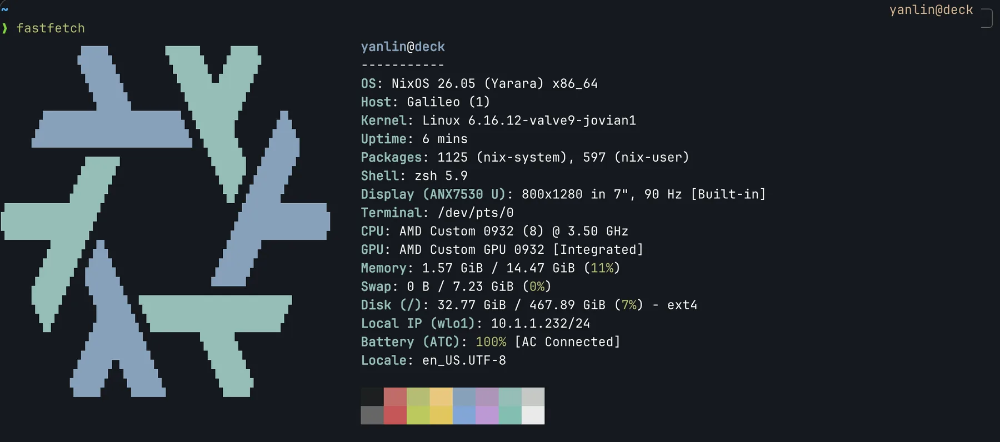
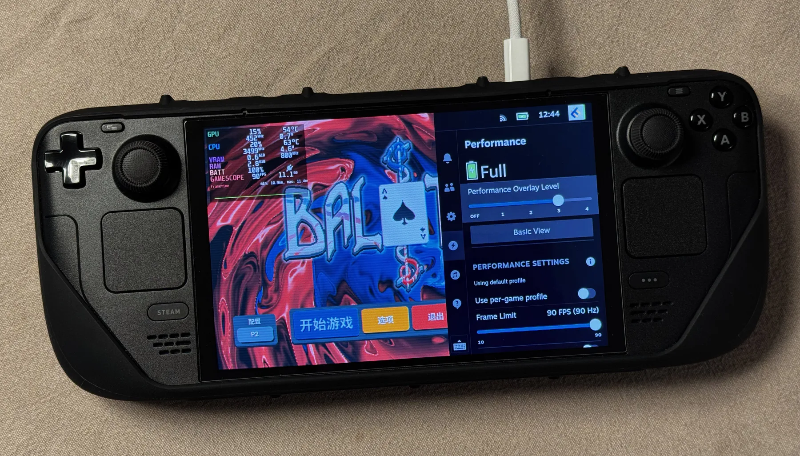

+++
title = "NixOS-powered Steam Deck"
date = "2026-02-08"
description = ""
draft = true
+++

[Steam Deck](https://store.steampowered.com/steamdeck) is a great handheld gaming device and Steam Deck OLED is even better with the beautiful OLED screen, among other hardware improvements.
Its default operating system (SteamOS) is essentially a custom Linux distribution with KDE Plasma desktop environment and a console-style Steam overlay.
It proves that Linux gaming has became quite mature, and depending on what games you often play, the experience can be better than a Windows machine in many aspects.
It also proves that the "plug and play" experience of traditional consoles and open hardware and software can coexist.




Steam Deck OLED (top) and Nintendo Switch 2 (bottom).
Both with the "Killswitch" line of cases from dbrand.


Given the open nature of the Steam Deck, and also considering some people might not prefer every design choice of SteamOS (e.g., the desktop environment), installing NixOS on Steam Deck can be a good option if you want to customize it while still preserving most of the handheld gaming experience. Thanks to the existence of [Jovian-NixOS](https://jovian-experiments.github.io/Jovian-NixOS/), a NixOS module built specifically for running NixOS on Steam Deck, the process is actually very straightforward if you are already familiar with NixOS.

## Install Process

Start by downloading a minimal NixOS ISO image from [NixOS's official website](https://nixos.org/download/), flash the image to a USB drive, and boot the Steam Deck from the USB drive by holding the volume down button and hitting the power button while it is powered off.
You should be able to see the NixOS installer screen.

Once we are in the command line interface of the installer, what I like to do is plug the Steam Deck into Ethernet and enable SSH connection by setting a password for the installer's default user `nixos`.

```bash
passwd nixos  # Set password
ip a  # Get IP address
```

And from now on we can work from our PC by connecting to the Steam Deck remotely.

Next, partition the drive. I prefer to use [`disko`](https://github.com/nix-community/disko) with the following `disk-config.nix`.
It will simply create an ext4 partition on Steam Deck's NVMe drive (since I have the OLED 512GB model).

```nix
{
  disko.devices.disk.main = {
    type = "disk";
    device = "/dev/nvme0n1";
    content = {
      type = "gpt";
      partitions = {
        ESP = {
          size = "512M"; type = "EF00";
          content = {
            type = "filesystem"; format = "vfat"; mountpoint = "/boot";
            mountOptions = [ "fmask=0077" "dmask=0077" ];
          };
        };
        root = {
          size = "100%";
          content = { type = "filesystem"; format = "ext4"; mountpoint = "/"; };
        };
      };
    };
  };
}
```

And then we can partition the drive using the following command.

```bash
sudo nix --experimental-features "nix-command flakes" run github:nix-community/disko -- --mode disko /tmp/disk-config.nix
```

Once done, you should be able to see the drive and the mounted system root.

```
[nixos@nixos:~]$ lsblk
NAME        MAJ:MIN RM   SIZE RO TYPE MOUNTPOINTS
loop0         7:0    0   1.4G  1 loop /nix/.ro-store
sda           8:0    1     0B  0 disk
sdb           8:16   1     0B  0 disk
sdc           8:32   1 232.9G  0 disk
├─sdc1        8:33   1   1.5G  0 part /iso
└─sdc2        8:34   1     3M  0 part
nvme0n1     259:0    0 476.9G  0 disk
├─nvme0n1p1 259:2    0   512M  0 part /mnt/boot
└─nvme0n1p2 259:3    0 476.4G  0 part /mnt
```

Generate hardware configuration on the Steam Deck:

```bash
sudo nixos-generate-config --root /mnt
cat /mnt/etc/nixos/hardware-configuration.nix
```

Do note that since we are using `disko` to manage the mounting of the system drive, we should remove the `fileSystems` and `swapDevices` entries from the generated configuration. Below is my final `hardware-configuration.nix`.

```nix
{ config, lib, pkgs, modulesPath, ... }: {
  imports = [ (modulesPath + "/installer/scan/not-detected.nix") ];
  boot.initrd.availableKernelModules = [
    "nvme" "xhci_pci" "usbhid" "usb_storage" "sd_mod" "sdhci_pci"
  ];
  boot.kernelModules = [ "kvm-amd" ];
  hardware.cpu.amd.updateMicrocode =
    lib.mkDefault config.hardware.enableRedistributableFirmware;
  nixpkgs.hostPlatform = lib.mkDefault "x86_64-linux";
}
```

Finally, we can install NixOS onto the system drive.
To keep things simple for the installation, I prepared a barebones system configuration `system.nix` with the `jovian-nixos` module as follows.
This config will only replicate the "gaming mode" of SteamOS, with no desktop environment.

```nix
{ config, pkgs, lib, ... }: {
  imports = [ ./hardware-configuration.nix ../system-default.nix ];

  boot.loader = {
    systemd-boot.enable = true;
    systemd-boot.configurationLimit = 10;
    efi.canTouchEfiVariables = true;
    timeout = 3;
  };

  jovian.devices.steamdeck.enable = true;
  jovian.steam = { enable = true; autoStart = true; user = "yanlin"; };
  jovian.steamos.useSteamOSConfig = true;
  jovian.hardware.has.amd.gpu = true;
  hardware.enableRedistributableFirmware = true;
  security.rtkit.enable = true;

  networking = {
    hostName = "deck";
    networkmanager.enable = true;
    firewall.enable = false;
  };

  users.users.yanlin = {
    extraGroups = [ "networkmanager" "wheel" "video" "audio" "input" ];
    openssh.authorizedKeys.keys = [ "<your ssh public key>" ];
  };

  environment.systemPackages = with pkgs; [ pciutils usbutils ];
}
```

And a barebones `home.nix` module since I use Home Manager:

```nix
{ config, pkgs, ... }: {
  imports = [ ../home-default.nix ];
}
```

And add the new system and Home Manager entries to the `flake.nix` in [my Nix config repo](https://github.com/Logan-Lin/nix-config).

```nix
{
  description = "Default environment";
  inputs = {
    nixpkgs.url = "github:NixOS/nixpkgs/nixpkgs-unstable";
    home-manager = { url = "github:nix-community/home-manager"; inputs.nixpkgs.follows = "nixpkgs"; };
    disko = { url = "github:nix-community/disko"; inputs.nixpkgs.follows = "nixpkgs"; };
    jovian = { url = "github:Jovian-Experiments/Jovian-NixOS"; inputs.nixpkgs.follows = "nixpkgs"; };
  };
  outputs = inputs@{ self, nixpkgs, home-manager, disko, jovian }: {
    nixosConfigurations."deck" = nixpkgs.lib.nixosSystem {
      system = "x86_64-linux";
      modules = [
        jovian.nixosModules.default  disko.nixosModules.disko
        ./hosts/nixos/deck/system.nix  ./hosts/nixos/deck/disk-config.nix
      ];
    };
    homeConfigurations."yanlin@deck" = home-manager.lib.homeManagerConfiguration {
      pkgs = nixpkgs.legacyPackages.x86_64-linux;
      modules = [ ./hosts/nixos/deck/home.nix ];
    };
  };
}
```

Since we have set up an SSH connection to the Steam Deck before, we can either pull the config repo from a remote repository on it, or transfer the repo to it using `scp` or `rsync`:

```bash
rsync -avP --filter=':- .gitignore' ~/.config/nix/ nixos@<deck-ip>:/tmp/nix-config
```

And install NixOS with the following command.

```bash
sudo nixos-install --flake /tmp/nix-config#deck
```



The (long) build process of NixOS install on the Steam Deck.

Note that this will take a long time (several hours), since it will build Valve's custom Linux kernel on Steam Deck's (not that powerful) CPU. Maybe you can consider an alternative install process by building the system image on another device if you don't want to wait.

Technically, you could also use the standard NixOS Linux kernel by disabling kernel patches in the system config as `enableKernelPatches = false`.
But from my testing, you won't be able to use the Steam Deck normally, since many things won't work (for example audio output).

Once the installation process has finished, you will be prompted to setup a password.
After that, reboot from the system drive and you should boot straight to the Steam gaming mode, just like the original SteamOS.

## How Does It Play?

Given the above configurations, if you stay in the gaming mode, you probably won't be able to notice that this Steam Deck is now powered by NixOS rather than SteamOS, aside from the unconventional boot screen.


Boot screen of this NixOS-powered Steam Deck (speed up 3 times).

Since we haven't included a desktop environment, right now if you try to enter desktop mode, it will just boot back to the gaming mode. If you are planning to use the Steam Deck only as a gaming handheld, then it is totally fine to leave it as it is. To some extent it is even more pure than SteamOS since no desktop environment is included.
Also, you can SSH into the Steam Deck even when it is in gaming mode and use whatever headless command line modules in your system or Home Manager config.



`fastfetch` screen of this Steam Deck, reminding you that it is really running NixOS.

As for the core gaming experience, there is no performance difference compared to SteamOS that I can tell.
Most of the functionalities that people love about SteamOS on the Steam Deck are all here, like the performance overlay and quick resume.



Balatro, playing on the NixOS-powered Steam Deck, with performance overlay.


## What Next?

If you have been using NixOS for a while, you probably can think of hundreds of things you can do on a NixOS-powered Steam Deck.

For example, if I want to introduce a desktop environment to make Steam Deck my Linux PC, all I have to do is to include either the [Hyprland module](https://github.com/Logan-Lin/nix-config/tree/master/modules/hyprland) or the [GNOME module](https://github.com/Logan-Lin/nix-config/tree/master/modules/gnome) in my Nix config repo, and declare the desktop session name as `jovian.steam.desktopSession = "hyprland"` or as `"gnome"`.

There are also lots of gaming-related stuff you can do with NixOS.
For example, in [this post](https://heywoodlh.io/nixos-steamdeck) where the owner set up a WireGuard tunnel to their desktop PC so they can do game streaming remotely.
Similarly you can think of things like introducing a BorgBackup module to do your own game save backup, using `rsync` and a timer to automatically upload Steam screenshots, and so on.

`jovian-nixos` also has [`decky-loader`](https://github.com/SteamDeckHomebrew/decky-loader) built-in, which is a popular plugin system for Steam Deck customization. All you need is to set `jovian.decky-loader.enable = true`.
Generally speaking, installing or removing packages on NixOS should be cleaner and easier than SteamOS, which is non-declarative and might brick your Steam Deck.

There can be some minor user experience issues that require you to finetune your Nix config, depending on your needs.
For example, unlike SteamOS that comes with good multi-language support, the above configuration will only grant you English support. For me, I need to include Chinese fonts in my Nix config for the Steam client to display Chinese characters.
I also haven't figured out how to get Chinese on-screen keyboard to work in gaming mode.

Part of the reason is, although this Steam Deck looks and feels like SteamOS for the most part, technically we are actually running a custom Linux distribution, installing the Steam client, and automatically booting into Steam client's big screen mode.
Valve introduces many custom functions in the pre-installed SteamOS on Steam Deck, but some of them haven't been introduced elsewhere yet. So do expect that not everything you missed from SteamOS can be brought back by tweaking your NixOS config.
