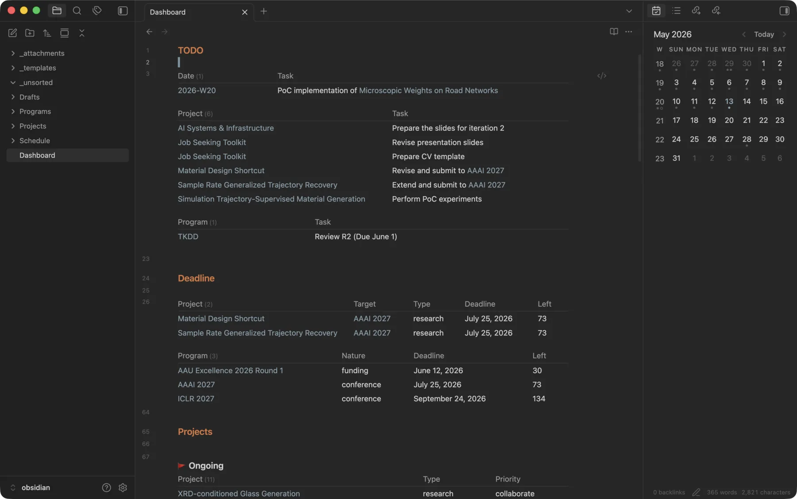
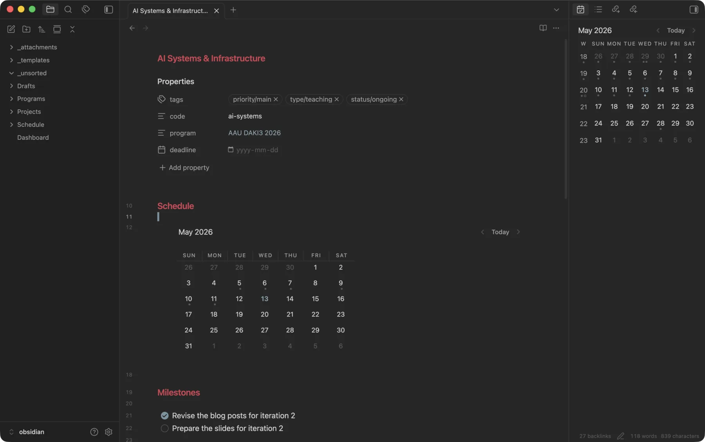

+++
title = "Obsidian and DataView for Personal Project Management"
date = 2026-05-13
description = "A plain-text, local-first project management system built with Obsidian and DataView"
+++

In [Replace Cloud with Local File Sync](../replace-cloud-w-sync), I argued for Obsidian over Notion mainly for its data ownership and offline access.
What I did not show is how Obsidian replaces Notion for project management.
Notion's so-called database view is indeed convenient for project management, and is probably the main reason many people stay with Notion despite the cloud-related problems.
In Obsidian, the equivalent is the [DataView](https://github.com/blacksmithgu/obsidian-dataview) community plugin plus a few conventions of my own.
Together, they turn the vault into a live dashboard for every project I am working on.

## Vault Structure

The vault has three folders and one file at the top level.
`Projects/` holds one note for each project I have worked on.
`Programs/` holds one note for each program.
A program is something a project might belong to, like an academic conference, an education program, or a funding call.
`Schedule/` holds daily notes, named `YYYY-MM-DD.md`.
`Dashboard.md` is the entry point I open every morning.

A project is one thing I work on, and a program optionally groups related projects.
A project links to its program through a `program` frontmatter field.
The dashboard uses that link to read the program's deadline when the project itself does not have one.

Every project note starts with the same frontmatter.

```yaml
---
tags:
  - priority/main
  - type/development
  - status/ongoing
code: personal-blog
program:
deadline:
---
```

I use a small, fixed set of tags.
Status is one of `status/ongoing`, `status/on-hold`, `status/done`, or `status/discarded`.
Type is one of `type/research`, `type/development`, `type/teaching`, or `type/writing`.
Priority is `priority/main` or `priority/collaborate`.

A program note has a simpler frontmatter.

```yaml
---
tags:
  - nature/conference
code: neurips-2026
deadline: 2026-05-08
---
```

The `nature/*` tag is one of `nature/conference`, `nature/education`, `nature/funding`, or `nature/journal`.

Each daily note under `Schedule/` can be used to document the projects I worked on that day, among other stuff.

````markdown
## TODO

- [ ] A task for today

## Notes

Free-form notes go here.

## Schedules

### [[Personal Blog]]

Drafted a new post.
````

A project page can then collect every daily note that points to it.

## DataView Dashboard

DataView reads the frontmatter, tags, inline fields, and task lists of every note in the vault and turns them into a dataset I can query.
A code block marked as `dataview` or `dataviewjs` is rendered in place as a table, calendar, or list.
`Dashboard.md` contains three such blocks.
Once written, the dashboard needs no maintenance.
I only edit individual notes' frontmatter and tasks from then on, and the dashboard reflects those changes immediately.



The rendered `Dashboard.md`, with live TODO, Deadline, and Projects sections.

The first block is the `TODO` list.
I open it every morning to see what is pending across the whole vault, instead of opening every project, program, and daily note individually.
It reads three folders and collects every incomplete task in a specific section.
From `Schedule/` it collects tasks under `TODO`.
From every ongoing project it collects tasks under `Milestones`.
From every program it does the same.

```js
const sources = [
  { head: "Date", query: '"Schedule"', section: "TODO" },
  { head: "Project", query: '"Projects" and #status/ongoing', section: "Milestones" },
  { head: "Program", query: '"Programs"', section: "Milestones" }
];

for (const s of sources) {
  dv.table(
    [s.head, "Task"],
    dv.pages(s.query)
      .file.tasks
      .where(t => !t.completed)
      .where(t => t.section.subpath?.includes(s.section))
      .sort(t => t.path, 'asc')
      .map(t => [dv.fileLink(t.path), t.text])
  );
  dv.el("div", "", { attr: { style: "height: 1em" } });
}
```

The second block, `Deadline`, shows me what is urgent and what is coming up.
It ranks every ongoing project by how soon it is due.
If the project has no deadline of its own, it inherits one from its program.
The same block also lists every program with a deadline inside the next 180 days, so I can see upcoming submission deadlines well in advance.

```js
const pages = dv.pages('"Projects"')
  .where(p => p.file.tags.some(t => t === "#status/ongoing"))
  .mutate(p => {
    const prog = p.program ? dv.page(p.program) : null;
    p.D = p.deadline || prog?.deadline;
  })
  .where(p => p.D);

dv.table(
  ["Project", "Target", "Type", "Deadline", "Left"],
  pages
    .sort(p => p.D, 'asc')
    .map(p => {
      const type = p.file.tags.find(t => t.startsWith("#type/"))?.replace("#type/", "") || "";
      const left = Math.round(dv.date("today").until(p.D).length("days"));
      return [p.file.link, p.program, type, p.D, left];
    })
);

const programs = dv.pages('"Programs"')
  .where(p => p.deadline)
  .mutate(p => {
    p.left = Math.round(dv.date("today").until(p.deadline).length("days"));
  })
  .where(p => p.left >= 0 && p.left <= 180);

dv.el("div", "", { attr: { style: "height: 1em" } });
dv.table(
  ["Program", "Nature", "Deadline", "Left"],
  programs
    .sort(p => p.deadline, 'asc')
    .map(p => {
      const nature = p.file.tags.find(t => t.startsWith("#nature/"))?.replace("#nature/", "") || "";
      return [p.file.link, nature, p.deadline, p.left];
    })
);
```

The third block, `Projects`, is the list of all projects.
I use it to find and open any project, ongoing or finished.
It groups every project by status, sorts inside each group by type and priority, and gives each group an emoji header so I can tell them apart easily.

```js
const statuses = [
  { key: "ongoing", label: "🚩 Ongoing" },
  { key: "on-hold", label: "🚧 On-hold" },
  { key: "done", label: "✅ Done" },
  { key: "discarded", label: "🗑️ Discarded" }
];

for (const s of statuses) {
  const pages = dv.pages('"Projects"')
    .where(p => p.file.tags.some(t => t === `#status/${s.key}`));

  if (pages.length > 0) {
    dv.span(`<b style="display: block; margin-top: 1em">${s.label}</b>\n`);
    dv.table(
      ["Project", "Type", "Priority"],
      pages
        .sort(p => {
          const type = p.file.tags.find(t => t.startsWith("#type/")) || "";
          const priority = p.file.tags.find(t => t.startsWith("#priority/")) || "";
          return type + priority;
        }, 'asc')
        .map(p => {
          const type = p.file.tags.find(t => t.startsWith("#type/"))?.replace("#type/", "") || "";
          const priority = p.file.tags.find(t => t.startsWith("#priority/"))?.replace("#priority/", "") || "";
          return [p.file.link, type, priority];
        })
    );
  }
}
```

This is also where the setup becomes more powerful than Notion.
Notion's database view is a good way to organize rows under one schema, but each database is more or less just a fancy folder.
Notion has no built-in way to aggregate or query across multiple databases, or across the whole workspace.
DataView treats the entire vault as one queryable dataset, which is what makes the dashboard above possible.

## Per-Project View

The template for a project page also embeds a DataView block, but a much shorter one.
It collects every daily note in `Schedule/` that linked to this project and renders them as a calendar heatmap.
Each project page then shows when I last worked on it.



A project page with its calendar view and milestones.

```dataview
CALENDAR date(file.name)
from "Schedule"
where contains(file.outlinks, this.file.link)
sort date(file.name) asc
```

Program pages use the reverse query.
Every project that links to this program appears in a single table.

```dataview
table tags
from "Projects"
where contains(file.outlinks, this.file.link)
```

## Closing Thoughts

What I like about Obsidian is that the plain-text approach extends past the notes themselves, and the above setup is a prime example.
Most of its community plugins, DataView included, also keep everything in plain text and avoid any kind of proprietary lock-in.
A DataView block is just a fenced code block inside a note, so even if DataView goes away tomorrow, the queries stay as readable text and the notes around them do not change at all.
The plugin itself is also just a piece of JavaScript code, so it will keep working as long as Obsidian does, even if its original author stops maintaining it.

The vault is inside a Syncthing folder, so it is identical on every machine and never relies on a cloud service.
The whole setup is just plain files synced peer to peer, with nothing locked into a single piece of software.
