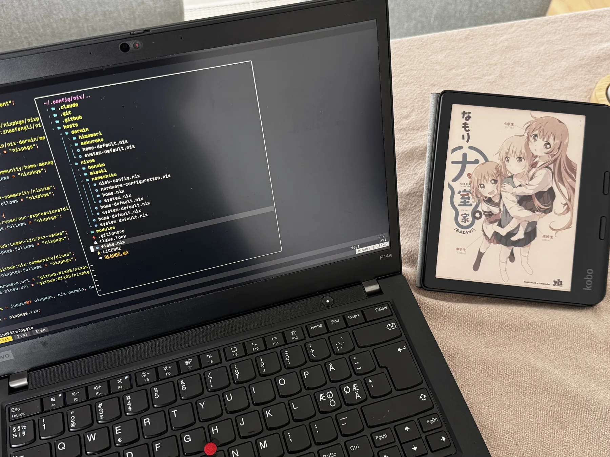

+++
title = "Name My Devices after Characters from Oomuroke"
date = "2026-08-31"
description = ""
+++

What are the hostnames you give to your computers and servers?
You might leave them as the default ones, which typically means that they will be composed of model numbers and other specifications, like `falkenstein-debian-cpx22` or `Apple iMac M3`.

But that's too technical for me. I want my personal devices to be a bit more emotionally connectable.
That's why I name my devices after the characters from Oomuroke (大室家), a manga series that is a spin-off of the [Yuru Yuri (ゆるゆり) series](https://ja.wikipedia.org/wiki/%E3%82%86%E3%82%8B%E3%82%86%E3%82%8A).
And you will soon see that each device is named after the character that (in my view) the device's property matches the best in terms of personality.

Below, the quote blocks are introductions to each character sourced from the [official website](https://ohmuroke.com/).

## `sakurako`

`sakurako` is a MacBook Air with Apple Silicon, named after Oomuro Sakurako (大室 櫻子).
Sakurako is the energetic and free-spirited middle Oomuro sister.
Just like her, `sakurako` is always on the move, which is what a laptop is designed for.
It also never seems to run out of energy, thanks to the amazing power efficiency of Apple Silicon.

> 大室三姉妹の次女。13歳の中学1年生。
> 七森中学校では生徒会に所属。
> 生徒会役員の古谷向日葵とは幼なじみのくされ縁で、ともに生徒会副会長の座を争う間柄。
> 明るく調子に乗りやすい性格で、運動は得意だが勉強は苦手。
> 家では優秀な姉の撫子、妹の花子から呆れられることもあるが、家族を大切に想っている。 

## `himawari`

`himawari` is an iMac with Apple Silicon, named after Furutani Himawari (古谷 向日葵).
Himawari is Sakurako's childhood friend. Apparently, Himawari and Sakurako see each other as constant rivals, but that didn't take away the fact that they deeply care about each other.
Resembling their relationship, `himawari` naturally pairs with `sakurako` given they are both Macs. Like Himawari, it is the calmer and more stationary one of the pair.

As a bonus, "himawari" means "sunflower" in Japanese, which corresponds to iMacs that [historically resembled the sunflower look](https://en.wikipedia.org/wiki/IMac_G4).

> 櫻子と一緒に七森中生徒会に入っている同級生。
> 櫻子とは幼稚園からの幼なじみだが、性格や好みは対照的で基本的には落ち着きがある。
> 普段は衝突ばかりしているが、なんだかんだでいつも櫻子と一緒にいる。 

## `nadeshiko`

`nadeshiko` is a home server, named after Oomuro Nadeshiko (大室 撫子).
Nadeshiko is the eldest and most mature of the Oomuro sisters.
Like her, this host is the calm and reliable one, running on a ZFS mirror of enterprise SSDs and quietly keeping the family's files and backups safe.

> 大室三姉妹の長女。18歳の高校3年生。
> 真面目でクールな性格。
> おバカな妹・櫻子を冷めた表情であしらいながらも、妹たちの好物を買ってあげたりとさりげない優しさを時おり見せる。
> いつも一緒にいる三輪藍、八重野美穂、園川めぐみとの仲良し４人組でも思いやりを発揮。
> どうやら彼女がいるようだが…？

## `hanako`

`hanako` is a cloud server, named after Oomuro Hanako (大室 花子).
Hanako is the youngest of the three Oomuro sisters and the family's composed honor student.
While this server has the most modest hardware in the fleet as a small cloud virtual machine, it stays always available and every other host relies on it, the way Hanako is seen as reliable and dependable by her family members and friends.

> 大室三姉妹の末っ子。8歳の小学2年生。
> 真面目で落ち着きがあり、勉強も運動も得意な優等生。
> それゆえ同級生たちからは深く信頼され半ば崇められているが、本人はそれを鼻にかけることもなく、みんなと仲良く過ごしている。
> お調子者の姉・櫻子に呆れてばかりの毎日だが、櫻子の好物を用意するなど姉想いの一面も。 

## `kokoro`

`kokoro` is a Google Pixel, named after Ogawa Kokoro (小川 こころ).
Kokoro is the dreamy and unpredictable oddball of Hanako's friends who hides surprising ability behind an airy manner.
Like her, this device is the quirky odd one out of the fleet. Not only is it the lone Android among the Apple phone and the Macs, but it is also running [GrapheneOS](https://grapheneos.org/) as my experimental device.

> 花子の小学校の友だち。
> いつも花子、未来と３人で行動している。穏やかでマイペースな性格であり、考え方や好みが独特。
> 未来と同じく花子を尊敬している。

## `mirai`

`mirai` is an iPhone, named after Souma Mirai (相馬 未来).
Mirai is a cheerful and ordinary member of Hanako's friends who never quite stands out.
Like her, this is a plain everyday phone that does nothing wrong and nothing remarkable.

> 花子の小学校の友だち。前髪をキューブのヘアゴムで留めている。
> 花子、こころと3人で放課後もよく遊んでいる。明るく時々おっちょこちょいな元気っこ。
> 勉強も運動もできる花子のことを尊敬し、慕っている。

## `misaki`

`misaki` is a ThinkPad laptop, named after Takasaki Misaki (高崎 みさき).
Misaki is a member of Hanako's friends who calls herself Hanako's rival and keeps trying to stand out despite rarely winning.
Like her, this laptop is less powerful than it presents, a years-old ThinkPad dressed up in a fully custom [NixOS](https://nixos.org/)-based [Hyprland](https://hypr.land/) desktop, loud and eager to be noticed yet never giving up.

> 小学2年生から花子と同じクラスになったクラスメイト。
> 花子を一方的にライバル視し、何かにつけては上から目線で勝負を挑むがいつもあしらわれている。
> 高飛車だが実はちょっと臆病。花子たちには「みさきち」と呼ばれている。

## `megumi`

`megumi` is an iPad, named after Sonokawa Megumi (園川 めぐみ).
Megumi is the gentle and easily teased member of Nadeshiko's friends who quietly works hard at a cake shop and dreams of opening her own.
Like her, this is viewed as the underdog of the fleet, a tablet joked about as redundant next to the phones and the computers while it steadily carries its share of the work.

> 撫子の友だちで、仲良し４人組のひとり。
> 4人の中ではいじられキャラで明るい性格。
> ケーキ屋でアルバイトをしている。 

The host setup displayed on `misaki` alongside volume 4 of the Oomuroke manga series.
