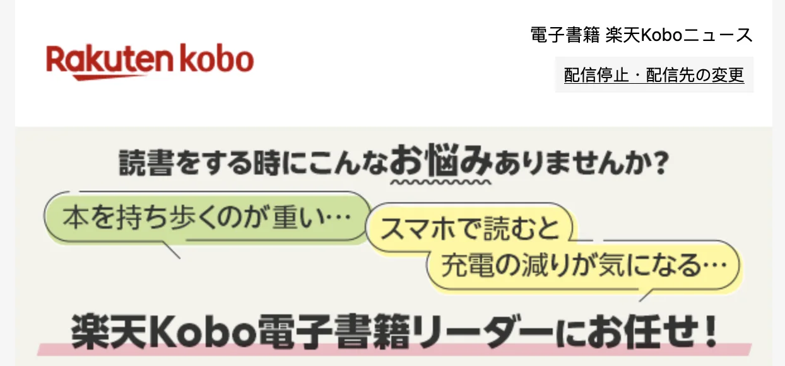
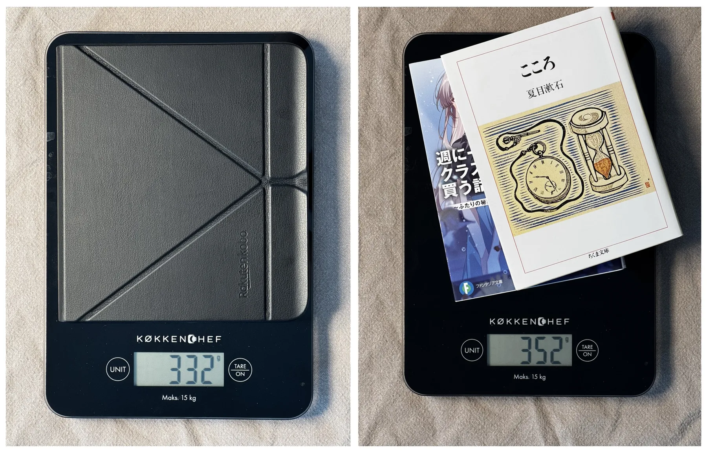
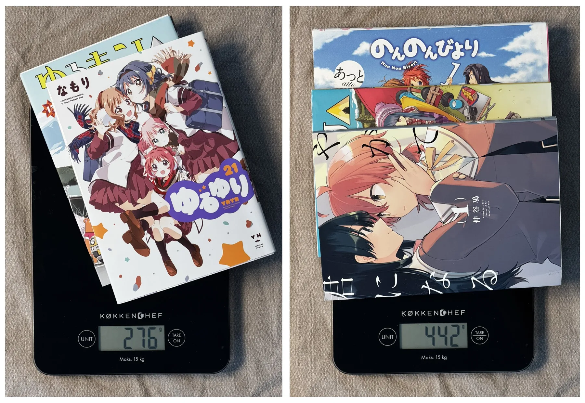
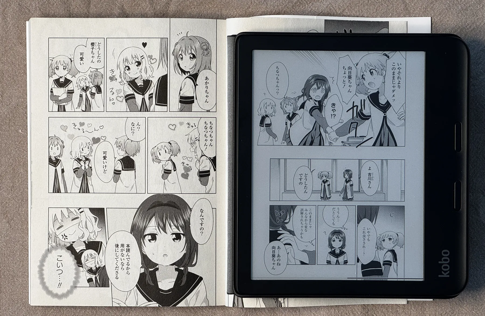

+++
title = "Selling Points of E-Books are Off"
date = 2026-04-10
+++

Selling points of electronic books are off, at least those frequently mentioned by e-book and e-reader vendors.

I recently received this advertisement email from Rakuten Kobo, a Japanese brand that sells electronic books and readers, just like Amazon with their Kindle lineup.

 Opening of the advertisement email I received from Rakuten Kobo. 

It is saying:

> 読書をする時にこんなお悩みありませんか？
> 本を持ち歩くのが重い... スマホで読むと充電の減りが気になる...
> 楽天Kobo電子書籍リーダーにお任せ！

Which translates to:
_Do you have these worries while reading books?
Walking around with books is heavy... Battery drain when reading on a smartphone is concerning... 
Leave it to the Rakuten Kobo e-reader!_

Which are selling points of e-books and e-readers frequently mentioned by most vendors, not limited to Rakuten Kobo.
However, they don't make a lot of sense in most real-world scenarios.

Technically it is possible to fit thousands of books into the 16GB or 32GB storage those e-readers usually have, and these books in physical form are certainly much heavier than an e-reader and would be impossible for anyone to carry around.
However there are really not many cases where you need to carry more than 2 books with you to read.
During daily routine, it is quite unlikely that someone will have enough time to finish more than 1 book within one day walking outside.
In the extreme case where someone takes a one-month trip, they would spend most of the time sightseeing rather than reading books, so 2 books are more than enough.
Even if someone has a collection of thousands of physical books, they can keep most of the books at home and take just one to two books with them if they want to read outside.

Under that condition, a Rakuten Kobo Libra Colour with its official case attached (which is basically mandatory if you want to carry it around) has a similar weight as 2 average Japanese novels (in A6 size), or between 2 to 3 average Japanese comic books (in B6 size). I would boldly assume this is a similar story for other e-readers on the market and novels in other languages.

 Weight comparison of a Kobo Libra Colour versus 2 novels. 

 Weight of 2 and 3 Japanese comic books. 

In other words, weight-wise, an e-reader is basically equivalent to the number of books that you can realistically finish outside, whether it is a short or a long trip.
Physical books also do not have any of the shortcomings of e-books, including but not limited to:
e-readers are battery-powered thus need to be charged;
e-reader screens either cause eye fatigue more easily (LED or OLED), or have lower contrast compared to real papers (e-ink);
e-books can have smaller or blurrier text or both;
in the case of Amazon with their Kindle service, you do not actually own your e-books and they make it as hard as possible for you to remove DRM from your downloaded e-book files, even if in most cases you are paying the same price for the e-books as for the physical books;
and most importantly, e-books do not have smells, while physical books smell good.

 Comparison of real papers and E-ink screen, both showing pages from the ゆるゆり series. 

Now, it might look ironic that I use an e-reader and have purchased a bunch of e-books anyway.
Well, that's why the title of this post is **Selling Points of E-Books are Off**, rather than **E-Books Make No Sense**.
Based on my situation, there are valid benefits of e-books, just rarely mentioned by the vendors.
One of them is, since I live outside of Japan, purchasing physical Japanese books usually means I need to ship them all the way from Japan, where the shipping fees and taxes combined will be several times the price of the books themselves.
I also use my E-reader to read ~~pirated~~ _completely legally obtained digital books_ or community-translation of books, which I cannot get physical copies of. For those, at least an e-reader with an e-ink screen is indeed much lighter on my eyes compared to LCD or OLED.
