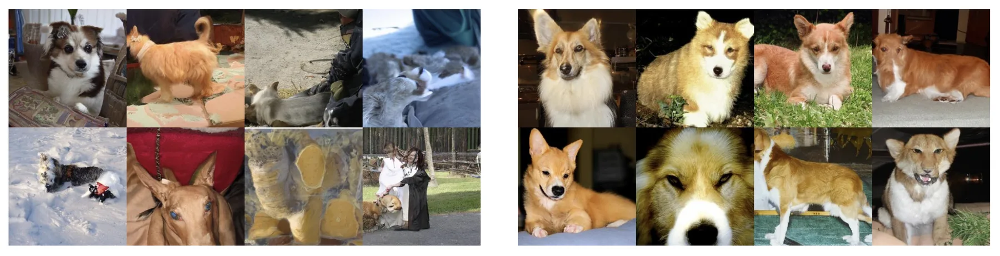
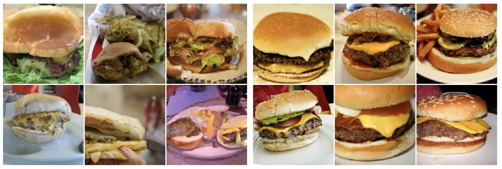
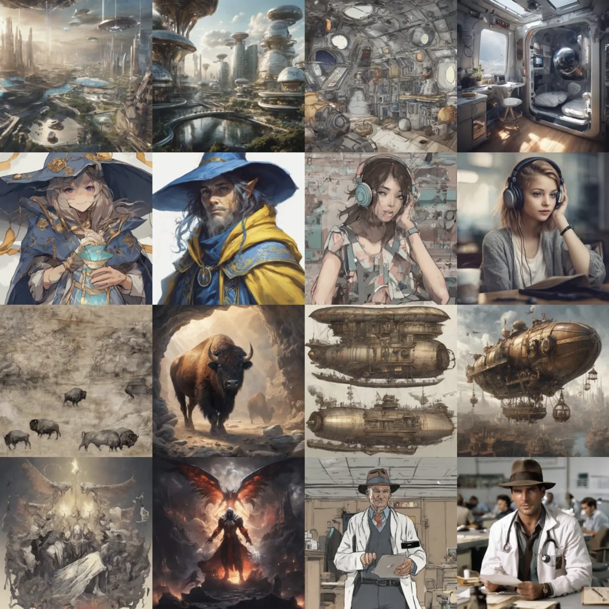

+++
title = "From Soft Guidance to Hard Constraints on Diffusion Sampling"
date = 2026-02-13
description = ""
+++

Diffusion models, or more broadly speaking, both score-matching and flow-matching models, are the foundational frameworks for building generative models these days. Compared to previous frameworks including VAEs and GANs, they are actually capable of generating high-quality data, ~like NSFW images that you might or might not want to jerk off to~.
For a more detailed treatment of diffusion models, see [this post on shortcut models](../ode-sde) and [this post on discrete diffusion models](../discrete-diffusion).

In many scenarios, we would like a generative model to be able to do conditional generation.
For example, when generating images, one might want to generate an image of a dog, rather than any image that is plausible.
Formally, instead of sampling from an unconditional probability $x\sim p_\theta(x)$ (where $p_\theta(x)$ is the probability parameterized by the generative model with parameters $\theta$), we want to sample from a conditional probability $x\sim p_\theta(x|y)$, where $y$ is the condition.

One straightforward solution is to train a diffusion model where the denoiser takes both the condition $y$ and the noisy data $x_t$ as input.
But there are some limitations with this solution:

1. We will need to train a new diffusion model from scratch for every new set of condition, which can be expensive
2. There is no way to balance the diversity and fidelity of generation; in other words, we cannot control the strength of the condition
3. The condition is just a soft guidance, not a hard constraint; in scenarios like the generation needs to obey a physical truth, this can be problematic

Luckily, there are several techniques tackling these limitations, each with their respective focus and quirks, and we will do an overview of them in this post.

{{ toc() }}

## Classifier Guidance: Steering Sampling with a Classifier

> Dhariwal, Prafulla, and Alexander Nichol. “Diffusion Models Beat GANs on Image Synthesis.”

Classifier guidance can be applied to an unconditional diffusion model to add condition signal retroactively, without re-training the diffusion model itself.

Recall in the score-matching formulation, an unconditional diffusion model learns the unconditional score $\nabla_{x_t}\log p(x_t)$, which represents the direction towards higher density area of the data distribution.
To do conditional generation, we will need the conditional score $\nabla_{x_t}\log p(x_t|y)$.
With Bayes' rule we can do a clean decomposition. Since $p(x_t|y)\propto p(y|x_t)\cdot p(x_t)$, taking the log and then the gradient, we have:


\nabla_{x_t}\log p(x_t|y)=\nabla_{x_t}\log p(x_t)+\nabla_{x_t}\log p(y|x_t)


In other words, the conditional score is the unconditional score plus the gradient of $\log p(y|x_t)$.

When $y$ is a class label, we can implement the above formulation by training a classifier $p_\phi(y|x_t)$ on noisy images $x_t$ at various noise levels. At each denoising step, we compute the classifier's gradient with respect to $x_t$ and add it to the diffusion model's score.
The diffusion model itself is never modified. In DDPM sampling, this becomes shifting the predicted mean:


\tilde{\mu}=\mu+s\,\Sigma\,\nabla_{x_t}\log p_\phi(y|x_t)


where $\Sigma$ is the covariance of the denoising step and $s$ is a gradient scale.
Intuitively, we are using the gradient of a classifier to steer the generation direction towards the condition's favor.
By extension, $y$ does not have to be a class label and $p_\phi(y|x_t)$ does not have to be a classifier: $p(y|x_t)$ can be any differentiable predictor that predicts the condition $y$ of any modality given $x_t$.

In theory, $s=1$ is the correct value corresponding to exact $p(x_t|y)$. In practice, it is too weak because the diffusion model's score overwhelms the classifier gradient. Scaling up to $s>1$ is equivalent to sampling from a sharpened distribution:


\nabla_{x_t}\log p(x_t)+s\cdot\nabla_{x_t}\log p(y|x_t)=\nabla_{x_t}\log\left[\frac{p(y|x_t)^s\cdot p(x_t)}{Z}\right]


When $s>1$, $p(y|x_t)^s$ concentrates mass on samples where the classifier is very confident. This gives a smooth diversity-fidelity tradeoff analogous to the truncation trick in GANs.


Images generated conditioned on class "Pembroke Welsh corgi" with classifier guidance, $s=1$ (left) or $s=10$ (right).
Images generated with lower $s$ have higher diversity while those generated with higher $s$ are more faithful to the condition.


Classifier guidance is modular in that any pretrained diffusion model can be steered with any differentiable condition predictor.
Nonetheless, it still requires training a condition predictor that works on noisy inputs.
There are also scenarios where training this predictor is impractical or too heavy, for example, when the condition is a text prompt, or inpainting context from a masked image.

## Classifier-Free Guidance

> Ho, Jonathan, and Tim Salimans. “Classifier-Free Diffusion Guidance.”

Classifier guidance steers an unconditional model with gradients from a condition predictor. Classifier-free guidance does the reverse, that is, it steers a conditional model with an unconditional signal.

Recall the Bayes' rule decomposition above. Rearranging it, the classifier gradient is the difference between the conditional and unconditional scores:


\nabla_{x_t}\log p(y|x_t)=\nabla_{x_t}\log p(x_t|y)-\nabla_{x_t}\log p(x_t)


If we already have a conditional diffusion model that estimates $\nabla_{x_t}\log p(x_t|y)$, and we also have an unconditional model that estimates $\nabla_{x_t}\log p(x_t)$, we can compute the implicit classifier gradient from their difference without needing an actual classifier. Plugging this back into the guided score with scale $s$:


\tilde{\nabla}_{x_t}\log p(x_t|y)=\nabla_{x_t}\log p(x_t)+s\cdot\left[\nabla_{x_t}\log p(x_t|y)-\nabla_{x_t}\log p(x_t)\right]


Equivalently, in the noise prediction formulation:


\tilde{\epsilon}_\theta=(1+s)\cdot\epsilon_\theta(x_t,t,y)-s\cdot\epsilon_\theta(x_t,t,\varnothing)


Similar to classifier guidance, higher $s$ amplifies the implicit classifier signal.


Images generated with classifier-free guidance, $s=0$ (left) or $s=3$ (right).
Similar conclusion to the above example with classifier guidance.


The conditional signal comes from an explicitly trained conditional generative model, i.e., a diffusion model where the denoiser takes the condition as input.
The unconditional signal could technically come from a separately trained unconditional model. But with a simple training trick, we can fit both into one denoiser: during training, randomly replace the condition $y$ with a null token $\varnothing$ with a probability around 10-20%. The network then learns both $\epsilon_\theta(x_t, t, y)$ and $\epsilon_\theta(x_t, t, \varnothing)$ with shared parameters. At sampling time, we run this single network twice per step, once with and once without the condition.

Another trick introduced in _Sadat, Seyedmorteza, Manuel Kansy, Otmar Hilliges, and Romann M. Weber. “No Training, No Problem: Rethinking Classifier-Free Guidance for Diffusion Models.”_ enables simulation of the unconditioned denoiser $\epsilon_\theta(x_t, t, \varnothing)$ with a normally trained conditioned denoiser $\epsilon_\theta(x_t, t, y)$: simply feed the denoiser with randomly drawn condition $y$ at sampling time. This works since when $y$ is random and independent of $x_t$, \nabla_{x_t}\log p(x_t|y) \approx \nabla_{x_t}\log p(x_t).

Compared to classifier guidance, we lose modularity since the model must be trained with condition signal.
The benefit is we gain more flexibility in the modality of condition, and it would work on any training dataset containing pairs of data $x$ and condition $y$.

## Guidance with Non-Differentiable Classifiers

> 1. Huang, Yujia, Adishree Ghatare, Yuanzhe Liu, et al. “Symbolic Music Generation with Non-Differentiable Rule Guided Diffusion.”
> 2. Yeh, Po-Hung, Kuang-Huei Lee, and Jun-Cheng Chen. “Training-Free Diffusion Model Alignment with Sampling Demons.”
> 3. Guo, Yingqing, Yukang Yang, Hui Yuan, and Mengdi Wang. “Training-Free Guidance Beyond Differentiability: Scalable Path Steering with Tree Search in Diffusion and Flow Models.”

I will say classifier-free guidance is not a replacement to classifier guidance, since classifier guidance still has the unique functionality of enabling an unconditioned diffusion model to do conditioned generation.

But on this aspect, classifier guidance has the limitation that $\nabla_{x_t}\log p(y|x_t)$ needs to be computable.
So, in scenarios where the classifier is non-differentiable, classifier guidance won't work.
Say for example, in symbolic music generation, one might want to control the note density (total number of notes) of the generated piece, where the classifier involves counting how many elements exceed a threshold. Or the classifier might be a black-box, like an online API scoring the aesthetics of an image, where gradients are simply not available.

In such scenarios, we can still steer the sampling process by exploiting the stochasticity in DDPM sampling.
In DDPM sampling, each denoising step samples from a Gaussian distribution around the predicted posterior mean:


x_{t-1}=\hat{x}_{t-1}+\sigma_t\mathbf{z},\quad\mathbf{z}\sim\mathcal{N}(\mathbf{0},\mathbf{I})


Different draws of $\mathbf{z}$ lead to different valid next states. We can exploit this to implement a search mechanism. Instead of drawing one noise sample and moving on, we draw $n$ candidates:


x_{t-1}^i=\hat{x}_{t-1}+\sigma_t\mathbf{z}^i,\quad\mathbf{z}^i\sim\mathcal{N}(\mathbf{0},\mathbf{I}),\quad i=1,\ldots,n


For each candidate $x_{t-1}^i$, we estimate the clean sample $\hat{x}_0^i$ it would eventually produce (via Tweedie's formula or a PF-ODE solver), and evaluate the classifier on it. Then we pick the candidate that maximizes the classifier and continue to the next step:


k=\underset{i}{\operatorname{argmax}}\;\log p(y|\hat{x}_0^i),\quad x_{t-1}=x_{t-1}^k


This procedure only requires forward evaluation of the classifier on estimated clean samples. The classifier can be anything that takes a clean sample and returns a score, and does not need to be differentiable or even fully transparent.

Beyond just picking the single best candidate, a softer variant is to construct the noise for the next step as a weighted combination of all $n$ candidate noises, where candidates with higher scores get higher weights:


\mathbf{z}^*\propto\sum_{i=1}^{n}w_i\,\mathbf{z}^i,\quad w_i=f\!\left(\log p(y|\hat{x}_0^i)\right)


where $f$ is some monotonically increasing weighting function. This avoids committing fully to one candidate and can produce smoother trajectories.


Each row is two pairs of images, and each pair of images is either generated by vanilla diffusion sampling (left) or guided with blackbox aesthetic scoring API (right).
The ones guided with aesthetic scoring API have higher fidelity.


A side note on flow matching models, where the sampling step is a deterministic ODE step with no noise to vary. We can still apply the same idea: at each sampling step, run the velocity predictor once to get the predicted clean sample $\hat{x}_1$, then create $n$ noisy variations $\hat{x}_1^i\sim\mathcal{N}(\hat{x}_1,\rho_t\mathbf{I})$, evaluate the classifier on each $\hat{x}_1^i$, and use the best one to compute the next ODE step.

Note that generating $n$ candidates does not require running the denoiser $n$ times. The posterior mean $\hat{x}_{t-1}$ is computed once, and the candidates are produced by simply drawing $n$ different noise samples from $\mathcal{N}(\mathbf{0},\mathbf{I})$, which is cheap. The main computational overhead is evaluating the classifier $n$ times per step.

> 1. Bansal, Arpit, Hong-Min Chu, Avi Schwarzschild, et al. “Universal Guidance for Diffusion Models.”
> 2. Shen, Yuchen, Chenhao Zhang, Chenghui Zhou, Sijie Fu, Newell Washburn, and Barnabás Póczos. “Non-Differentiable Diffusion Guidance for Improved Molecular Geometry.”

Another route is to preserve the classifier guidance framework, but for non-differentiable classifiers, estimate the required gradient using simultaneous perturbation stochastic approximation (SPSA). The idea is straightforward: to approximate $\nabla_{x_t}\log p(y|x_t)$, we probe around $x_t$ with a random perturbation and use the change in classifier score to construct a gradient estimate. Concretely, draw a random perturbation vector $\boldsymbol{\Delta}\sim\mathcal{N}(\mathbf{0},\mathbf{I})$ and compute:


\widetilde{\nabla}_{x_t}\log p(y|x_t)\approx\frac{\log p(y|x_t+\zeta\boldsymbol{\Delta})-\log p(y|x_t-\zeta\boldsymbol{\Delta})}{2\zeta}\,\boldsymbol{\Delta}


where $\zeta$ is a small perturbation scale. The numerator measures how much the classifier score changes along the random direction $\boldsymbol{\Delta}$, and multiplying by $\boldsymbol{\Delta}$ projects that scalar difference back into a full-dimensional gradient estimate. In expectation over $\boldsymbol{\Delta}$ this recovers the true gradient, and it requires only two forward evaluations of the classifier regardless of the dimensionality of $x_t$. The estimated gradient then replaces the exact gradient in the classifier guidance update.

## Imposing Hard Constraints on Diffusion Sampling

> Utkarsh, Utkarsh, Pengfei Cai, Alan Edelman, Rafael Gomez-Bombarelli, and Christopher Vincent Rackauckas. “Physics-Constrained Flow Matching: Sampling Generative Models with Hard Constraints.”

All the above techniques can only add soft guidance to the diffusion sampling process.
No matter how large of a gradient scale s we use, there is no guarantee that the generated sample strictly satisfies the condition.
In scenarios like scientific computing, this can be a problem, since the generation might need to exactly conserve mass or satisfy boundary conditions.

In such scenarios, we can guarantee exact constraint satisfaction by projecting intermediate steps onto the constraint surface during sampling.
Consider the flow matching setting, where the model has a learned velocity field v_\theta(x_t, t) that transports noise x_0 to clean samples x_1 via the ODE \frac{d}{dt}x_t = v_\theta(x_t, t).
The constraint is formulated as h(x_1) = 0, where $h$ is a differentiable function.

At each sampling step t \to t + \delta t, we first estimate the clean sample \hat{x}_1 from the current x_t (similar to Tweedie's formula, we can use one Euler step from $t$ to $1$).
This \hat{x}_1 generally violates the constraint, i.e. h(\hat{x}_1) \neq 0.
Thus, we project \hat{x}_1 onto the constraint manifold \mathcal{M} = \{x : h(x) = 0\}. The idea is to linearize the constraint near \hat{x}_1, so that \mathcal{M} locally looks like a hyperplane, and then do an orthogonal projection onto that hyperplane. This is a single Gauss-Newton step:


\hat{x}_1^{\text{proj}} = \hat{x}_1 - J^\top(JJ^\top)^{-1}\,h(\hat{x}_1)


where J is the Jacobian of the constraint, i.e., $J=\nabla h(\hat{x}_1)$.
The term J^\top(JJ^\top)^{-1} is the pseudoinverse of J, which maps a constraint violation h(\hat{x}_1) back to the smallest displacement in sample space that would zero it out under the linearization.
For linear constraints this lands exactly on \mathcal{M}; for nonlinear constraints it is approximate but gets refined at every subsequent flow step.

To propagate the above correction back to the current sampling step, we simply parameterize the corrected $x_t'$ as:


x_{t}' = (1 - t)\,x_0 + t\,\hat{x}_1^{\text{proj}}


At the end of flow matching sampling, \hat{x}_1 may still not exactly satisfy the constraint due to discretization and nonlinearity of h. As a final cleanup, we can solve:
\arg\min_{x'}\|x' - \hat{x}_1\|^2 \;\text{s.t.}\; h(x') = 0
using Newton iterations to machine precision, i.e., making the final generation x' satisfy the constraint as close as the computing hardware allows.

This approach does have the same limitation as classifier guidance that the constraint needs to be differentiable.
On top of that, the constraint also needs to be able to be expressed as h(x_1) = 0.
But it shares the same benefit with classifier guidance that it can be plugged into a pretrained model since it only changes the sampling process.
One could also see that you do not want to use DDPM sampling with this approach, since its stochasticity won't help us get the exact satisfaction of a constraint, and that is why we choose to use flow matching with ODE sampling.

