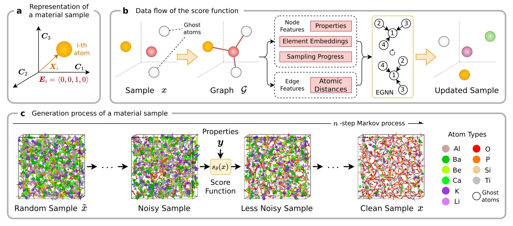
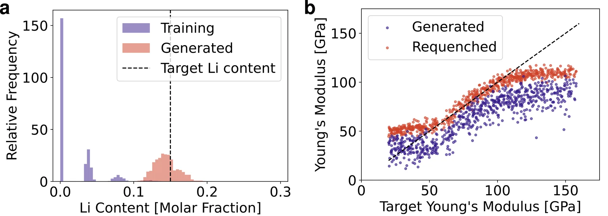
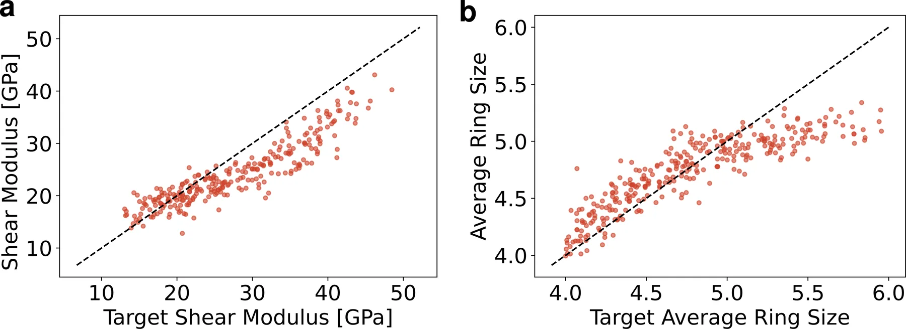
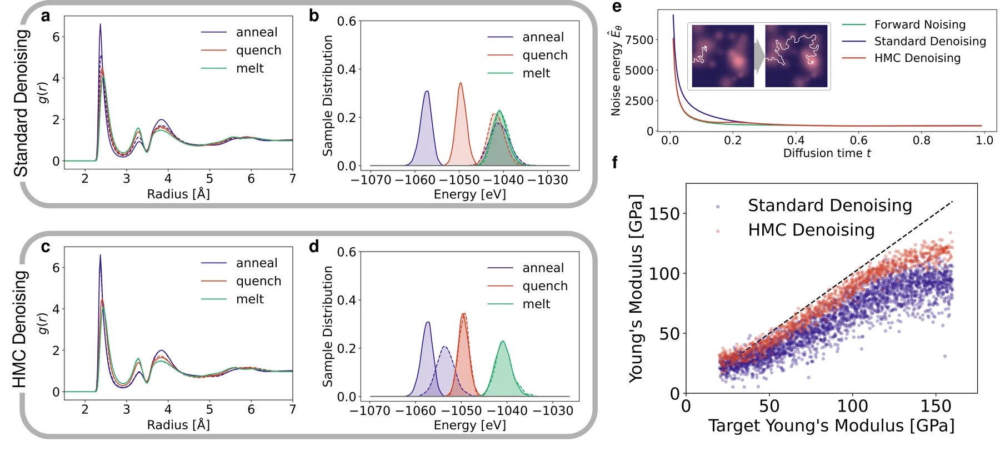

+++
title = "Inverse Design of Amorphous Materials, and the Relaxation Problem"
date = 2026-06-17
description = "AMDEN, a diffusion framework for inverse design of amorphous materials, why standard denoising fails to produce relaxed low-energy structures, and how HMC denoising recovers them."
+++

Diffusion models have become a standard tool for the inverse design of materials, generating structures conditioned on target properties rather than searching for them by trial and error.
For crystalline materials this works well, with frameworks like MatterGen generating crystal structures for desired properties.
[Amorphous materials](https://en.wikipedia.org/wiki/Amorphous_solid), the disordered solids such as glasses, have lagged behind.

This post presents AMDEN, a diffusion framework for the inverse design of amorphous materials, and the problem that ended up at its center.
A diffusion model trained on glass structures can generate a sample that looks structurally close to the reference, with only minor differences in the [radial distribution function](https://en.wikipedia.org/wiki/Radial_distribution_function) (RDF) that captures how interatomic distances are distributed, while its energy is clearly wrong, sitting well above the relaxed, low-energy structures it was trained on, the ones whose atoms have settled into a local energy minimum.
This limitation comes from denoising on the energy landscapes that glasses occupy, and it is what stands between diffusion models and the relaxed structures that materials design actually targets.

> Jonas A. Finkler and Yan Lin (equal contribution), Tao Du, Jilin Hu, and Morten M. Smedskjaer. "Inverse Design of Amorphous Materials with Targeted Properties." Paper published at [Advanced Materials](https://doi.org/10.1002/adma.202522493). Code and datasets at [github.com/Logan-Lin/AMDEN-code](https://github.com/Logan-Lin/AMDEN-code).

{{ toc() }}

## Amorphous Materials

A [crystal](https://en.wikipedia.org/wiki/Crystal) is the simple case for a generative model.
Its atoms sit on a repeating lattice, so it is fully described by a small unit cell, and a structure from one source can be reconciled with another by cheaply re-relaxing the atoms.
An amorphous material has no long-range order, just atoms frozen into a disordered arrangement, the state a glass reaches when a liquid is cooled too fast to crystallize.
These disordered solids are candidates for batteries and energy storage, non-linear optics, and catalysis, and their properties depend on both composition and thermal history, which gives a large design space.
Two glasses of identical composition can differ because one was cooled slowly and the other quenched.

Inverse design targets that design space directly, without trial and error.
Instead of choosing a composition and process, synthesizing, and measuring, the model starts from the desired properties and produces an atomic structure that should exhibit them.
The difficulty is that amorphous materials remove the conveniences crystals offer, in three ways that shape the model.

First, a target does not pin down one structure.
For a given composition and process, the valid structures form a distribution, and the model must sample from it rather than predict one answer.
Second, the relevant structure lives at the medium range, roughly 5 to 20 Angstrom, or 0.5 to 2 nm, so faithful samples need cells of hundreds of atoms rather than a handful.
Third, density is a design variable in its own right, and it strongly affects properties.
On top of this, each realistic reference structure comes from a slow melt-quench molecular dynamics (MD) simulation, where the material is melted and cooled gradually.
That cost makes amorphous datasets scarce, small, and noisy, which is the opposite of what a data-hungry generative model wants, and it is the main reason amorphous inverse design has trailed the crystalline case.

## The AMDEN Model

AMDEN, the Amorphous Material DEnoising Network, addresses these three difficulties in turn.

A material sample is a triple $x = (C, X, E)$, where $C$ is the cell, $X$ the atom positions, and $E$ a one-hot encoding of each atom's element.
AMDEN is a score-based diffusion model over $x$ with a fixed cell, generating a structure by denoising an initial random sample.
The model learns a score function $s_\theta$ that approximates the gradient of the log data density,


s_\theta(x) \approx \nabla_x \log p(x),


and each reverse step follows this score toward more probable structures.
The forward process differs for the two parts of a sample, dispersing positions into a uniform cloud across the cell and the element labels into Gaussian noise over a diffusion time $t$,


X_t = \alpha_X(t)\, X + \sigma_X(t)\, \epsilon_X, \qquad E_t = \alpha_E(t)\, E + \sigma_E(t)\, \epsilon_E,


where $\epsilon_X$ and $\epsilon_E$ are Gaussian noise and the schedules $\alpha$ and $\sigma$ control how much signal and noise each carries at time $t$.
We use a stochastic differential equation (SDE) sampler rather than a deterministic one, since the added randomness helps the model explore the many valid structures and reach different ones across runs, which matters when there is no single right answer.

> Song, Yang, Jascha Sohl-Dickstein, Diederik P. Kingma, Abhishek Kumar, Stefano Ermon, and Ben Poole. "Score-based generative modeling through stochastic differential equations."

With cells of hundreds of atoms, the architecture has to scale, so its design matters.
The score function is an equivariant graph neural network (EGNN) over a graph that connects atoms within a 6.5 Angstrom cutoff, computed with periodic boundary conditions so the finite cell behaves as an endlessly repeating solid.
A material is unchanged under relabeling of atoms, translation, rotation, and mirroring, and the EGNN builds in these invariances so they need not be learned from scarce data.
Conditioning is what makes it inverse design, with the target properties $y$ entering as node features alongside the element embedding and diffusion time.
Any property left out takes a learned null embedding, so the model can condition on any subset of properties.
We use classifier-free guidance to set the conditioning strength, combining the conditional score $s_\theta(x, y)$ and the unconditional score $s_\theta(x)$ with a weight $w$ into a guided score $s'_\theta$,


s'_\theta(x, y) = (1 + w)\, s_\theta(x, y) - w\, s_\theta(x).


The unconditional branch $s_\theta(x)$ comes either from a separate unconditional model or, more cheaply, from feeding the model random properties drawn from the training set, since a condition independent of the structure leaves the conditional score equal to the unconditional one.

Density needs a mechanism of its own, because the model has no built-in way to set it.
A diffusion model can move atoms and change their elements but cannot change the number of atoms, which is fixed from the first sample to the last.
AMDEN introduces a ghost atom type to fill the cell up to a target density, scattered among the real atoms during generation and removed at the end, so the model sets the real density by choosing which atoms emerge as ghosts.
A voxel grid could also vary the number of atoms, but it would break the rotational symmetry the EGNN preserves.


The AMDEN pipeline, where reverse diffusion turns a random sample into a structure, with the score predicted by an equivariant graph neural network conditioned on the target properties.


## Composition and Structure

We test AMDEN on two datasets.
The model and the method are the same for both, and the data decides whether the target is reached through composition or through structure.

On a multi-element glass (MEG) dataset of eleven elements, whose samples span a range of compositions, we condition on [Young's modulus](https://en.wikipedia.org/wiki/Young%27s_modulus), a measure of stiffness, and lithium content, both relevant to solid electrolytes for batteries.
The generated lithium content lands within a few percent of the target, while the Young's modulus correlates but falls short at the high end.
To locate the error, we re-ran the full melt-quench simulation on the generated compositions.
The re-quenched Young's modulus correlates much better with the targets, though it still falls short above about 110 GPa.
AMDEN was therefore choosing the right composition, and the error lay in the atomic structure that standard denoising produced.


On the MEG dataset the generated lithium content matches the target, while the Young's modulus falls short until the generated compositions are re-quenched, which shows the structure is the source of the error.


On amorphous silica with a fixed SiO2 composition, the model cannot use composition to set the target and must reach it through the atomic structure and the density.
Conditioning on shear modulus and on the average ring size, a medium-range structural feature, AMDEN extrapolates to larger cells and to structures unreachable by a standard melt-quench.
Such structures are sometimes called forbidden glasses, and generating them on purpose opens a route to study structure-property relationships that ordinary synthesis cannot reach.


On silica with a fixed composition, AMDEN tunes the shear modulus and the average ring size through the atomic structure and the density.


The silica result is clean, but the MEG result leaves a structural gap that standard denoising cannot close.

## Relaxed Structures

To isolate what standard denoising gets wrong, we reduced the problem to pure amorphous silicon and built three datasets that differ only in thermal history.
The melt dataset is sampled from a liquid at 2500 K, the quench dataset is cooled almost instantly to 300 K, and the anneal dataset is cooled slowly, at 1 K per picosecond, to 300 K.
Slower cooling settles the atoms into lower-energy, more relaxed structures with sharper RDF peaks, and the relaxed structures are usually the ones we want.
We trained a separate unconditional AMDEN model on each dataset, so the only difference in their output came from the data.

On the melt data the generated RDF matches the reference almost exactly.
On the quench and anneal data the model cannot reach the low-energy structures.
The energy of its samples sits at nearly the same high value for all three datasets, even though the reference energies drop steadily from melt to quench to anneal.
The model trained on slowly annealed, low-energy structures produces samples at the same high energy as the model trained on the hot melt.
The RDF of the quench samples can match the reference closely while the energy does not, and for the anneal samples even the structure differs, so a close structural fingerprint does not certify a sample and the energy is the more reliable signal.


Standard denoising leaves the generated silicon structures at too high an energy even when their RDF looks right, while HMC denoising drops the energy onto the training data and recovers the relaxed low-energy structures.


### Why Denoising Fails

The cause lies in the shape of the [potential energy landscape](https://en.wikipedia.org/wiki/Energy_landscape), where each arrangement of atoms is a point at a height equal to its energy.
For some materials this landscape is a funnel, with a downhill path from almost anywhere through basins of decreasing energy connected by low barriers, so a sequence of small downhill steps reaches a good structure.
A glass has a rugged landscape instead, with many basins of varying depth separated by high barriers, and moving from a shallow basin to a deeper one requires climbing over a barrier first.
Physics reaches the deep basins only through a slow, almost random search in which thermal motion occasionally kicks the system over a barrier, which is exactly what the slow anneal does and why it is expensive.

Denoising assumes the opposite, refining the current state at each step on the assumption that it can keep improving incrementally, which is the funnel assumption, so on a rugged landscape it strands the trajectory in the nearest shallow basin.
We argue this is an inherent limitation of diffusion models on such landscapes, which a larger model would not fix.
It aligns with the known failure of diffusion models to sample spin glasses below a critical temperature, and with the speciation picture of image diffusion, where the model commits early to a coarse class and does not revise it in later stages.

> Ghio, Davide, Yatin Dandi, Florent Krzakala, and Lenka Zdeborová. "Sampling with flows, diffusion, and autoregressive neural networks from a spin-glass perspective." PNAS, 2024.
>
> Biroli, Giulio, Tony Bonnaire, Valentin De Bortoli, and Marc Mézard. "Dynamical regimes of diffusion models." Nature Communications, 2024.

### HMC Denoising

The energy-based variant of AMDEN changes what the network predicts.
It predicts a scalar noise energy $\hat{E}_\theta(x)$ for the whole sample and takes the score as its negative gradient.


s_\theta(x) = -\frac{1}{k_B T}\nabla_x \hat{E}_\theta(x), \qquad k_B T = 1


This gives an explicit landscape to work on, with the learned distribution


p(x) \propto \exp\!\left(-\frac{\hat{E}_\theta(x)}{k_B T}\right),


so lower noise energy means a more probable structure.
The noise energy is generally not the physical potential energy, since the network never sees energy or forces in training.
It is a learned scalar whose shape encodes the probability distribution of the data, which is all the method needs.

With an energy available, we interleave Hamiltonian Monte Carlo (HMC) steps on $\hat{E}_\theta$ between the denoising steps, a procedure we call HMC denoising.
Each HMC step draws a random momentum for the atoms, integrates a short velocity-Verlet trajectory of fifteen steps on the energy, and accepts or rejects the result by a Metropolis criterion.
Because the atoms carry momentum, the trajectory can cross a barrier and reach a deeper basin.
The random momenta and the integration play the role of the thermal motion that real annealing uses to escape basins, and the accept-reject step keeps the trajectory equilibrated on the learned distribution at each point of the denoising.

HMC denoising recovers the low-energy relaxed structures, with energies and RDFs that match the reference data and reproduce the trend of lower energy at lower cooling rate.
It also closes the original gap, bringing the Young's modulus of the generated MEG samples near the target without any re-quenching.
The model never sees potential energy or forces during training, yet sampling on its learned noise energy recovers the physical energy ordering it was never shown.

## Discussion

HMC denoising adds computational cost on top of standard denoising, in both training and inference.
Training requires a double backpropagation, and inference runs many model evaluations per HMC step, with about 2000 diffusion steps rather than the 200 of standard denoising.
The relevant comparison is against the simulation it replaces.
Generating one roughly 800-atom MEG sample takes about a minute on an A100 GPU, against 2.5 to 3.5 hours for the corresponding melt-quench in the LAMMPS MD package on a single CPU core, and the larger gain is going straight from target properties to a structure rather than scanning the design space.

Cost aside, AMDEN has a few more limits.
AMDEN is most reliable within or near its training distribution, with limited extrapolation, and its samples are not guaranteed to be stoichiometrically balanced, meaning they may miss the exact element ratios such as one silicon to two oxygen, though constrained sampling at inference can enforce that cheaply.
The largest constraint is the scarcity of large, high-quality amorphous datasets, the same simulation cost that held the field back to begin with.
With diffusion models that only denoise, a glass whose structure looks close to right can still be clearly wrong in energy, a gap that barely shows in the structure, because of the rugged landscape.
Once the model carries its own energy and can cross barriers, it recovers structures at the correct energy, without ever being given the physical energy during training.
